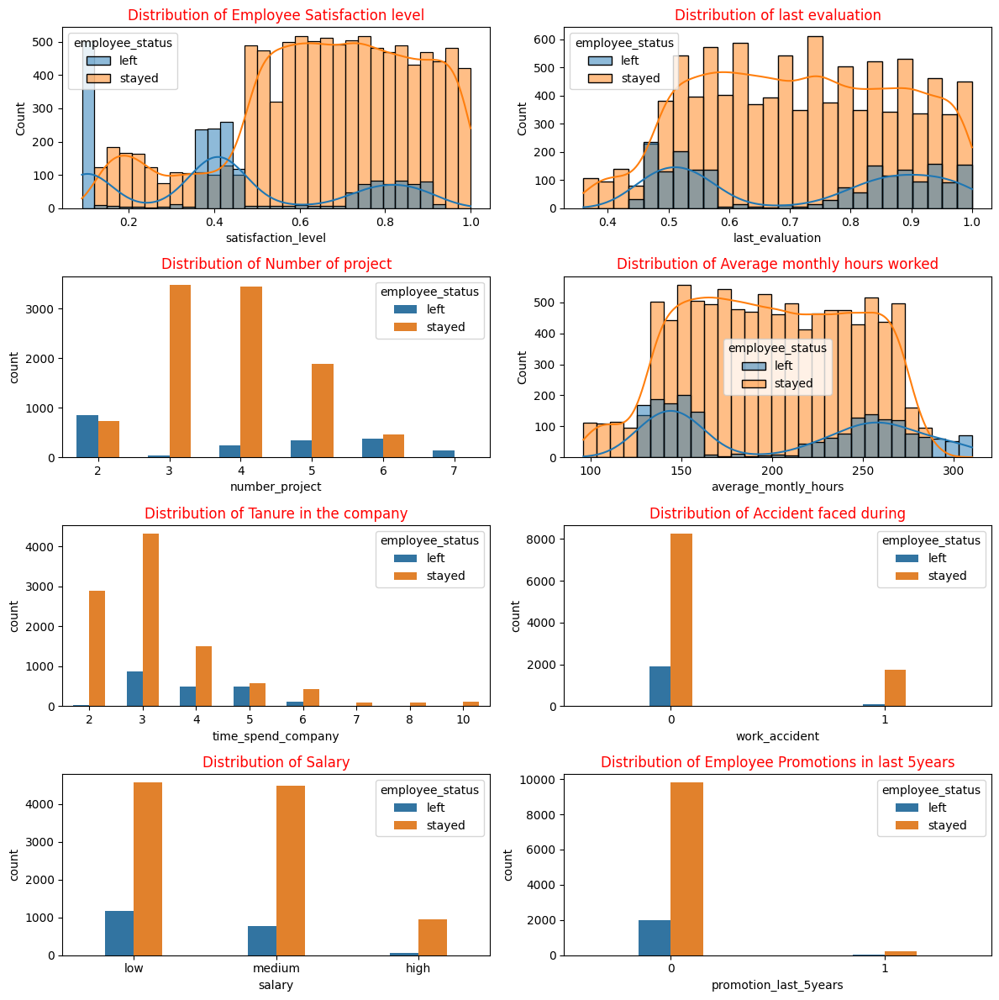

<div class="alert alert-block alert-success">

<span style="font-family: Arial; font-size:1.8em;color:black;"> **Capstone project: Salifort Motors - Employee Churn prediction**

<span style="font-family: Arial; font-size:1.4em;color:black;"> **Google Advanced Data Analytics Professional Certificate** Course

**Author: Suranjan Sinha**
</div>

## <span style="font-family: Arial; font-size:0.9em;color:blue;"> List of contents

1. ### **[Introduction](#1)**
2. ### **[PACE: PLAN stage](#20)**
    2a. **[Familiarize with HR dataset](#21)**
    <br>2b. **[Project Goal and Deliverables](#22)**
    <br>2c. **[Packages and Data Imports](#23)**
3. ### **[PACE: ANALYSIS stage](#40)**
    3a. **[Exploratory Data Analysis (EDA - Initial data cleaning)](#41)**
    <br>3b. **[Rename columns](#43)**
    <br>3c. **[Check missing values](#44)**
    <br>3d. **[Check duplicates](#45)**
    <br>3e. **[Check outliers](#46)**
    <br>3f. **[Analyse relationship between variables](#47)**
    <br>3g. **[Data Visualization](#48)**
    <br>3h. **[Check Target class imbalance](#49)**
    <br>3h. **[Insights](#490)**
4. ### **[PACE: CONSTRUCT stage](#50)**
    4a. **[Evaluation metrics](#51)**
    <br>4b. **[Feature Engineering- Feature Transformation](#52)**
    <br>4c. **[Encoding categorical variables](#53)**
    <br>4d. **[Feature Selection](#54)**
    <br>4e. **[Create Train/Test sets](#55)**
    <br>4f. **[Build Model - Logistic Regression](#56)**
    <br>4g. **[Build Model - Decision Tree](#57)**
    <br>4h. **[Build Model - Random Forest (with hyperparameter tuning)](#58)**
    <br>4i. **[Build Model - XGBoost (with hyperparameter tuning)](#59)**
5. ### **[PACE: EXECUTE stage](#60)**
    5a. **[Project Steps followed](#61)**
    <br>5b. **[Reference to Evaluate and Interpret Model performance](#62)**
    <br>5c. **[Summary- Confusion Matrix](#63)**
    <br>5d. **[Summary- Evaluation Metrics](#64)**
    <br>5e. **[Summary- Feature importance](#65)**
    <br>5f. **[Next step to improve model performance](#67)**
    <br>5g. **[Additional conclusion from Data and Model](#68)**
    <br>5h. **[Business recommendations](#66)**
    <br>5i. **[Ethical Considerations](#69)**

## <span style="font-family: Arial; font-size:0.9em;color:blue;"> <a id=1></a> **Introduction**
Salifort Motors is a fictional, alternative energy vehicle manufacturer. Its global workforce of over 100,000 employees research, design, construct, validate, and distribute electric, solar, algae, and hydrogen-based vehicles

This capstone project is an opportunity to analyze a dataset and build predictive models that can provide insights to the Human Resources (HR) department of a large consulting firm.

Currently, there is a high rate of turnover among Salifort employees. Salifort’s senior leadership team is concerned about how many employees are leaving the company. Salifort strives to create a corporate culture that supports employee success and professional development. Further, the high turnover rate is costly in the financial sense. Salifort makes a big investment in recruiting, training, and upskilling its employees. 

As a first step, the leadership team asks Human Resources to survey a sample of employees to learn more about what might be driving turnover. 

Next, the leadership team asked to analyze the survey data and come up with ideas for how to increase employee retention. To help with this, they suggest to design a model that predicts whether an employee will leave the company based on their job title, department, number of projects, average monthly hours, and any other relevant data points. A good model will help the company increase retention and job satisfaction for current employees, and save money and time training new employees.


## <span style="font-family: Arial; font-size:0.85em;color:blue;"> PACE stages


## <span style="font-family: Arial; font-size:0.85em;color:blue;"> <a id=20></a> **Pace: Plan Stage**

**Understand the business scenario and problem**

The HR department at Salifort Motors wants to take some initiatives to improve employee satisfaction levels at the company. They collected data from employees, but now they don’t know how to utilize this data. As data analytics professional I am being asked to provide data-driven suggestions based on understanding of the data. They have the following question: what’s likely to make the employee leave the company?

Our goals in this project are to analyze the data collected by the HR department and to build a model that predicts whether or not an employee will leave the company.

If we can predict employees who are likely to quit, it might be possible to identify factors that contribute to their leaving. Because it is time-consuming and expensive to find, interview, and hire new employees, increasing employee retention will be beneficial to the company.

### <span style="font-family: Arial; font-size:0.85em;color:blue;"> <a id=21></a> **Familiarize with HR dataset**

The dataset received contains **15,000 rows** and **10 columns** for the variables listed below. Each row is a different employee’s self-reported information.


### <span style="font-family: Arial; font-size:0.85em;color:blue;"> <a id=22></a> **Project Goal and Deliverables**

**Key Stakeholders:**
- Salifort's Sr Management team
- Salifort's HR department team

**Goals** in this project are to analyze the data collected by the HR department and to build a model that predicts whether or not an employee will leave the company.

If this model can predict employees likely to quit, it might be possible to identify factors that contribute to their leaving. As it is time-consuming and expensive to find, interview, and hire new employees, increasing employee retention will be beneficial to the company.

**Methodologies**
- Exploratory Data Analysis
- Descriptive Statistics
- Logistic regression model
- Decision Tree Model
- Random Forest Model
- XGBoost Model

**Deliverables:**
- Jupyter notebook including:
    - codes
    - analysis workflow
    - model selection
    - model testing
    - Evaluation and results


**Reflect on these questions as you complete the plan stage.**

1. Who are your stakeholders for this project?
2. What are you trying to solve or accomplish?
3. What are your initial observations when you explore the data?
4. What resources do you find yourself using as you complete this stage? (Make sure to include the links.)
5. Do you have any ethical considerations in this stage?

Reply:
1. Sr management of Salifort Motors and HR department head at Salifort Motors
2. Goal is to predict existing employees who are likely to quit
3. 

## <span style="font-family: Arial; font-size:0.85em;color:blue;"> <a id=23></a> **Step 1. Imports**

- Import packages
- Load dataset


```python
# Import packages for data manipulation
import pandas as pd
import numpy as np
pd.set_option('display.max_columns', None)
import pickle

# Import packages for data visualization
import matplotlib.pyplot as plt
import seaborn as sns

# Import packages for data preprocessing
from sklearn.preprocessing import OneHotEncoder, StandardScaler

# Import packages for data modeling
from sklearn.model_selection import train_test_split, GridSearchCV
from sklearn.metrics import classification_report, accuracy_score, precision_score, \
recall_score, f1_score, confusion_matrix, ConfusionMatrixDisplay
from sklearn.metrics import roc_auc_score, roc_curve, classification_report, RocCurveDisplay
import sklearn.metrics as metrics

from sklearn.tree import DecisionTreeClassifier, plot_tree

from sklearn.linear_model import LogisticRegression
from sklearn.ensemble import RandomForestClassifier
from xgboost import XGBClassifier
from xgboost import plot_importance

from scipy import stats
```


```python
df0 = pd.read_csv("C:/Personal/Google Advanced Data Analytics/Capstone Project/Raw Data/HR_capstone_dataset.csv")
```


```python
df0.head()
```


<div>
<style scoped>
    .dataframe tbody tr th:only-of-type {
        vertical-align: middle;
    }

    .dataframe tbody tr th {
        vertical-align: top;
    }

    .dataframe thead th {
        text-align: right;
    }
</style>
<table border="1" class="dataframe">
  <thead>
    <tr style="text-align: right;">
      <th></th>
      <th>satisfaction_level</th>
      <th>last_evaluation</th>
      <th>number_project</th>
      <th>average_montly_hours</th>
      <th>time_spend_company</th>
      <th>Work_accident</th>
      <th>left</th>
      <th>promotion_last_5years</th>
      <th>Department</th>
      <th>salary</th>
    </tr>
  </thead>
  <tbody>
    <tr>
      <th>0</th>
      <td>0.38</td>
      <td>0.53</td>
      <td>2</td>
      <td>157</td>
      <td>3</td>
      <td>0</td>
      <td>1</td>
      <td>0</td>
      <td>sales</td>
      <td>low</td>
    </tr>
    <tr>
      <th>1</th>
      <td>0.80</td>
      <td>0.86</td>
      <td>5</td>
      <td>262</td>
      <td>6</td>
      <td>0</td>
      <td>1</td>
      <td>0</td>
      <td>sales</td>
      <td>medium</td>
    </tr>
    <tr>
      <th>2</th>
      <td>0.11</td>
      <td>0.88</td>
      <td>7</td>
      <td>272</td>
      <td>4</td>
      <td>0</td>
      <td>1</td>
      <td>0</td>
      <td>sales</td>
      <td>medium</td>
    </tr>
    <tr>
      <th>3</th>
      <td>0.72</td>
      <td>0.87</td>
      <td>5</td>
      <td>223</td>
      <td>5</td>
      <td>0</td>
      <td>1</td>
      <td>0</td>
      <td>sales</td>
      <td>low</td>
    </tr>
    <tr>
      <th>4</th>
      <td>0.37</td>
      <td>0.52</td>
      <td>2</td>
      <td>159</td>
      <td>3</td>
      <td>0</td>
      <td>1</td>
      <td>0</td>
      <td>sales</td>
      <td>low</td>
    </tr>
  </tbody>
</table>
</div>


## <span style="font-family: Arial; font-size:0.85em;color:blue;"> <a id=40></a> **Pace: Analyze Stage**

## <span style="font-family: Arial; font-size:0.85em;color:blue;"> <a id=41></a> **Step 2. Exploratory Data Analysis (EDA - Initial data cleaning)**

- Understand your variables
- Clean your dataset (missing data, redundant data, outliers)


```python
# Gather basic information about the data
### YOUR CODE HERE ###
df0.info()
```

    <class 'pandas.core.frame.DataFrame'>
    RangeIndex: 14999 entries, 0 to 14998
    Data columns (total 10 columns):
     #   Column                 Non-Null Count  Dtype  
    ---  ------                 --------------  -----  
     0   satisfaction_level     14999 non-null  float64
     1   last_evaluation        14999 non-null  float64
     2   number_project         14999 non-null  int64  
     3   average_montly_hours   14999 non-null  int64  
     4   time_spend_company     14999 non-null  int64  
     5   Work_accident          14999 non-null  int64  
     6   left                   14999 non-null  int64  
     7   promotion_last_5years  14999 non-null  int64  
     8   Department             14999 non-null  object 
     9   salary                 14999 non-null  object 
    dtypes: float64(2), int64(6), object(2)
    memory usage: 1.1+ MB
    


```python
# Gather descriptive statistics about the data
### YOUR CODE HERE ###
df0.describe()
```


<div>
<style scoped>
    .dataframe tbody tr th:only-of-type {
        vertical-align: middle;
    }

    .dataframe tbody tr th {
        vertical-align: top;
    }

    .dataframe thead th {
        text-align: right;
    }
</style>
<table border="1" class="dataframe">
  <thead>
    <tr style="text-align: right;">
      <th></th>
      <th>satisfaction_level</th>
      <th>last_evaluation</th>
      <th>number_project</th>
      <th>average_montly_hours</th>
      <th>time_spend_company</th>
      <th>Work_accident</th>
      <th>left</th>
      <th>promotion_last_5years</th>
    </tr>
  </thead>
  <tbody>
    <tr>
      <th>count</th>
      <td>14999.000000</td>
      <td>14999.000000</td>
      <td>14999.000000</td>
      <td>14999.000000</td>
      <td>14999.000000</td>
      <td>14999.000000</td>
      <td>14999.000000</td>
      <td>14999.000000</td>
    </tr>
    <tr>
      <th>mean</th>
      <td>0.612834</td>
      <td>0.716102</td>
      <td>3.803054</td>
      <td>201.050337</td>
      <td>3.498233</td>
      <td>0.144610</td>
      <td>0.238083</td>
      <td>0.021268</td>
    </tr>
    <tr>
      <th>std</th>
      <td>0.248631</td>
      <td>0.171169</td>
      <td>1.232592</td>
      <td>49.943099</td>
      <td>1.460136</td>
      <td>0.351719</td>
      <td>0.425924</td>
      <td>0.144281</td>
    </tr>
    <tr>
      <th>min</th>
      <td>0.090000</td>
      <td>0.360000</td>
      <td>2.000000</td>
      <td>96.000000</td>
      <td>2.000000</td>
      <td>0.000000</td>
      <td>0.000000</td>
      <td>0.000000</td>
    </tr>
    <tr>
      <th>25%</th>
      <td>0.440000</td>
      <td>0.560000</td>
      <td>3.000000</td>
      <td>156.000000</td>
      <td>3.000000</td>
      <td>0.000000</td>
      <td>0.000000</td>
      <td>0.000000</td>
    </tr>
    <tr>
      <th>50%</th>
      <td>0.640000</td>
      <td>0.720000</td>
      <td>4.000000</td>
      <td>200.000000</td>
      <td>3.000000</td>
      <td>0.000000</td>
      <td>0.000000</td>
      <td>0.000000</td>
    </tr>
    <tr>
      <th>75%</th>
      <td>0.820000</td>
      <td>0.870000</td>
      <td>5.000000</td>
      <td>245.000000</td>
      <td>4.000000</td>
      <td>0.000000</td>
      <td>0.000000</td>
      <td>0.000000</td>
    </tr>
    <tr>
      <th>max</th>
      <td>1.000000</td>
      <td>1.000000</td>
      <td>7.000000</td>
      <td>310.000000</td>
      <td>10.000000</td>
      <td>1.000000</td>
      <td>1.000000</td>
      <td>1.000000</td>
    </tr>
  </tbody>
</table>
</div>


```python
df0['Department'].describe()
```


    count     14999
    unique       10
    top       sales
    freq       4140
    Name: Department, dtype: object


```python
df0['Department'].value_counts()
```


    Department
    sales          4140
    technical      2720
    support        2229
    IT             1227
    product_mng     902
    marketing       858
    RandD           787
    accounting      767
    hr              739
    management      630
    Name: count, dtype: int64


```python
df0['salary'].describe()
```


    count     14999
    unique        3
    top         low
    freq       7316
    Name: salary, dtype: object


```python
df0['salary'].value_counts()
```


    salary
    low       7316
    medium    6446
    high      1237
    Name: count, dtype: int64


***

### <span style="font-family: Arial; font-size:0.85em;color:blue;"> <a id=43></a> **Rename columns**

As a data cleaning step, rename the columns as needed. Standardize the column names so that they are all in snake_case, correct any column names that are misspelled, and make column names more concise as needed.


```python
# Display all column names
df0.columns
```


    Index(['satisfaction_level', 'last_evaluation', 'number_project',
           'average_montly_hours', 'time_spend_company', 'Work_accident', 'left',
           'promotion_last_5years', 'Department', 'salary'],
          dtype='object')


```python
# Rename columns as needed
df0.columns = df0.columns.str.lower()

# Display all column names after the update
df0.columns
```


    Index(['satisfaction_level', 'last_evaluation', 'number_project',
           'average_montly_hours', 'time_spend_company', 'work_accident', 'left',
           'promotion_last_5years', 'department', 'salary'],
          dtype='object')


***

### <span style="font-family: Arial; font-size:0.85em;color:blue;"> <a id=44></a> **Check missing values**

Check missing values in the data


```python
# Check missing values
df0.isna().sum()
```


    satisfaction_level       0
    last_evaluation          0
    number_project           0
    average_montly_hours     0
    time_spend_company       0
    work_accident            0
    left                     0
    promotion_last_5years    0
    department               0
    salary                   0
    dtype: int64


***Observation***: No missing value were observed in the data

***

### <span style="font-family: Arial; font-size:0.85em;color:blue;"> <a id=45></a> **Check duplicates**

Check for any duplicate entries in the data


```python
# Check for duplicates
### YOUR CODE HERE ###
df0.duplicated().sum()
```


    3008


```python
# Inspect some rows containing duplicates as needed
### YOUR CODE HERE ###
duplicates = df0[df0.duplicated()].sort_values(by=['satisfaction_level','last_evaluation', 'average_montly_hours'], ascending=True)
duplicates.head(6)
```


<div>
<style scoped>
    .dataframe tbody tr th:only-of-type {
        vertical-align: middle;
    }

    .dataframe tbody tr th {
        vertical-align: top;
    }

    .dataframe thead th {
        text-align: right;
    }
</style>
<table border="1" class="dataframe">
  <thead>
    <tr style="text-align: right;">
      <th></th>
      <th>satisfaction_level</th>
      <th>last_evaluation</th>
      <th>number_project</th>
      <th>average_montly_hours</th>
      <th>time_spend_company</th>
      <th>work_accident</th>
      <th>left</th>
      <th>promotion_last_5years</th>
      <th>department</th>
      <th>salary</th>
    </tr>
  </thead>
  <tbody>
    <tr>
      <th>12030</th>
      <td>0.09</td>
      <td>0.62</td>
      <td>6</td>
      <td>294</td>
      <td>4</td>
      <td>0</td>
      <td>1</td>
      <td>0</td>
      <td>accounting</td>
      <td>low</td>
    </tr>
    <tr>
      <th>14241</th>
      <td>0.09</td>
      <td>0.62</td>
      <td>6</td>
      <td>294</td>
      <td>4</td>
      <td>0</td>
      <td>1</td>
      <td>0</td>
      <td>accounting</td>
      <td>low</td>
    </tr>
    <tr>
      <th>12071</th>
      <td>0.09</td>
      <td>0.77</td>
      <td>5</td>
      <td>275</td>
      <td>4</td>
      <td>0</td>
      <td>1</td>
      <td>0</td>
      <td>product_mng</td>
      <td>medium</td>
    </tr>
    <tr>
      <th>14282</th>
      <td>0.09</td>
      <td>0.77</td>
      <td>5</td>
      <td>275</td>
      <td>4</td>
      <td>0</td>
      <td>1</td>
      <td>0</td>
      <td>product_mng</td>
      <td>medium</td>
    </tr>
    <tr>
      <th>12652</th>
      <td>0.09</td>
      <td>0.77</td>
      <td>6</td>
      <td>290</td>
      <td>4</td>
      <td>0</td>
      <td>1</td>
      <td>0</td>
      <td>technical</td>
      <td>medium</td>
    </tr>
    <tr>
      <th>14863</th>
      <td>0.09</td>
      <td>0.77</td>
      <td>6</td>
      <td>290</td>
      <td>4</td>
      <td>0</td>
      <td>1</td>
      <td>0</td>
      <td>technical</td>
      <td>medium</td>
    </tr>
  </tbody>
</table>
</div>


```python
# check the number of duplicate entries
print(duplicates.shape)
print(round(3008/14999*100,2),'% of data which are duplicate')
```

    (3008, 10)
    20.05 % of data which are duplicate
    


```python
# Drop duplicates and save resulting dataframe in a new variable as needed
### YOUR CODE HERE ###
df1 = df0.drop_duplicates(keep='first')

# Display first few rows of new dataframe as needed
### YOUR CODE HERE ###
df1.head()
```


<div>
<style scoped>
    .dataframe tbody tr th:only-of-type {
        vertical-align: middle;
    }

    .dataframe tbody tr th {
        vertical-align: top;
    }

    .dataframe thead th {
        text-align: right;
    }
</style>
<table border="1" class="dataframe">
  <thead>
    <tr style="text-align: right;">
      <th></th>
      <th>satisfaction_level</th>
      <th>last_evaluation</th>
      <th>number_project</th>
      <th>average_montly_hours</th>
      <th>time_spend_company</th>
      <th>work_accident</th>
      <th>left</th>
      <th>promotion_last_5years</th>
      <th>department</th>
      <th>salary</th>
    </tr>
  </thead>
  <tbody>
    <tr>
      <th>0</th>
      <td>0.38</td>
      <td>0.53</td>
      <td>2</td>
      <td>157</td>
      <td>3</td>
      <td>0</td>
      <td>1</td>
      <td>0</td>
      <td>sales</td>
      <td>low</td>
    </tr>
    <tr>
      <th>1</th>
      <td>0.80</td>
      <td>0.86</td>
      <td>5</td>
      <td>262</td>
      <td>6</td>
      <td>0</td>
      <td>1</td>
      <td>0</td>
      <td>sales</td>
      <td>medium</td>
    </tr>
    <tr>
      <th>2</th>
      <td>0.11</td>
      <td>0.88</td>
      <td>7</td>
      <td>272</td>
      <td>4</td>
      <td>0</td>
      <td>1</td>
      <td>0</td>
      <td>sales</td>
      <td>medium</td>
    </tr>
    <tr>
      <th>3</th>
      <td>0.72</td>
      <td>0.87</td>
      <td>5</td>
      <td>223</td>
      <td>5</td>
      <td>0</td>
      <td>1</td>
      <td>0</td>
      <td>sales</td>
      <td>low</td>
    </tr>
    <tr>
      <th>4</th>
      <td>0.37</td>
      <td>0.52</td>
      <td>2</td>
      <td>159</td>
      <td>3</td>
      <td>0</td>
      <td>1</td>
      <td>0</td>
      <td>sales</td>
      <td>low</td>
    </tr>
  </tbody>
</table>
</div>


***Observation***: There were 3008 duplicate entries identified in the dataset. Which constitutes about 20% of the total dataset.
<br>Keeping the last entry of the samilar duplicated rows, rest of the duplicates were deleted and was stored in a new df1 Data Frame. Keeping the original dataset intact.


***
### <span style="font-family: Arial; font-size:0.85em;color:blue;"> <a id=46></a> **Check outliers**


```python
# Create a boxplot to visualize distribution of `tenure` and detect any outliers
plt.figure(figsize=(3,2))
sns.boxplot(x=df1['time_spend_company'])
plt.title('Tenure')
```


    Text(0.5, 1.0, 'Tenure')


    

    


```python
# Determine the number of rows containing outliers
### YOUR CODE HERE ###
percentile25 = df1['time_spend_company'].quantile(0.25)
percentile75 = df1['time_spend_company'].quantile(0.75)
iqr = percentile75 - percentile25
upper_limit = percentile75 + (1.5 * iqr)
df1[df1['time_spend_company'] > upper_limit].shape
```


    (824, 10)


***Observation***: Total 824 number of rows contains outliers as identified from column 'time_spend_company'. These values might not be outliers but actual years spent in the company. 
<br> Certain types of models are more sensitive to outliers than others. Based on the type of model we will decide to exclude the outliers or include them in modeling. 

***
### <span style="font-family: Arial; font-size:0.85em;color:blue;"> <a id=47></a> **EDA - Analyse relationship between variables**


```python
# Creating a copy of 'satisfaction_level'
df1['employee_status'] = np.where(df1['left']==0, 'stayed','left')
```

    C:\Users\dsinh\AppData\Local\Temp\ipykernel_39640\146753406.py:2: SettingWithCopyWarning: 
    A value is trying to be set on a copy of a slice from a DataFrame.
    Try using .loc[row_indexer,col_indexer] = value instead
    
    See the caveats in the documentation: https://pandas.pydata.org/pandas-docs/stable/user_guide/indexing.html#returning-a-view-versus-a-copy
      df1['employee_status'] = np.where(df1['left']==0, 'stayed','left')
    


```python
df1.head()
```


<div>
<style scoped>
    .dataframe tbody tr th:only-of-type {
        vertical-align: middle;
    }

    .dataframe tbody tr th {
        vertical-align: top;
    }

    .dataframe thead th {
        text-align: right;
    }
</style>
<table border="1" class="dataframe">
  <thead>
    <tr style="text-align: right;">
      <th></th>
      <th>satisfaction_level</th>
      <th>last_evaluation</th>
      <th>number_project</th>
      <th>average_montly_hours</th>
      <th>time_spend_company</th>
      <th>work_accident</th>
      <th>left</th>
      <th>promotion_last_5years</th>
      <th>department</th>
      <th>salary</th>
      <th>employee_status</th>
    </tr>
  </thead>
  <tbody>
    <tr>
      <th>0</th>
      <td>0.38</td>
      <td>0.53</td>
      <td>2</td>
      <td>157</td>
      <td>3</td>
      <td>0</td>
      <td>1</td>
      <td>0</td>
      <td>sales</td>
      <td>low</td>
      <td>left</td>
    </tr>
    <tr>
      <th>1</th>
      <td>0.80</td>
      <td>0.86</td>
      <td>5</td>
      <td>262</td>
      <td>6</td>
      <td>0</td>
      <td>1</td>
      <td>0</td>
      <td>sales</td>
      <td>medium</td>
      <td>left</td>
    </tr>
    <tr>
      <th>2</th>
      <td>0.11</td>
      <td>0.88</td>
      <td>7</td>
      <td>272</td>
      <td>4</td>
      <td>0</td>
      <td>1</td>
      <td>0</td>
      <td>sales</td>
      <td>medium</td>
      <td>left</td>
    </tr>
    <tr>
      <th>3</th>
      <td>0.72</td>
      <td>0.87</td>
      <td>5</td>
      <td>223</td>
      <td>5</td>
      <td>0</td>
      <td>1</td>
      <td>0</td>
      <td>sales</td>
      <td>low</td>
      <td>left</td>
    </tr>
    <tr>
      <th>4</th>
      <td>0.37</td>
      <td>0.52</td>
      <td>2</td>
      <td>159</td>
      <td>3</td>
      <td>0</td>
      <td>1</td>
      <td>0</td>
      <td>sales</td>
      <td>low</td>
      <td>left</td>
    </tr>
  </tbody>
</table>
</div>


**Identifying most correlated variables**


```python
df1.corr(method='pearson', numeric_only=True)
```


<div>
<style scoped>
    .dataframe tbody tr th:only-of-type {
        vertical-align: middle;
    }

    .dataframe tbody tr th {
        vertical-align: top;
    }

    .dataframe thead th {
        text-align: right;
    }
</style>
<table border="1" class="dataframe">
  <thead>
    <tr style="text-align: right;">
      <th></th>
      <th>satisfaction_level</th>
      <th>last_evaluation</th>
      <th>number_project</th>
      <th>average_montly_hours</th>
      <th>time_spend_company</th>
      <th>work_accident</th>
      <th>left</th>
      <th>promotion_last_5years</th>
    </tr>
  </thead>
  <tbody>
    <tr>
      <th>satisfaction_level</th>
      <td>1.000000</td>
      <td>0.095186</td>
      <td>-0.133246</td>
      <td>-0.006252</td>
      <td>-0.152915</td>
      <td>0.039940</td>
      <td>-0.350558</td>
      <td>0.019789</td>
    </tr>
    <tr>
      <th>last_evaluation</th>
      <td>0.095186</td>
      <td>1.000000</td>
      <td>0.270256</td>
      <td>0.264678</td>
      <td>0.096829</td>
      <td>-0.005695</td>
      <td>0.013520</td>
      <td>-0.007206</td>
    </tr>
    <tr>
      <th>number_project</th>
      <td>-0.133246</td>
      <td>0.270256</td>
      <td>1.000000</td>
      <td>0.331516</td>
      <td>0.188837</td>
      <td>-0.005612</td>
      <td>0.030928</td>
      <td>-0.000544</td>
    </tr>
    <tr>
      <th>average_montly_hours</th>
      <td>-0.006252</td>
      <td>0.264678</td>
      <td>0.331516</td>
      <td>1.000000</td>
      <td>0.102875</td>
      <td>-0.012860</td>
      <td>0.070409</td>
      <td>-0.004964</td>
    </tr>
    <tr>
      <th>time_spend_company</th>
      <td>-0.152915</td>
      <td>0.096829</td>
      <td>0.188837</td>
      <td>0.102875</td>
      <td>1.000000</td>
      <td>0.000003</td>
      <td>0.173295</td>
      <td>0.056828</td>
    </tr>
    <tr>
      <th>work_accident</th>
      <td>0.039940</td>
      <td>-0.005695</td>
      <td>-0.005612</td>
      <td>-0.012860</td>
      <td>0.000003</td>
      <td>1.000000</td>
      <td>-0.125436</td>
      <td>0.029852</td>
    </tr>
    <tr>
      <th>left</th>
      <td>-0.350558</td>
      <td>0.013520</td>
      <td>0.030928</td>
      <td>0.070409</td>
      <td>0.173295</td>
      <td>-0.125436</td>
      <td>1.000000</td>
      <td>-0.044657</td>
    </tr>
    <tr>
      <th>promotion_last_5years</th>
      <td>0.019789</td>
      <td>-0.007206</td>
      <td>-0.000544</td>
      <td>-0.004964</td>
      <td>0.056828</td>
      <td>0.029852</td>
      <td>-0.044657</td>
      <td>1.000000</td>
    </tr>
  </tbody>
</table>
</div>


```python
# Vizualize correlation heatmap of the data
plt.figure(figsize=(12,8))
sns.heatmap(df1.corr(method='pearson', numeric_only=True), annot=True, cmap='Reds')
plt.title('Correlation Heatmap')

plt.show()
```


    

    


***Observation***: No variables are found to be highly correlated

***
### <span style="font-family: Arial; font-size:0.85em;color:blue;"> <a id=48></a> **EDA - Data Visualization**
<br>Now, examining variables and creating plots to visualize relationships between variables in the data.


```python
# Create a plot as needed
# Plot predictor variables and target variable distribution 
fig, axes = plt.subplots(4,2, figsize=(12,12))

# Distribution of satisfaction_level
sns.histplot(data=df1, x=df1['satisfaction_level'], hue='employee_status', ax=axes[0,0], kde=True)
axes[0,0].set_title('Distribution of Employee Satisfaction level', color='r')

# Distribution of last_evaluation
sns.histplot(data=df1, x=df1['last_evaluation'], hue='employee_status', ax=axes[0,1], kde=True)
axes[0,1].set_title('Distribution of last evaluation', color='r')

# Distribution of number_project
sns.countplot(data=df1, x=df1['number_project'], width=0.6, hue='employee_status', ax=axes[1,0])
axes[1,0].set_title('Distribution of Number of project', color='r')

# Distribution of average_montly_hours
sns.histplot(data=df1, x=df1['average_montly_hours'], hue='employee_status', ax=axes[1,1], kde=True)
axes[1,1].set_title('Distribution of Average monthly hours worked', color='r')

# Distribution of time_spend_company
sns.countplot(data=df1, x=df1['time_spend_company'], width=0.6, hue='employee_status', ax=axes[2,0])
axes[2,0].set_title('Distribution of Tanure in the company', color='r')

# Distribution of work_accident
sns.countplot(data=df1, x=df1['work_accident'], width=0.2, hue='employee_status', ax=axes[2,1])
axes[2,1].set_title('Distribution of Accident faced during', color='r')

# Distribution of Salary
sns.countplot(data=df1, x=df1['salary'], width=0.4, hue='employee_status', ax=axes[3,0])
axes[3,0].set_title('Distribution of Salary', color='r')

# Distribution of promotion_last_5years
sns.countplot(data=df1, x=df1['promotion_last_5years'], width=0.3, hue='employee_status', ax=axes[3,1])
axes[3,1].set_title('Distribution of Employee Promotions in last 5years', color='r')

# plot
plt.tight_layout()
```


    

    


```python
# number of projects vs satisfaction level
plt.figure(figsize=(6,4))
b=df1.groupby('number_project')['satisfaction_level'].mean().reset_index()
sns.barplot(data=b, x='number_project', y='satisfaction_level', width=0.4)
plt.title('Satisfaction level distribution affected by number of projects handled')
```


    Text(0.5, 1.0, 'Satisfaction level distribution affected by number of projects handled')


    

    


```python
# Distribution of Department vs. employee left
plt.figure(figsize=(10,4))
sns.countplot(data=df1, x=df1['department'], hue='employee_status')
plt.title('Distribution of department with respect to employee left')
sns.set(font_scale=0.9)
plt.show()
```


    

    


***Observation***: In the plot, Employees left vs average monthly hours worked, it shows that the histogram has two peaks also knows as bimodal. Bimodality shows that within left employees one group of employees who worked 7-8hrs per day while the other group worked more than 11hours a day.
<br>In the plot, Employees left vs number of projects, it shows that there are employees who are involved in 6 to 7 projects. These employees % of churn ratio is very high. 
<br>In the plot, Employee left vs Time spent in the company, it shows that most of the employees are in the company for past 2-3 years. Thereafter from 4th year, employees retainability is less and tend to leave the company. 
<br>Looking at employee left vs individual Departmental team, its observed that maximum employees left from sales team followed by technical and support teams. 
<br>Checking salary distribution vs employees left, it is observed that most of the employees who left were from low salary group and very few left from high salary group. 

***
### <span style="font-family: Arial; font-size:0.85em;color:blue;"> <a id=49></a> **EDA - Check Target class imbalance**


```python
# Get numbers of people who left vs. stayed
### YOUR CODE HERE ###
print('Number of people left vs. stayed:', '\n', df1['employee_status'].value_counts())

# Get percentages of people who left vs. stayed
### YOUR CODE HERE ###
print('Number of people left vs. stayed in %:', '\n', round(df1['employee_status'].value_counts(normalize=True)*100,2))
```

    Number of people left vs. stayed: 
     employee_status
    stayed    10000
    left       1991
    Name: count, dtype: int64
    Number of people left vs. stayed in %: 
     employee_status
    stayed    83.4
    left      16.6
    Name: proportion, dtype: float64
    

***Observation***: The dataset has 83.4% employees retained and 16.6% employees left. 
<br>There is a imbalance in the target variable. Though this imbalance is within limit and can still be considered without oversampling the data.

***
### <span style="font-family: Arial; font-size:0.85em;color:blue;"> <a id=490></a> **Insights**
- No missing value were observed in the data

- There were 3008 duplicate entries identified in the dataset. Which constitutes about 20% of the total dataset. Keeping the last entry of the samilar duplicated rows, rest of the duplicates were deleted and was stored in a new df1 Data Frame. Keeping the original dataset intact.

- Total 824 number of rows contains outliers as identified from column 'time_spend_company'. These values might not be outliers but actual years spent in the company. Certain types of models are more sensitive to outliers than others. Based on the type of model we will decide to exclude the outliers or include them in modeling.

- No variables are found to be highly correlated

- In the plot, Employees left vs average monthly hours worked, it shows that the histogram has two peaks also knows as bimodal. Bimodality shows that within left employees one group of employees who worked 7-8hrs per day while the other group worked more than 11hours a day.

- In the plot, Employees left vs number of projects, it shows that there are employees who are involved in 6 to 7 projects. These employees % of churn ratio is very high.

- In the plot, Employee left vs Time spent in the company, it shows that most of the employees are in the company for past 2-3 years. Thereafter from 4th year onwards, employees retainability is less and employees tend to leave the company.

- Looking at employee left vs individual Departmental team, its observed that maximum employees left from sales team followed by technical and support teams.

- After checking salary distribution vs employees left, it is observed that most of the employees who left were from low salary group and very few left from high salary group.

- The dataset has 83.4% employees retained and 16.6% employees left. There is a imbalance in the target variable. Though this imbalance is within limit and can still be considered without oversampling the data.

***
## <span style="font-family: Arial; font-size:0.85em;color:blue;"> <a id=50></a> **Pace: Construct Stage**
As our predictor variable is categorical/binary we will first build 4 different classification models:
- Binomial Logistic Regression
- Decision Trees
- Random Forest
- XGBoost

We will then select the champion model with best evaluation score to predict on the test data


### <span style="font-family: Arial; font-size:0.85em;color:blue;"> <a id=51></a> **Evaluation metrics**

**Evaluation metrics**:
1. Precision score
2. Recall score
3. F1 score
4. Accuracy score
5. Confusion matrix: A perfect model would yield all true negatives and true positives, and no false negatives or false positives.
    1. True Negative (TN): The upper-left quadrant displays the number of true negatives, the total count that classification model correctly predicted as False(0). In this case, the employees who didnt leave 
    2. False Positive (FP): The upper-right quadrant displays the number of false positives, the total count that classification model incorrectly predicted as True(1). In this case the classification model predicted the employee as 'left' but in reality employee 'stayed'
    3. False Negative (FN): The lower-left quadrant displays the number of false negatives, the count that classification model incorrectly predicted as False(0). In this case the classification model incorrectly predicted an employee as 'stayed' but in reality that employee 'left'
    4. True Positive (TP): The lower-right quadrant displays the number of true positives, the count that classification model correctly predicted as True(1). In this case the classification model correctly predicted employees who left.

The False negatives may cause the company to spend more resources on an employee who decides to leave, as otherwise this may result in spending on hiring new employees and training them which is also time consuming. The False positives may cause the company to spend on the employee incentives and rewards with more benefit, thinking this employee might leave. False negatives will be worse for the company, however false positives will be unnecessary expense to Salifort Motors.

***
### <span style="font-family: Arial; font-size:0.85em;color:blue;"> <a id=52></a> **Feature Engineering- Feature Transformation**

**Extra working hours** may lead to poor satisfaction and thereby leaving the company
- Normal working hours is 8hours per day.
- Average Working days in a year (considering 2days weekend) = 261 days
- Average working days in a month = 261 / 12 = 21.75 days
- Average working hours per month = 21.75 * 8 (hours per day) = 174 hrs


```python
# creating a column to identify which employee worked more than normal working hours 174.
# keeping any working hours less than 174 as 0 and any working hours more than 174 as difference of actual hours 
df1['extra_working_hours'] = np.where(df1['average_montly_hours'] <= 174, 0, df1['average_montly_hours']-174)
df1.head()
```

    C:\Users\dsinh\AppData\Local\Temp\ipykernel_39640\419898338.py:3: SettingWithCopyWarning: 
    A value is trying to be set on a copy of a slice from a DataFrame.
    Try using .loc[row_indexer,col_indexer] = value instead
    
    See the caveats in the documentation: https://pandas.pydata.org/pandas-docs/stable/user_guide/indexing.html#returning-a-view-versus-a-copy
      df1['extra_working_hours'] = np.where(df1['average_montly_hours'] <= 174, 0, df1['average_montly_hours']-174)
    


<div>
<style scoped>
    .dataframe tbody tr th:only-of-type {
        vertical-align: middle;
    }

    .dataframe tbody tr th {
        vertical-align: top;
    }

    .dataframe thead th {
        text-align: right;
    }
</style>
<table border="1" class="dataframe">
  <thead>
    <tr style="text-align: right;">
      <th></th>
      <th>satisfaction_level</th>
      <th>last_evaluation</th>
      <th>number_project</th>
      <th>average_montly_hours</th>
      <th>time_spend_company</th>
      <th>work_accident</th>
      <th>left</th>
      <th>promotion_last_5years</th>
      <th>department</th>
      <th>salary</th>
      <th>employee_status</th>
      <th>extra_working_hours</th>
    </tr>
  </thead>
  <tbody>
    <tr>
      <th>0</th>
      <td>0.38</td>
      <td>0.53</td>
      <td>2</td>
      <td>157</td>
      <td>3</td>
      <td>0</td>
      <td>1</td>
      <td>0</td>
      <td>sales</td>
      <td>low</td>
      <td>left</td>
      <td>0</td>
    </tr>
    <tr>
      <th>1</th>
      <td>0.80</td>
      <td>0.86</td>
      <td>5</td>
      <td>262</td>
      <td>6</td>
      <td>0</td>
      <td>1</td>
      <td>0</td>
      <td>sales</td>
      <td>medium</td>
      <td>left</td>
      <td>88</td>
    </tr>
    <tr>
      <th>2</th>
      <td>0.11</td>
      <td>0.88</td>
      <td>7</td>
      <td>272</td>
      <td>4</td>
      <td>0</td>
      <td>1</td>
      <td>0</td>
      <td>sales</td>
      <td>medium</td>
      <td>left</td>
      <td>98</td>
    </tr>
    <tr>
      <th>3</th>
      <td>0.72</td>
      <td>0.87</td>
      <td>5</td>
      <td>223</td>
      <td>5</td>
      <td>0</td>
      <td>1</td>
      <td>0</td>
      <td>sales</td>
      <td>low</td>
      <td>left</td>
      <td>49</td>
    </tr>
    <tr>
      <th>4</th>
      <td>0.37</td>
      <td>0.52</td>
      <td>2</td>
      <td>159</td>
      <td>3</td>
      <td>0</td>
      <td>1</td>
      <td>0</td>
      <td>sales</td>
      <td>low</td>
      <td>left</td>
      <td>0</td>
    </tr>
  </tbody>
</table>
</div>


**Log of satisfaction_level and last_evaluation**
- For feature scaling we will create a new column with log value of satisfaction_level and last_evaluation


```python
df1['log_satisfaction_level'] = np.log(df1['satisfaction_level'])
df1['log_last_evaluation'] = np.log(df1['last_evaluation'])
df1.head()
```

    C:\Users\dsinh\AppData\Local\Temp\ipykernel_39640\3489145900.py:1: SettingWithCopyWarning: 
    A value is trying to be set on a copy of a slice from a DataFrame.
    Try using .loc[row_indexer,col_indexer] = value instead
    
    See the caveats in the documentation: https://pandas.pydata.org/pandas-docs/stable/user_guide/indexing.html#returning-a-view-versus-a-copy
      df1['log_satisfaction_level'] = np.log(df1['satisfaction_level'])
    C:\Users\dsinh\AppData\Local\Temp\ipykernel_39640\3489145900.py:2: SettingWithCopyWarning: 
    A value is trying to be set on a copy of a slice from a DataFrame.
    Try using .loc[row_indexer,col_indexer] = value instead
    
    See the caveats in the documentation: https://pandas.pydata.org/pandas-docs/stable/user_guide/indexing.html#returning-a-view-versus-a-copy
      df1['log_last_evaluation'] = np.log(df1['last_evaluation'])
    


<div>
<style scoped>
    .dataframe tbody tr th:only-of-type {
        vertical-align: middle;
    }

    .dataframe tbody tr th {
        vertical-align: top;
    }

    .dataframe thead th {
        text-align: right;
    }
</style>
<table border="1" class="dataframe">
  <thead>
    <tr style="text-align: right;">
      <th></th>
      <th>satisfaction_level</th>
      <th>last_evaluation</th>
      <th>number_project</th>
      <th>average_montly_hours</th>
      <th>time_spend_company</th>
      <th>work_accident</th>
      <th>left</th>
      <th>promotion_last_5years</th>
      <th>department</th>
      <th>salary</th>
      <th>employee_status</th>
      <th>extra_working_hours</th>
      <th>log_satisfaction_level</th>
      <th>log_last_evaluation</th>
    </tr>
  </thead>
  <tbody>
    <tr>
      <th>0</th>
      <td>0.38</td>
      <td>0.53</td>
      <td>2</td>
      <td>157</td>
      <td>3</td>
      <td>0</td>
      <td>1</td>
      <td>0</td>
      <td>sales</td>
      <td>low</td>
      <td>left</td>
      <td>0</td>
      <td>-0.967584</td>
      <td>-0.634878</td>
    </tr>
    <tr>
      <th>1</th>
      <td>0.80</td>
      <td>0.86</td>
      <td>5</td>
      <td>262</td>
      <td>6</td>
      <td>0</td>
      <td>1</td>
      <td>0</td>
      <td>sales</td>
      <td>medium</td>
      <td>left</td>
      <td>88</td>
      <td>-0.223144</td>
      <td>-0.150823</td>
    </tr>
    <tr>
      <th>2</th>
      <td>0.11</td>
      <td>0.88</td>
      <td>7</td>
      <td>272</td>
      <td>4</td>
      <td>0</td>
      <td>1</td>
      <td>0</td>
      <td>sales</td>
      <td>medium</td>
      <td>left</td>
      <td>98</td>
      <td>-2.207275</td>
      <td>-0.127833</td>
    </tr>
    <tr>
      <th>3</th>
      <td>0.72</td>
      <td>0.87</td>
      <td>5</td>
      <td>223</td>
      <td>5</td>
      <td>0</td>
      <td>1</td>
      <td>0</td>
      <td>sales</td>
      <td>low</td>
      <td>left</td>
      <td>49</td>
      <td>-0.328504</td>
      <td>-0.139262</td>
    </tr>
    <tr>
      <th>4</th>
      <td>0.37</td>
      <td>0.52</td>
      <td>2</td>
      <td>159</td>
      <td>3</td>
      <td>0</td>
      <td>1</td>
      <td>0</td>
      <td>sales</td>
      <td>low</td>
      <td>left</td>
      <td>0</td>
      <td>-0.994252</td>
      <td>-0.653926</td>
    </tr>
  </tbody>
</table>
</div>


**Employee Productivity**: Calculate employee productivity to understand which employees devoted more efforts for the company
- formula: productivity = number_project * average_montly_hours


```python
# Create a new column of employee productivity = number_project * average_montly_hours
df1['productivity'] = df1['number_project']*df1['average_montly_hours']
df1.head()
```

    C:\Users\dsinh\AppData\Local\Temp\ipykernel_39640\1458603458.py:2: SettingWithCopyWarning: 
    A value is trying to be set on a copy of a slice from a DataFrame.
    Try using .loc[row_indexer,col_indexer] = value instead
    
    See the caveats in the documentation: https://pandas.pydata.org/pandas-docs/stable/user_guide/indexing.html#returning-a-view-versus-a-copy
      df1['productivity'] = df1['number_project']*df1['average_montly_hours']
    


<div>
<style scoped>
    .dataframe tbody tr th:only-of-type {
        vertical-align: middle;
    }

    .dataframe tbody tr th {
        vertical-align: top;
    }

    .dataframe thead th {
        text-align: right;
    }
</style>
<table border="1" class="dataframe">
  <thead>
    <tr style="text-align: right;">
      <th></th>
      <th>satisfaction_level</th>
      <th>last_evaluation</th>
      <th>number_project</th>
      <th>average_montly_hours</th>
      <th>time_spend_company</th>
      <th>work_accident</th>
      <th>left</th>
      <th>promotion_last_5years</th>
      <th>department</th>
      <th>salary</th>
      <th>employee_status</th>
      <th>extra_working_hours</th>
      <th>log_satisfaction_level</th>
      <th>log_last_evaluation</th>
      <th>productivity</th>
    </tr>
  </thead>
  <tbody>
    <tr>
      <th>0</th>
      <td>0.38</td>
      <td>0.53</td>
      <td>2</td>
      <td>157</td>
      <td>3</td>
      <td>0</td>
      <td>1</td>
      <td>0</td>
      <td>sales</td>
      <td>low</td>
      <td>left</td>
      <td>0</td>
      <td>-0.967584</td>
      <td>-0.634878</td>
      <td>314</td>
    </tr>
    <tr>
      <th>1</th>
      <td>0.80</td>
      <td>0.86</td>
      <td>5</td>
      <td>262</td>
      <td>6</td>
      <td>0</td>
      <td>1</td>
      <td>0</td>
      <td>sales</td>
      <td>medium</td>
      <td>left</td>
      <td>88</td>
      <td>-0.223144</td>
      <td>-0.150823</td>
      <td>1310</td>
    </tr>
    <tr>
      <th>2</th>
      <td>0.11</td>
      <td>0.88</td>
      <td>7</td>
      <td>272</td>
      <td>4</td>
      <td>0</td>
      <td>1</td>
      <td>0</td>
      <td>sales</td>
      <td>medium</td>
      <td>left</td>
      <td>98</td>
      <td>-2.207275</td>
      <td>-0.127833</td>
      <td>1904</td>
    </tr>
    <tr>
      <th>3</th>
      <td>0.72</td>
      <td>0.87</td>
      <td>5</td>
      <td>223</td>
      <td>5</td>
      <td>0</td>
      <td>1</td>
      <td>0</td>
      <td>sales</td>
      <td>low</td>
      <td>left</td>
      <td>49</td>
      <td>-0.328504</td>
      <td>-0.139262</td>
      <td>1115</td>
    </tr>
    <tr>
      <th>4</th>
      <td>0.37</td>
      <td>0.52</td>
      <td>2</td>
      <td>159</td>
      <td>3</td>
      <td>0</td>
      <td>1</td>
      <td>0</td>
      <td>sales</td>
      <td>low</td>
      <td>left</td>
      <td>0</td>
      <td>-0.994252</td>
      <td>-0.653926</td>
      <td>318</td>
    </tr>
  </tbody>
</table>
</div>


**Employee ranking of Productivity per time spent in the company**: Calculate employee productivity per time spent in the company to understand which employees devoted more efforts for the company during the whole tanure in the company
- formula: ranking of productivity_per_year = (number_project * average_montly_hours) / time_spend_company


```python
# Create a new column ranking productivity per year
df1['productivity_per_year_rank'] = (df1['productivity']/df1['time_spend_company']).rank(pct=True)
df1.head()
```

    C:\Users\dsinh\AppData\Local\Temp\ipykernel_39640\1661980510.py:2: SettingWithCopyWarning: 
    A value is trying to be set on a copy of a slice from a DataFrame.
    Try using .loc[row_indexer,col_indexer] = value instead
    
    See the caveats in the documentation: https://pandas.pydata.org/pandas-docs/stable/user_guide/indexing.html#returning-a-view-versus-a-copy
      df1['productivity_per_year_rank'] = (df1['productivity']/df1['time_spend_company']).rank(pct=True)
    


<div>
<style scoped>
    .dataframe tbody tr th:only-of-type {
        vertical-align: middle;
    }

    .dataframe tbody tr th {
        vertical-align: top;
    }

    .dataframe thead th {
        text-align: right;
    }
</style>
<table border="1" class="dataframe">
  <thead>
    <tr style="text-align: right;">
      <th></th>
      <th>satisfaction_level</th>
      <th>last_evaluation</th>
      <th>number_project</th>
      <th>average_montly_hours</th>
      <th>time_spend_company</th>
      <th>work_accident</th>
      <th>left</th>
      <th>promotion_last_5years</th>
      <th>department</th>
      <th>salary</th>
      <th>employee_status</th>
      <th>extra_working_hours</th>
      <th>log_satisfaction_level</th>
      <th>log_last_evaluation</th>
      <th>productivity</th>
      <th>productivity_per_year_rank</th>
    </tr>
  </thead>
  <tbody>
    <tr>
      <th>0</th>
      <td>0.38</td>
      <td>0.53</td>
      <td>2</td>
      <td>157</td>
      <td>3</td>
      <td>0</td>
      <td>1</td>
      <td>0</td>
      <td>sales</td>
      <td>low</td>
      <td>left</td>
      <td>0</td>
      <td>-0.967584</td>
      <td>-0.634878</td>
      <td>314</td>
      <td>0.121675</td>
    </tr>
    <tr>
      <th>1</th>
      <td>0.80</td>
      <td>0.86</td>
      <td>5</td>
      <td>262</td>
      <td>6</td>
      <td>0</td>
      <td>1</td>
      <td>0</td>
      <td>sales</td>
      <td>medium</td>
      <td>left</td>
      <td>88</td>
      <td>-0.223144</td>
      <td>-0.150823</td>
      <td>1310</td>
      <td>0.443207</td>
    </tr>
    <tr>
      <th>2</th>
      <td>0.11</td>
      <td>0.88</td>
      <td>7</td>
      <td>272</td>
      <td>4</td>
      <td>0</td>
      <td>1</td>
      <td>0</td>
      <td>sales</td>
      <td>medium</td>
      <td>left</td>
      <td>98</td>
      <td>-2.207275</td>
      <td>-0.127833</td>
      <td>1904</td>
      <td>0.939746</td>
    </tr>
    <tr>
      <th>3</th>
      <td>0.72</td>
      <td>0.87</td>
      <td>5</td>
      <td>223</td>
      <td>5</td>
      <td>0</td>
      <td>1</td>
      <td>0</td>
      <td>sales</td>
      <td>low</td>
      <td>left</td>
      <td>49</td>
      <td>-0.328504</td>
      <td>-0.139262</td>
      <td>1115</td>
      <td>0.458844</td>
    </tr>
    <tr>
      <th>4</th>
      <td>0.37</td>
      <td>0.52</td>
      <td>2</td>
      <td>159</td>
      <td>3</td>
      <td>0</td>
      <td>1</td>
      <td>0</td>
      <td>sales</td>
      <td>low</td>
      <td>left</td>
      <td>0</td>
      <td>-0.994252</td>
      <td>-0.653926</td>
      <td>318</td>
      <td>0.127888</td>
    </tr>
  </tbody>
</table>
</div>


**Satisfaction level per effort estimation**:
- We will compute the satisfaction level per effort given by each employee
- formula = satisfaction_level / (average_monthly_hours * time_spend_company)


```python
# create a new column for satisfaction_per_effort
df1['satisfaction_per_effort'] = df1['satisfaction_level'] / (df1['average_montly_hours'] * df1['time_spend_company'])
df1.head()
```

    C:\Users\dsinh\AppData\Local\Temp\ipykernel_39640\1524468987.py:2: SettingWithCopyWarning: 
    A value is trying to be set on a copy of a slice from a DataFrame.
    Try using .loc[row_indexer,col_indexer] = value instead
    
    See the caveats in the documentation: https://pandas.pydata.org/pandas-docs/stable/user_guide/indexing.html#returning-a-view-versus-a-copy
      df1['satisfaction_per_effort'] = df1['satisfaction_level'] / (df1['average_montly_hours'] * df1['time_spend_company'])
    


<div>
<style scoped>
    .dataframe tbody tr th:only-of-type {
        vertical-align: middle;
    }

    .dataframe tbody tr th {
        vertical-align: top;
    }

    .dataframe thead th {
        text-align: right;
    }
</style>
<table border="1" class="dataframe">
  <thead>
    <tr style="text-align: right;">
      <th></th>
      <th>satisfaction_level</th>
      <th>last_evaluation</th>
      <th>number_project</th>
      <th>average_montly_hours</th>
      <th>time_spend_company</th>
      <th>work_accident</th>
      <th>left</th>
      <th>promotion_last_5years</th>
      <th>department</th>
      <th>salary</th>
      <th>employee_status</th>
      <th>extra_working_hours</th>
      <th>log_satisfaction_level</th>
      <th>log_last_evaluation</th>
      <th>productivity</th>
      <th>productivity_per_year_rank</th>
      <th>satisfaction_per_effort</th>
    </tr>
  </thead>
  <tbody>
    <tr>
      <th>0</th>
      <td>0.38</td>
      <td>0.53</td>
      <td>2</td>
      <td>157</td>
      <td>3</td>
      <td>0</td>
      <td>1</td>
      <td>0</td>
      <td>sales</td>
      <td>low</td>
      <td>left</td>
      <td>0</td>
      <td>-0.967584</td>
      <td>-0.634878</td>
      <td>314</td>
      <td>0.121675</td>
      <td>0.000807</td>
    </tr>
    <tr>
      <th>1</th>
      <td>0.80</td>
      <td>0.86</td>
      <td>5</td>
      <td>262</td>
      <td>6</td>
      <td>0</td>
      <td>1</td>
      <td>0</td>
      <td>sales</td>
      <td>medium</td>
      <td>left</td>
      <td>88</td>
      <td>-0.223144</td>
      <td>-0.150823</td>
      <td>1310</td>
      <td>0.443207</td>
      <td>0.000509</td>
    </tr>
    <tr>
      <th>2</th>
      <td>0.11</td>
      <td>0.88</td>
      <td>7</td>
      <td>272</td>
      <td>4</td>
      <td>0</td>
      <td>1</td>
      <td>0</td>
      <td>sales</td>
      <td>medium</td>
      <td>left</td>
      <td>98</td>
      <td>-2.207275</td>
      <td>-0.127833</td>
      <td>1904</td>
      <td>0.939746</td>
      <td>0.000101</td>
    </tr>
    <tr>
      <th>3</th>
      <td>0.72</td>
      <td>0.87</td>
      <td>5</td>
      <td>223</td>
      <td>5</td>
      <td>0</td>
      <td>1</td>
      <td>0</td>
      <td>sales</td>
      <td>low</td>
      <td>left</td>
      <td>49</td>
      <td>-0.328504</td>
      <td>-0.139262</td>
      <td>1115</td>
      <td>0.458844</td>
      <td>0.000646</td>
    </tr>
    <tr>
      <th>4</th>
      <td>0.37</td>
      <td>0.52</td>
      <td>2</td>
      <td>159</td>
      <td>3</td>
      <td>0</td>
      <td>1</td>
      <td>0</td>
      <td>sales</td>
      <td>low</td>
      <td>left</td>
      <td>0</td>
      <td>-0.994252</td>
      <td>-0.653926</td>
      <td>318</td>
      <td>0.127888</td>
      <td>0.000776</td>
    </tr>
  </tbody>
</table>
</div>


***
### <span style="font-family: Arial; font-size:0.85em;color:blue;"> <a id=53></a> **Encoding categorical variables**


```python
# show few lines of transformed dataset
df1.head()
```


<div>
<style scoped>
    .dataframe tbody tr th:only-of-type {
        vertical-align: middle;
    }

    .dataframe tbody tr th {
        vertical-align: top;
    }

    .dataframe thead th {
        text-align: right;
    }
</style>
<table border="1" class="dataframe">
  <thead>
    <tr style="text-align: right;">
      <th></th>
      <th>satisfaction_level</th>
      <th>last_evaluation</th>
      <th>number_project</th>
      <th>average_montly_hours</th>
      <th>time_spend_company</th>
      <th>work_accident</th>
      <th>left</th>
      <th>promotion_last_5years</th>
      <th>department</th>
      <th>salary</th>
      <th>employee_status</th>
      <th>extra_working_hours</th>
      <th>log_satisfaction_level</th>
      <th>log_last_evaluation</th>
      <th>productivity</th>
      <th>productivity_per_year_rank</th>
      <th>satisfaction_per_effort</th>
    </tr>
  </thead>
  <tbody>
    <tr>
      <th>0</th>
      <td>0.38</td>
      <td>0.53</td>
      <td>2</td>
      <td>157</td>
      <td>3</td>
      <td>0</td>
      <td>1</td>
      <td>0</td>
      <td>sales</td>
      <td>low</td>
      <td>left</td>
      <td>0</td>
      <td>-0.967584</td>
      <td>-0.634878</td>
      <td>314</td>
      <td>0.121675</td>
      <td>0.000807</td>
    </tr>
    <tr>
      <th>1</th>
      <td>0.80</td>
      <td>0.86</td>
      <td>5</td>
      <td>262</td>
      <td>6</td>
      <td>0</td>
      <td>1</td>
      <td>0</td>
      <td>sales</td>
      <td>medium</td>
      <td>left</td>
      <td>88</td>
      <td>-0.223144</td>
      <td>-0.150823</td>
      <td>1310</td>
      <td>0.443207</td>
      <td>0.000509</td>
    </tr>
    <tr>
      <th>2</th>
      <td>0.11</td>
      <td>0.88</td>
      <td>7</td>
      <td>272</td>
      <td>4</td>
      <td>0</td>
      <td>1</td>
      <td>0</td>
      <td>sales</td>
      <td>medium</td>
      <td>left</td>
      <td>98</td>
      <td>-2.207275</td>
      <td>-0.127833</td>
      <td>1904</td>
      <td>0.939746</td>
      <td>0.000101</td>
    </tr>
    <tr>
      <th>3</th>
      <td>0.72</td>
      <td>0.87</td>
      <td>5</td>
      <td>223</td>
      <td>5</td>
      <td>0</td>
      <td>1</td>
      <td>0</td>
      <td>sales</td>
      <td>low</td>
      <td>left</td>
      <td>49</td>
      <td>-0.328504</td>
      <td>-0.139262</td>
      <td>1115</td>
      <td>0.458844</td>
      <td>0.000646</td>
    </tr>
    <tr>
      <th>4</th>
      <td>0.37</td>
      <td>0.52</td>
      <td>2</td>
      <td>159</td>
      <td>3</td>
      <td>0</td>
      <td>1</td>
      <td>0</td>
      <td>sales</td>
      <td>low</td>
      <td>left</td>
      <td>0</td>
      <td>-0.994252</td>
      <td>-0.653926</td>
      <td>318</td>
      <td>0.127888</td>
      <td>0.000776</td>
    </tr>
  </tbody>
</table>
</div>


**Encode salary column**
- salary column is in object type. We will encode it to integer so that it can be used as predictor variable in models


```python
# Encode Salary column to integer
map_ref = {'low':1,
          'medium':2,
          'high':3}
df1['salary'] = df1['salary'].map(map_ref)
df1.head()
```

    C:\Users\dsinh\AppData\Local\Temp\ipykernel_39640\1048059334.py:5: SettingWithCopyWarning: 
    A value is trying to be set on a copy of a slice from a DataFrame.
    Try using .loc[row_indexer,col_indexer] = value instead
    
    See the caveats in the documentation: https://pandas.pydata.org/pandas-docs/stable/user_guide/indexing.html#returning-a-view-versus-a-copy
      df1['salary'] = df1['salary'].map(map_ref)
    


<div>
<style scoped>
    .dataframe tbody tr th:only-of-type {
        vertical-align: middle;
    }

    .dataframe tbody tr th {
        vertical-align: top;
    }

    .dataframe thead th {
        text-align: right;
    }
</style>
<table border="1" class="dataframe">
  <thead>
    <tr style="text-align: right;">
      <th></th>
      <th>satisfaction_level</th>
      <th>last_evaluation</th>
      <th>number_project</th>
      <th>average_montly_hours</th>
      <th>time_spend_company</th>
      <th>work_accident</th>
      <th>left</th>
      <th>promotion_last_5years</th>
      <th>department</th>
      <th>salary</th>
      <th>employee_status</th>
      <th>extra_working_hours</th>
      <th>log_satisfaction_level</th>
      <th>log_last_evaluation</th>
      <th>productivity</th>
      <th>productivity_per_year_rank</th>
      <th>satisfaction_per_effort</th>
    </tr>
  </thead>
  <tbody>
    <tr>
      <th>0</th>
      <td>0.38</td>
      <td>0.53</td>
      <td>2</td>
      <td>157</td>
      <td>3</td>
      <td>0</td>
      <td>1</td>
      <td>0</td>
      <td>sales</td>
      <td>1</td>
      <td>left</td>
      <td>0</td>
      <td>-0.967584</td>
      <td>-0.634878</td>
      <td>314</td>
      <td>0.121675</td>
      <td>0.000807</td>
    </tr>
    <tr>
      <th>1</th>
      <td>0.80</td>
      <td>0.86</td>
      <td>5</td>
      <td>262</td>
      <td>6</td>
      <td>0</td>
      <td>1</td>
      <td>0</td>
      <td>sales</td>
      <td>2</td>
      <td>left</td>
      <td>88</td>
      <td>-0.223144</td>
      <td>-0.150823</td>
      <td>1310</td>
      <td>0.443207</td>
      <td>0.000509</td>
    </tr>
    <tr>
      <th>2</th>
      <td>0.11</td>
      <td>0.88</td>
      <td>7</td>
      <td>272</td>
      <td>4</td>
      <td>0</td>
      <td>1</td>
      <td>0</td>
      <td>sales</td>
      <td>2</td>
      <td>left</td>
      <td>98</td>
      <td>-2.207275</td>
      <td>-0.127833</td>
      <td>1904</td>
      <td>0.939746</td>
      <td>0.000101</td>
    </tr>
    <tr>
      <th>3</th>
      <td>0.72</td>
      <td>0.87</td>
      <td>5</td>
      <td>223</td>
      <td>5</td>
      <td>0</td>
      <td>1</td>
      <td>0</td>
      <td>sales</td>
      <td>1</td>
      <td>left</td>
      <td>49</td>
      <td>-0.328504</td>
      <td>-0.139262</td>
      <td>1115</td>
      <td>0.458844</td>
      <td>0.000646</td>
    </tr>
    <tr>
      <th>4</th>
      <td>0.37</td>
      <td>0.52</td>
      <td>2</td>
      <td>159</td>
      <td>3</td>
      <td>0</td>
      <td>1</td>
      <td>0</td>
      <td>sales</td>
      <td>1</td>
      <td>left</td>
      <td>0</td>
      <td>-0.994252</td>
      <td>-0.653926</td>
      <td>318</td>
      <td>0.127888</td>
      <td>0.000776</td>
    </tr>
  </tbody>
</table>
</div>


**Dummy encoding**
- We will Encode 'department' column as dummies


```python
df1 = pd.get_dummies(df1, columns=['department'])
df1.head()
```


<div>
<style scoped>
    .dataframe tbody tr th:only-of-type {
        vertical-align: middle;
    }

    .dataframe tbody tr th {
        vertical-align: top;
    }

    .dataframe thead th {
        text-align: right;
    }
</style>
<table border="1" class="dataframe">
  <thead>
    <tr style="text-align: right;">
      <th></th>
      <th>satisfaction_level</th>
      <th>last_evaluation</th>
      <th>number_project</th>
      <th>average_montly_hours</th>
      <th>time_spend_company</th>
      <th>work_accident</th>
      <th>left</th>
      <th>promotion_last_5years</th>
      <th>salary</th>
      <th>employee_status</th>
      <th>extra_working_hours</th>
      <th>log_satisfaction_level</th>
      <th>log_last_evaluation</th>
      <th>productivity</th>
      <th>productivity_per_year_rank</th>
      <th>satisfaction_per_effort</th>
      <th>department_IT</th>
      <th>department_RandD</th>
      <th>department_accounting</th>
      <th>department_hr</th>
      <th>department_management</th>
      <th>department_marketing</th>
      <th>department_product_mng</th>
      <th>department_sales</th>
      <th>department_support</th>
      <th>department_technical</th>
    </tr>
  </thead>
  <tbody>
    <tr>
      <th>0</th>
      <td>0.38</td>
      <td>0.53</td>
      <td>2</td>
      <td>157</td>
      <td>3</td>
      <td>0</td>
      <td>1</td>
      <td>0</td>
      <td>1</td>
      <td>left</td>
      <td>0</td>
      <td>-0.967584</td>
      <td>-0.634878</td>
      <td>314</td>
      <td>0.121675</td>
      <td>0.000807</td>
      <td>False</td>
      <td>False</td>
      <td>False</td>
      <td>False</td>
      <td>False</td>
      <td>False</td>
      <td>False</td>
      <td>True</td>
      <td>False</td>
      <td>False</td>
    </tr>
    <tr>
      <th>1</th>
      <td>0.80</td>
      <td>0.86</td>
      <td>5</td>
      <td>262</td>
      <td>6</td>
      <td>0</td>
      <td>1</td>
      <td>0</td>
      <td>2</td>
      <td>left</td>
      <td>88</td>
      <td>-0.223144</td>
      <td>-0.150823</td>
      <td>1310</td>
      <td>0.443207</td>
      <td>0.000509</td>
      <td>False</td>
      <td>False</td>
      <td>False</td>
      <td>False</td>
      <td>False</td>
      <td>False</td>
      <td>False</td>
      <td>True</td>
      <td>False</td>
      <td>False</td>
    </tr>
    <tr>
      <th>2</th>
      <td>0.11</td>
      <td>0.88</td>
      <td>7</td>
      <td>272</td>
      <td>4</td>
      <td>0</td>
      <td>1</td>
      <td>0</td>
      <td>2</td>
      <td>left</td>
      <td>98</td>
      <td>-2.207275</td>
      <td>-0.127833</td>
      <td>1904</td>
      <td>0.939746</td>
      <td>0.000101</td>
      <td>False</td>
      <td>False</td>
      <td>False</td>
      <td>False</td>
      <td>False</td>
      <td>False</td>
      <td>False</td>
      <td>True</td>
      <td>False</td>
      <td>False</td>
    </tr>
    <tr>
      <th>3</th>
      <td>0.72</td>
      <td>0.87</td>
      <td>5</td>
      <td>223</td>
      <td>5</td>
      <td>0</td>
      <td>1</td>
      <td>0</td>
      <td>1</td>
      <td>left</td>
      <td>49</td>
      <td>-0.328504</td>
      <td>-0.139262</td>
      <td>1115</td>
      <td>0.458844</td>
      <td>0.000646</td>
      <td>False</td>
      <td>False</td>
      <td>False</td>
      <td>False</td>
      <td>False</td>
      <td>False</td>
      <td>False</td>
      <td>True</td>
      <td>False</td>
      <td>False</td>
    </tr>
    <tr>
      <th>4</th>
      <td>0.37</td>
      <td>0.52</td>
      <td>2</td>
      <td>159</td>
      <td>3</td>
      <td>0</td>
      <td>1</td>
      <td>0</td>
      <td>1</td>
      <td>left</td>
      <td>0</td>
      <td>-0.994252</td>
      <td>-0.653926</td>
      <td>318</td>
      <td>0.127888</td>
      <td>0.000776</td>
      <td>False</td>
      <td>False</td>
      <td>False</td>
      <td>False</td>
      <td>False</td>
      <td>False</td>
      <td>False</td>
      <td>True</td>
      <td>False</td>
      <td>False</td>
    </tr>
  </tbody>
</table>
</div>


```python
# drop employee_status column as satisfaction_level column is already present
df1 = df1.drop('employee_status', axis=1)
df1.head()
```


<div>
<style scoped>
    .dataframe tbody tr th:only-of-type {
        vertical-align: middle;
    }

    .dataframe tbody tr th {
        vertical-align: top;
    }

    .dataframe thead th {
        text-align: right;
    }
</style>
<table border="1" class="dataframe">
  <thead>
    <tr style="text-align: right;">
      <th></th>
      <th>satisfaction_level</th>
      <th>last_evaluation</th>
      <th>number_project</th>
      <th>average_montly_hours</th>
      <th>time_spend_company</th>
      <th>work_accident</th>
      <th>left</th>
      <th>promotion_last_5years</th>
      <th>salary</th>
      <th>extra_working_hours</th>
      <th>log_satisfaction_level</th>
      <th>log_last_evaluation</th>
      <th>productivity</th>
      <th>productivity_per_year_rank</th>
      <th>satisfaction_per_effort</th>
      <th>department_IT</th>
      <th>department_RandD</th>
      <th>department_accounting</th>
      <th>department_hr</th>
      <th>department_management</th>
      <th>department_marketing</th>
      <th>department_product_mng</th>
      <th>department_sales</th>
      <th>department_support</th>
      <th>department_technical</th>
    </tr>
  </thead>
  <tbody>
    <tr>
      <th>0</th>
      <td>0.38</td>
      <td>0.53</td>
      <td>2</td>
      <td>157</td>
      <td>3</td>
      <td>0</td>
      <td>1</td>
      <td>0</td>
      <td>1</td>
      <td>0</td>
      <td>-0.967584</td>
      <td>-0.634878</td>
      <td>314</td>
      <td>0.121675</td>
      <td>0.000807</td>
      <td>False</td>
      <td>False</td>
      <td>False</td>
      <td>False</td>
      <td>False</td>
      <td>False</td>
      <td>False</td>
      <td>True</td>
      <td>False</td>
      <td>False</td>
    </tr>
    <tr>
      <th>1</th>
      <td>0.80</td>
      <td>0.86</td>
      <td>5</td>
      <td>262</td>
      <td>6</td>
      <td>0</td>
      <td>1</td>
      <td>0</td>
      <td>2</td>
      <td>88</td>
      <td>-0.223144</td>
      <td>-0.150823</td>
      <td>1310</td>
      <td>0.443207</td>
      <td>0.000509</td>
      <td>False</td>
      <td>False</td>
      <td>False</td>
      <td>False</td>
      <td>False</td>
      <td>False</td>
      <td>False</td>
      <td>True</td>
      <td>False</td>
      <td>False</td>
    </tr>
    <tr>
      <th>2</th>
      <td>0.11</td>
      <td>0.88</td>
      <td>7</td>
      <td>272</td>
      <td>4</td>
      <td>0</td>
      <td>1</td>
      <td>0</td>
      <td>2</td>
      <td>98</td>
      <td>-2.207275</td>
      <td>-0.127833</td>
      <td>1904</td>
      <td>0.939746</td>
      <td>0.000101</td>
      <td>False</td>
      <td>False</td>
      <td>False</td>
      <td>False</td>
      <td>False</td>
      <td>False</td>
      <td>False</td>
      <td>True</td>
      <td>False</td>
      <td>False</td>
    </tr>
    <tr>
      <th>3</th>
      <td>0.72</td>
      <td>0.87</td>
      <td>5</td>
      <td>223</td>
      <td>5</td>
      <td>0</td>
      <td>1</td>
      <td>0</td>
      <td>1</td>
      <td>49</td>
      <td>-0.328504</td>
      <td>-0.139262</td>
      <td>1115</td>
      <td>0.458844</td>
      <td>0.000646</td>
      <td>False</td>
      <td>False</td>
      <td>False</td>
      <td>False</td>
      <td>False</td>
      <td>False</td>
      <td>False</td>
      <td>True</td>
      <td>False</td>
      <td>False</td>
    </tr>
    <tr>
      <th>4</th>
      <td>0.37</td>
      <td>0.52</td>
      <td>2</td>
      <td>159</td>
      <td>3</td>
      <td>0</td>
      <td>1</td>
      <td>0</td>
      <td>1</td>
      <td>0</td>
      <td>-0.994252</td>
      <td>-0.653926</td>
      <td>318</td>
      <td>0.127888</td>
      <td>0.000776</td>
      <td>False</td>
      <td>False</td>
      <td>False</td>
      <td>False</td>
      <td>False</td>
      <td>False</td>
      <td>False</td>
      <td>True</td>
      <td>False</td>
      <td>False</td>
    </tr>
  </tbody>
</table>
</div>


***
### <span style="font-family: Arial; font-size:0.85em;color:blue;"> <a id=54></a> **Feature Selection**


```python
X = df1.copy()
```


```python
# drop unnecessary columns
X = X.drop('left', axis=1)
```

**Dropping Department and Sub-department columns**
- As we are predicting the possiblity of employee who can leave the company, Department information can not be the driving factor for the affect of employee churn.


```python
X = X.drop(['department_IT', 'department_RandD', 'department_accounting',
       'department_hr', 'department_management', 'department_marketing',
       'department_product_mng', 'department_sales', 'department_support',
       'department_technical'], axis=1)
```


```python
X.columns
```


    Index(['satisfaction_level', 'last_evaluation', 'number_project',
           'average_montly_hours', 'time_spend_company', 'work_accident',
           'promotion_last_5years', 'salary', 'extra_working_hours',
           'log_satisfaction_level', 'log_last_evaluation', 'productivity',
           'productivity_per_year_rank', 'satisfaction_per_effort'],
          dtype='object')


```python
X.head()
```


<div>
<style scoped>
    .dataframe tbody tr th:only-of-type {
        vertical-align: middle;
    }

    .dataframe tbody tr th {
        vertical-align: top;
    }

    .dataframe thead th {
        text-align: right;
    }
</style>
<table border="1" class="dataframe">
  <thead>
    <tr style="text-align: right;">
      <th></th>
      <th>satisfaction_level</th>
      <th>last_evaluation</th>
      <th>number_project</th>
      <th>average_montly_hours</th>
      <th>time_spend_company</th>
      <th>work_accident</th>
      <th>promotion_last_5years</th>
      <th>salary</th>
      <th>extra_working_hours</th>
      <th>log_satisfaction_level</th>
      <th>log_last_evaluation</th>
      <th>productivity</th>
      <th>productivity_per_year_rank</th>
      <th>satisfaction_per_effort</th>
    </tr>
  </thead>
  <tbody>
    <tr>
      <th>0</th>
      <td>0.38</td>
      <td>0.53</td>
      <td>2</td>
      <td>157</td>
      <td>3</td>
      <td>0</td>
      <td>0</td>
      <td>1</td>
      <td>0</td>
      <td>-0.967584</td>
      <td>-0.634878</td>
      <td>314</td>
      <td>0.121675</td>
      <td>0.000807</td>
    </tr>
    <tr>
      <th>1</th>
      <td>0.80</td>
      <td>0.86</td>
      <td>5</td>
      <td>262</td>
      <td>6</td>
      <td>0</td>
      <td>0</td>
      <td>2</td>
      <td>88</td>
      <td>-0.223144</td>
      <td>-0.150823</td>
      <td>1310</td>
      <td>0.443207</td>
      <td>0.000509</td>
    </tr>
    <tr>
      <th>2</th>
      <td>0.11</td>
      <td>0.88</td>
      <td>7</td>
      <td>272</td>
      <td>4</td>
      <td>0</td>
      <td>0</td>
      <td>2</td>
      <td>98</td>
      <td>-2.207275</td>
      <td>-0.127833</td>
      <td>1904</td>
      <td>0.939746</td>
      <td>0.000101</td>
    </tr>
    <tr>
      <th>3</th>
      <td>0.72</td>
      <td>0.87</td>
      <td>5</td>
      <td>223</td>
      <td>5</td>
      <td>0</td>
      <td>0</td>
      <td>1</td>
      <td>49</td>
      <td>-0.328504</td>
      <td>-0.139262</td>
      <td>1115</td>
      <td>0.458844</td>
      <td>0.000646</td>
    </tr>
    <tr>
      <th>4</th>
      <td>0.37</td>
      <td>0.52</td>
      <td>2</td>
      <td>159</td>
      <td>3</td>
      <td>0</td>
      <td>0</td>
      <td>1</td>
      <td>0</td>
      <td>-0.994252</td>
      <td>-0.653926</td>
      <td>318</td>
      <td>0.127888</td>
      <td>0.000776</td>
    </tr>
  </tbody>
</table>
</div>


```python
# Assign target variable
y=df1['left']
```

***
### <span style="font-family: Arial; font-size:0.85em;color:blue;"> <a id=55></a> **Create Train/Test sets**

- Split data into training and testing sets, 75/25 ratio
- As target variable is imbalanced, accordingly we will use same ratio when creating train/test set, using parameter 'stratify'


```python
X_train, X_test, y_train, y_test = train_test_split(X, y, test_size=0.25, stratify=y, random_state=0)
```

***
### <span style="font-family: Arial; font-size:0.85em;color:blue;"> <a id=56></a> **Build Model - Logistic Regression**

**Recall model assumptions**
<br>Logistic Regression model assumptions

- Outcome variable is categorical
- Observations are independent of each other
- No severe multicollinearity among X variables
- No extreme outliers
- Linear relationship between each X variable and the logit of the outcome variable
- Sufficiently large sample size


```python
# Fit logistic regression model to the data
log_clf = LogisticRegression(random_state=0, max_iter=6000).fit(X_train,y_train)

# Predict the outcome of the test data
y_pred = log_clf.predict(X_test)
```


```python
# Analyse Logistic Regression results
# Print out the model's accuracy, precision, recall, and F1 score.
print("Logistic Regression results:")
print("Accuracy:", "%.6f" % metrics.accuracy_score(y_test, y_pred))
print("Precision:", "%.6f" % metrics.precision_score(y_test, y_pred))
print("Recall:", "%.6f" % metrics.recall_score(y_test, y_pred))
print("F1 Score:", "%.6f" % metrics.f1_score(y_test, y_pred))
```

    Logistic Regression results:
    Accuracy: 0.912608
    Precision: 0.793532
    Recall: 0.640562
    F1 Score: 0.708889
    

**Logistic Regression Results and Evaluation**


```python
# Logistic Regression Test Results
model_name = 'Logistic Regression'
precision = "%.6f" % metrics.precision_score(y_test, y_pred)
recall = "%.6f" % metrics.recall_score(y_test, y_pred)
f1 = "%.6f" % metrics.f1_score(y_test, y_pred)
accuracy = "%.6f" % metrics.accuracy_score(y_test, y_pred)
result10 = pd.DataFrame({'Model':[model_name],
                       'Precision':[precision],
                        'Recall':[recall],
                        'F1':[f1],
                        'Accuracy':[accuracy]})
result10
```


<div>
<style scoped>
    .dataframe tbody tr th:only-of-type {
        vertical-align: middle;
    }

    .dataframe tbody tr th {
        vertical-align: top;
    }

    .dataframe thead th {
        text-align: right;
    }
</style>
<table border="1" class="dataframe">
  <thead>
    <tr style="text-align: right;">
      <th></th>
      <th>Model</th>
      <th>Precision</th>
      <th>Recall</th>
      <th>F1</th>
      <th>Accuracy</th>
    </tr>
  </thead>
  <tbody>
    <tr>
      <th>0</th>
      <td>Logistic Regression</td>
      <td>0.793532</td>
      <td>0.640562</td>
      <td>0.708889</td>
      <td>0.912608</td>
    </tr>
  </tbody>
</table>
</div>


```python
# Confusion metrix
log_cm = metrics.confusion_matrix(y_test, y_pred, labels = log_clf.classes_)
disp = metrics.ConfusionMatrixDisplay(confusion_matrix = log_cm, display_labels = ['stayed', 'left']) # log_clf.classes_
plt.rcParams.update({'font.size': 16})
disp.plot()
disp.ax_.set_title("Logistic Regression Confusion Matrix")
```


    Text(0.5, 1.0, 'Logistic Regression Confusion Matrix')


    

    


***
### <span style="font-family: Arial; font-size:0.85em;color:blue;"> <a id=57></a> **Build Model - Decision Tree**


```python
# Fit Decision tree classifier model to the data
decision_tree = DecisionTreeClassifier(random_state=0)

decision_tree.fit(X_train, y_train)

dt_pred = decision_tree.predict(X_test)
```


```python
# Analyse Decision tree results
# print out the decision tree models precision, recall, f1 and accuracy score
print("Decision Tree results:")
print("Accuracy:", "%.6f" % metrics.accuracy_score(y_test, dt_pred))
print("Precision:", "%.6f" % metrics.precision_score(y_test, dt_pred))
print("Recall:", "%.6f" % metrics.recall_score(y_test, dt_pred))
print("F1 Score:", "%.6f" % metrics.f1_score(y_test, dt_pred))
```

    Decision Tree results:
    Accuracy: 0.967645
    Precision: 0.893910
    Recall: 0.913655
    F1 Score: 0.903674
    

**Decision Tree Results and Evaluation**


```python
# Decision Tree Test Results
model_name = 'Decision Tree'
precision = "%.6f" % metrics.precision_score(y_test, dt_pred)
recall = "%.6f" % metrics.recall_score(y_test, dt_pred)
f1 = "%.6f" % metrics.f1_score(y_test, dt_pred)
accuracy = "%.6f" % metrics.accuracy_score(y_test, dt_pred)
result11 = pd.DataFrame({'Model':[model_name],
                       'Precision':[precision],
                        'Recall':[recall],
                        'F1':[f1],
                        'Accuracy':[accuracy]})
result11
```


<div>
<style scoped>
    .dataframe tbody tr th:only-of-type {
        vertical-align: middle;
    }

    .dataframe tbody tr th {
        vertical-align: top;
    }

    .dataframe thead th {
        text-align: right;
    }
</style>
<table border="1" class="dataframe">
  <thead>
    <tr style="text-align: right;">
      <th></th>
      <th>Model</th>
      <th>Precision</th>
      <th>Recall</th>
      <th>F1</th>
      <th>Accuracy</th>
    </tr>
  </thead>
  <tbody>
    <tr>
      <th>0</th>
      <td>Decision Tree</td>
      <td>0.893910</td>
      <td>0.913655</td>
      <td>0.903674</td>
      <td>0.967645</td>
    </tr>
  </tbody>
</table>
</div>


```python
result = pd.concat([result10, result11]).sort_values(by=['F1'], ascending=False).reset_index(drop='first')
result
```


<div>
<style scoped>
    .dataframe tbody tr th:only-of-type {
        vertical-align: middle;
    }

    .dataframe tbody tr th {
        vertical-align: top;
    }

    .dataframe thead th {
        text-align: right;
    }
</style>
<table border="1" class="dataframe">
  <thead>
    <tr style="text-align: right;">
      <th></th>
      <th>Model</th>
      <th>Precision</th>
      <th>Recall</th>
      <th>F1</th>
      <th>Accuracy</th>
    </tr>
  </thead>
  <tbody>
    <tr>
      <th>0</th>
      <td>Decision Tree</td>
      <td>0.893910</td>
      <td>0.913655</td>
      <td>0.903674</td>
      <td>0.967645</td>
    </tr>
    <tr>
      <th>1</th>
      <td>Logistic Regression</td>
      <td>0.793532</td>
      <td>0.640562</td>
      <td>0.708889</td>
      <td>0.912608</td>
    </tr>
  </tbody>
</table>
</div>


```python
# Confusion Matrix
dt_cm = metrics.confusion_matrix(y_test, dt_pred, labels = decision_tree.classes_)
disp = metrics.ConfusionMatrixDisplay(confusion_matrix = dt_cm,display_labels = ['stayed', 'left']) # decision_tree.classes_ 
plt.rcParams.update({'font.size': 16})
disp.plot()
disp.ax_.set_title("Decision Tree Confusion Matrix")
```


    Text(0.5, 1.0, 'Decision Tree Confusion Matrix')


    

    


```python
# Plot decision tree
plt.figure(figsize=(20,12))
plot_tree(decision_tree, max_depth=2, fontsize=16, feature_names=X.columns)

```


    [Text(0.5, 0.875, 'satisfaction_level <= 0.465\ngini = 0.277\nsamples = 8993\nvalue = [7500, 1493]'),
     Text(0.25, 0.625, 'productivity <= 323.0\ngini = 0.5\nsamples = 2129\nvalue = [1075, 1054]'),
     Text(0.125, 0.375, 'productivity_per_year_rank <= 0.032\ngini = 0.194\nsamples = 706\nvalue = [77, 629]'),
     Text(0.0625, 0.125, '\n  (...)  \n'),
     Text(0.1875, 0.125, '\n  (...)  \n'),
     Text(0.375, 0.375, 'satisfaction_level <= 0.115\ngini = 0.419\nsamples = 1423\nvalue = [998.0, 425.0]'),
     Text(0.3125, 0.125, '\n  (...)  \n'),
     Text(0.4375, 0.125, '\n  (...)  \n'),
     Text(0.75, 0.625, 'time_spend_company <= 4.5\ngini = 0.12\nsamples = 6864\nvalue = [6425.0, 439.0]'),
     Text(0.625, 0.375, 'extra_working_hours <= 116.5\ngini = 0.019\nsamples = 5913\nvalue = [5855, 58]'),
     Text(0.5625, 0.125, '\n  (...)  \n'),
     Text(0.6875, 0.125, '\n  (...)  \n'),
     Text(0.875, 0.375, 'productivity_per_year_rank <= 0.283\ngini = 0.48\nsamples = 951\nvalue = [570, 381]'),
     Text(0.8125, 0.125, '\n  (...)  \n'),
     Text(0.9375, 0.125, '\n  (...)  \n')]


    

    


```python
# Display feature importances
importances = decision_tree.feature_importances_
dt_importances = pd.Series(importances, index=X.columns).sort_values(ascending=False)

fig, ax = plt.subplots()
dt_importances.plot.bar(ax=ax)
plt.title('Decision tree - Feature importance')
```


    Text(0.5, 1.0, 'Decision tree - Feature importances')


    

    


***
### <span style="font-family: Arial; font-size:0.85em;color:blue;"> <a id=58></a> **Build Model - Random Forest (with hyperparameter tuning)**


```python
# Instantiate Random forest classifier
rf = RandomForestClassifier(random_state=0)

# Create a dictionary of hyperparameters to tune
cv_params = {'max_depth': [5,7],
            'max_features':[0.3, 0.6],
            'max_samples': [0.7],
            'min_samples_leaf': [1,2],
            'min_samples_split': [2,3],
            'n_estimators': [50, 75, 100]}

# Define a dictionary of scoring metrics to capture
scoring = ['precision', 'recall', 'f1', 'accuracy']

# Intantiate the GridSearchCV object
rf_cv = GridSearchCV(rf, cv_params, scoring=scoring, cv=5, refit='recall')
```


```python
%%time
# fit model
rf_cv = rf_cv.fit(X_train, y_train)
rf_cv
```

    CPU times: total: 1min 8s
    Wall time: 1min 41s
    


<style>#sk-container-id-1 {
  /* Definition of color scheme common for light and dark mode */
  --sklearn-color-text: black;
  --sklearn-color-line: gray;
  /* Definition of color scheme for unfitted estimators */
  --sklearn-color-unfitted-level-0: #fff5e6;
  --sklearn-color-unfitted-level-1: #f6e4d2;
  --sklearn-color-unfitted-level-2: #ffe0b3;
  --sklearn-color-unfitted-level-3: chocolate;
  /* Definition of color scheme for fitted estimators */
  --sklearn-color-fitted-level-0: #f0f8ff;
  --sklearn-color-fitted-level-1: #d4ebff;
  --sklearn-color-fitted-level-2: #b3dbfd;
  --sklearn-color-fitted-level-3: cornflowerblue;

  /* Specific color for light theme */
  --sklearn-color-text-on-default-background: var(--sg-text-color, var(--theme-code-foreground, var(--jp-content-font-color1, black)));
  --sklearn-color-background: var(--sg-background-color, var(--theme-background, var(--jp-layout-color0, white)));
  --sklearn-color-border-box: var(--sg-text-color, var(--theme-code-foreground, var(--jp-content-font-color1, black)));
  --sklearn-color-icon: #696969;

  @media (prefers-color-scheme: dark) {
    /* Redefinition of color scheme for dark theme */
    --sklearn-color-text-on-default-background: var(--sg-text-color, var(--theme-code-foreground, var(--jp-content-font-color1, white)));
    --sklearn-color-background: var(--sg-background-color, var(--theme-background, var(--jp-layout-color0, #111)));
    --sklearn-color-border-box: var(--sg-text-color, var(--theme-code-foreground, var(--jp-content-font-color1, white)));
    --sklearn-color-icon: #878787;
  }
}

#sk-container-id-1 {
  color: var(--sklearn-color-text);
}

#sk-container-id-1 pre {
  padding: 0;
}

#sk-container-id-1 input.sk-hidden--visually {
  border: 0;
  clip: rect(1px 1px 1px 1px);
  clip: rect(1px, 1px, 1px, 1px);
  height: 1px;
  margin: -1px;
  overflow: hidden;
  padding: 0;
  position: absolute;
  width: 1px;
}

#sk-container-id-1 div.sk-dashed-wrapped {
  border: 1px dashed var(--sklearn-color-line);
  margin: 0 0.4em 0.5em 0.4em;
  box-sizing: border-box;
  padding-bottom: 0.4em;
  background-color: var(--sklearn-color-background);
}

#sk-container-id-1 div.sk-container {
  /* jupyter's `normalize.less` sets `[hidden] { display: none; }`
     but bootstrap.min.css set `[hidden] { display: none !important; }`
     so we also need the `!important` here to be able to override the
     default hidden behavior on the sphinx rendered scikit-learn.org.
     See: https://github.com/scikit-learn/scikit-learn/issues/21755 */
  display: inline-block !important;
  position: relative;
}

#sk-container-id-1 div.sk-text-repr-fallback {
  display: none;
}

div.sk-parallel-item,
div.sk-serial,
div.sk-item {
  /* draw centered vertical line to link estimators */
  background-image: linear-gradient(var(--sklearn-color-text-on-default-background), var(--sklearn-color-text-on-default-background));
  background-size: 2px 100%;
  background-repeat: no-repeat;
  background-position: center center;
}

/* Parallel-specific style estimator block */

#sk-container-id-1 div.sk-parallel-item::after {
  content: "";
  width: 100%;
  border-bottom: 2px solid var(--sklearn-color-text-on-default-background);
  flex-grow: 1;
}

#sk-container-id-1 div.sk-parallel {
  display: flex;
  align-items: stretch;
  justify-content: center;
  background-color: var(--sklearn-color-background);
  position: relative;
}

#sk-container-id-1 div.sk-parallel-item {
  display: flex;
  flex-direction: column;
}

#sk-container-id-1 div.sk-parallel-item:first-child::after {
  align-self: flex-end;
  width: 50%;
}

#sk-container-id-1 div.sk-parallel-item:last-child::after {
  align-self: flex-start;
  width: 50%;
}

#sk-container-id-1 div.sk-parallel-item:only-child::after {
  width: 0;
}

/* Serial-specific style estimator block */

#sk-container-id-1 div.sk-serial {
  display: flex;
  flex-direction: column;
  align-items: center;
  background-color: var(--sklearn-color-background);
  padding-right: 1em;
  padding-left: 1em;
}


/* Toggleable style: style used for estimator/Pipeline/ColumnTransformer box that is
clickable and can be expanded/collapsed.
- Pipeline and ColumnTransformer use this feature and define the default style
- Estimators will overwrite some part of the style using the `sk-estimator` class
*/

/* Pipeline and ColumnTransformer style (default) */

#sk-container-id-1 div.sk-toggleable {
  /* Default theme specific background. It is overwritten whether we have a
  specific estimator or a Pipeline/ColumnTransformer */
  background-color: var(--sklearn-color-background);
}

/* Toggleable label */
#sk-container-id-1 label.sk-toggleable__label {
  cursor: pointer;
  display: block;
  width: 100%;
  margin-bottom: 0;
  padding: 0.5em;
  box-sizing: border-box;
  text-align: center;
}

#sk-container-id-1 label.sk-toggleable__label-arrow:before {
  /* Arrow on the left of the label */
  content: "▸";
  float: left;
  margin-right: 0.25em;
  color: var(--sklearn-color-icon);
}

#sk-container-id-1 label.sk-toggleable__label-arrow:hover:before {
  color: var(--sklearn-color-text);
}

/* Toggleable content - dropdown */

#sk-container-id-1 div.sk-toggleable__content {
  max-height: 0;
  max-width: 0;
  overflow: hidden;
  text-align: left;
  /* unfitted */
  background-color: var(--sklearn-color-unfitted-level-0);
}

#sk-container-id-1 div.sk-toggleable__content.fitted {
  /* fitted */
  background-color: var(--sklearn-color-fitted-level-0);
}

#sk-container-id-1 div.sk-toggleable__content pre {
  margin: 0.2em;
  border-radius: 0.25em;
  color: var(--sklearn-color-text);
  /* unfitted */
  background-color: var(--sklearn-color-unfitted-level-0);
}

#sk-container-id-1 div.sk-toggleable__content.fitted pre {
  /* unfitted */
  background-color: var(--sklearn-color-fitted-level-0);
}

#sk-container-id-1 input.sk-toggleable__control:checked~div.sk-toggleable__content {
  /* Expand drop-down */
  max-height: 200px;
  max-width: 100%;
  overflow: auto;
}

#sk-container-id-1 input.sk-toggleable__control:checked~label.sk-toggleable__label-arrow:before {
  content: "▾";
}

/* Pipeline/ColumnTransformer-specific style */

#sk-container-id-1 div.sk-label input.sk-toggleable__control:checked~label.sk-toggleable__label {
  color: var(--sklearn-color-text);
  background-color: var(--sklearn-color-unfitted-level-2);
}

#sk-container-id-1 div.sk-label.fitted input.sk-toggleable__control:checked~label.sk-toggleable__label {
  background-color: var(--sklearn-color-fitted-level-2);
}

/* Estimator-specific style */

/* Colorize estimator box */
#sk-container-id-1 div.sk-estimator input.sk-toggleable__control:checked~label.sk-toggleable__label {
  /* unfitted */
  background-color: var(--sklearn-color-unfitted-level-2);
}

#sk-container-id-1 div.sk-estimator.fitted input.sk-toggleable__control:checked~label.sk-toggleable__label {
  /* fitted */
  background-color: var(--sklearn-color-fitted-level-2);
}

#sk-container-id-1 div.sk-label label.sk-toggleable__label,
#sk-container-id-1 div.sk-label label {
  /* The background is the default theme color */
  color: var(--sklearn-color-text-on-default-background);
}

/* On hover, darken the color of the background */
#sk-container-id-1 div.sk-label:hover label.sk-toggleable__label {
  color: var(--sklearn-color-text);
  background-color: var(--sklearn-color-unfitted-level-2);
}

/* Label box, darken color on hover, fitted */
#sk-container-id-1 div.sk-label.fitted:hover label.sk-toggleable__label.fitted {
  color: var(--sklearn-color-text);
  background-color: var(--sklearn-color-fitted-level-2);
}

/* Estimator label */

#sk-container-id-1 div.sk-label label {
  font-family: monospace;
  font-weight: bold;
  display: inline-block;
  line-height: 1.2em;
}

#sk-container-id-1 div.sk-label-container {
  text-align: center;
}

/* Estimator-specific */
#sk-container-id-1 div.sk-estimator {
  font-family: monospace;
  border: 1px dotted var(--sklearn-color-border-box);
  border-radius: 0.25em;
  box-sizing: border-box;
  margin-bottom: 0.5em;
  /* unfitted */
  background-color: var(--sklearn-color-unfitted-level-0);
}

#sk-container-id-1 div.sk-estimator.fitted {
  /* fitted */
  background-color: var(--sklearn-color-fitted-level-0);
}

/* on hover */
#sk-container-id-1 div.sk-estimator:hover {
  /* unfitted */
  background-color: var(--sklearn-color-unfitted-level-2);
}

#sk-container-id-1 div.sk-estimator.fitted:hover {
  /* fitted */
  background-color: var(--sklearn-color-fitted-level-2);
}

/* Specification for estimator info (e.g. "i" and "?") */

/* Common style for "i" and "?" */

.sk-estimator-doc-link,
a:link.sk-estimator-doc-link,
a:visited.sk-estimator-doc-link {
  float: right;
  font-size: smaller;
  line-height: 1em;
  font-family: monospace;
  background-color: var(--sklearn-color-background);
  border-radius: 1em;
  height: 1em;
  width: 1em;
  text-decoration: none !important;
  margin-left: 1ex;
  /* unfitted */
  border: var(--sklearn-color-unfitted-level-1) 1pt solid;
  color: var(--sklearn-color-unfitted-level-1);
}

.sk-estimator-doc-link.fitted,
a:link.sk-estimator-doc-link.fitted,
a:visited.sk-estimator-doc-link.fitted {
  /* fitted */
  border: var(--sklearn-color-fitted-level-1) 1pt solid;
  color: var(--sklearn-color-fitted-level-1);
}

/* On hover */
div.sk-estimator:hover .sk-estimator-doc-link:hover,
.sk-estimator-doc-link:hover,
div.sk-label-container:hover .sk-estimator-doc-link:hover,
.sk-estimator-doc-link:hover {
  /* unfitted */
  background-color: var(--sklearn-color-unfitted-level-3);
  color: var(--sklearn-color-background);
  text-decoration: none;
}

div.sk-estimator.fitted:hover .sk-estimator-doc-link.fitted:hover,
.sk-estimator-doc-link.fitted:hover,
div.sk-label-container:hover .sk-estimator-doc-link.fitted:hover,
.sk-estimator-doc-link.fitted:hover {
  /* fitted */
  background-color: var(--sklearn-color-fitted-level-3);
  color: var(--sklearn-color-background);
  text-decoration: none;
}

/* Span, style for the box shown on hovering the info icon */
.sk-estimator-doc-link span {
  display: none;
  z-index: 9999;
  position: relative;
  font-weight: normal;
  right: .2ex;
  padding: .5ex;
  margin: .5ex;
  width: min-content;
  min-width: 20ex;
  max-width: 50ex;
  color: var(--sklearn-color-text);
  box-shadow: 2pt 2pt 4pt #999;
  /* unfitted */
  background: var(--sklearn-color-unfitted-level-0);
  border: .5pt solid var(--sklearn-color-unfitted-level-3);
}

.sk-estimator-doc-link.fitted span {
  /* fitted */
  background: var(--sklearn-color-fitted-level-0);
  border: var(--sklearn-color-fitted-level-3);
}

.sk-estimator-doc-link:hover span {
  display: block;
}

/* "?"-specific style due to the `<a>` HTML tag */

#sk-container-id-1 a.estimator_doc_link {
  float: right;
  font-size: 1rem;
  line-height: 1em;
  font-family: monospace;
  background-color: var(--sklearn-color-background);
  border-radius: 1rem;
  height: 1rem;
  width: 1rem;
  text-decoration: none;
  /* unfitted */
  color: var(--sklearn-color-unfitted-level-1);
  border: var(--sklearn-color-unfitted-level-1) 1pt solid;
}

#sk-container-id-1 a.estimator_doc_link.fitted {
  /* fitted */
  border: var(--sklearn-color-fitted-level-1) 1pt solid;
  color: var(--sklearn-color-fitted-level-1);
}

/* On hover */
#sk-container-id-1 a.estimator_doc_link:hover {
  /* unfitted */
  background-color: var(--sklearn-color-unfitted-level-3);
  color: var(--sklearn-color-background);
  text-decoration: none;
}

#sk-container-id-1 a.estimator_doc_link.fitted:hover {
  /* fitted */
  background-color: var(--sklearn-color-fitted-level-3);
}
</style><div id="sk-container-id-1" class="sk-top-container"><div class="sk-text-repr-fallback"><pre>GridSearchCV(cv=5, estimator=RandomForestClassifier(random_state=0),
             param_grid={&#x27;max_depth&#x27;: [5, 7], &#x27;max_features&#x27;: [0.3, 0.6],
                         &#x27;max_samples&#x27;: [0.7], &#x27;min_samples_leaf&#x27;: [1, 2],
                         &#x27;min_samples_split&#x27;: [2, 3],
                         &#x27;n_estimators&#x27;: [50, 75, 100]},
             refit=&#x27;recall&#x27;, scoring=[&#x27;precision&#x27;, &#x27;recall&#x27;, &#x27;f1&#x27;, &#x27;accuracy&#x27;])</pre><b>In a Jupyter environment, please rerun this cell to show the HTML representation or trust the notebook. <br />On GitHub, the HTML representation is unable to render, please try loading this page with nbviewer.org.</b></div><div class="sk-container" hidden><div class="sk-item sk-dashed-wrapped"><div class="sk-label-container"><div class="sk-label fitted sk-toggleable"><input class="sk-toggleable__control sk-hidden--visually" id="sk-estimator-id-1" type="checkbox" ><label for="sk-estimator-id-1" class="sk-toggleable__label fitted sk-toggleable__label-arrow fitted">&nbsp;&nbsp;GridSearchCV<a class="sk-estimator-doc-link fitted" rel="noreferrer" target="_blank" href="https://scikit-learn.org/1.4/modules/generated/sklearn.model_selection.GridSearchCV.html">?<span>Documentation for GridSearchCV</span></a><span class="sk-estimator-doc-link fitted">i<span>Fitted</span></span></label><div class="sk-toggleable__content fitted"><pre>GridSearchCV(cv=5, estimator=RandomForestClassifier(random_state=0),
             param_grid={&#x27;max_depth&#x27;: [5, 7], &#x27;max_features&#x27;: [0.3, 0.6],
                         &#x27;max_samples&#x27;: [0.7], &#x27;min_samples_leaf&#x27;: [1, 2],
                         &#x27;min_samples_split&#x27;: [2, 3],
                         &#x27;n_estimators&#x27;: [50, 75, 100]},
             refit=&#x27;recall&#x27;, scoring=[&#x27;precision&#x27;, &#x27;recall&#x27;, &#x27;f1&#x27;, &#x27;accuracy&#x27;])</pre></div> </div></div><div class="sk-parallel"><div class="sk-parallel-item"><div class="sk-item"><div class="sk-label-container"><div class="sk-label fitted sk-toggleable"><input class="sk-toggleable__control sk-hidden--visually" id="sk-estimator-id-2" type="checkbox" ><label for="sk-estimator-id-2" class="sk-toggleable__label fitted sk-toggleable__label-arrow fitted">estimator: RandomForestClassifier</label><div class="sk-toggleable__content fitted"><pre>RandomForestClassifier(random_state=0)</pre></div> </div></div><div class="sk-serial"><div class="sk-item"><div class="sk-estimator fitted sk-toggleable"><input class="sk-toggleable__control sk-hidden--visually" id="sk-estimator-id-3" type="checkbox" ><label for="sk-estimator-id-3" class="sk-toggleable__label fitted sk-toggleable__label-arrow fitted">&nbsp;RandomForestClassifier<a class="sk-estimator-doc-link fitted" rel="noreferrer" target="_blank" href="https://scikit-learn.org/1.4/modules/generated/sklearn.ensemble.RandomForestClassifier.html">?<span>Documentation for RandomForestClassifier</span></a></label><div class="sk-toggleable__content fitted"><pre>RandomForestClassifier(random_state=0)</pre></div> </div></div></div></div></div></div></div></div></div>


**Random Forest - Hyperparameter tuning**
- 2nd iteration


```python
# Check best recall score
rf_cv.best_score_
```


    0.9136001436555856


```python
# Check best parameters
rf_cv.best_params_
```


    {'max_depth': 7,
     'max_features': 0.6,
     'max_samples': 0.7,
     'min_samples_leaf': 1,
     'min_samples_split': 2,
     'n_estimators': 50}


```python
# Create a dictionary of hyperparameters to tune
cv_params = {'max_depth': [7,12],
            'max_features':[0.6, 0.9],
            'max_samples': [0.5, 0.7],
            'min_samples_leaf': [1,2],
            'min_samples_split': [2,3],
            'n_estimators': [25, 50, 75]}

# Intantiate the GridSearchCV object
rf_cv = GridSearchCV(rf, cv_params, scoring=scoring, cv=5, refit='recall')
```


```python
%%time
# fit model again for 2nd iteraton
rf_cv = rf_cv.fit(X_train, y_train)
rf_cv
```

    CPU times: total: 3min 3s
    Wall time: 4min 10s
    


<style>#sk-container-id-2 {
  /* Definition of color scheme common for light and dark mode */
  --sklearn-color-text: black;
  --sklearn-color-line: gray;
  /* Definition of color scheme for unfitted estimators */
  --sklearn-color-unfitted-level-0: #fff5e6;
  --sklearn-color-unfitted-level-1: #f6e4d2;
  --sklearn-color-unfitted-level-2: #ffe0b3;
  --sklearn-color-unfitted-level-3: chocolate;
  /* Definition of color scheme for fitted estimators */
  --sklearn-color-fitted-level-0: #f0f8ff;
  --sklearn-color-fitted-level-1: #d4ebff;
  --sklearn-color-fitted-level-2: #b3dbfd;
  --sklearn-color-fitted-level-3: cornflowerblue;

  /* Specific color for light theme */
  --sklearn-color-text-on-default-background: var(--sg-text-color, var(--theme-code-foreground, var(--jp-content-font-color1, black)));
  --sklearn-color-background: var(--sg-background-color, var(--theme-background, var(--jp-layout-color0, white)));
  --sklearn-color-border-box: var(--sg-text-color, var(--theme-code-foreground, var(--jp-content-font-color1, black)));
  --sklearn-color-icon: #696969;

  @media (prefers-color-scheme: dark) {
    /* Redefinition of color scheme for dark theme */
    --sklearn-color-text-on-default-background: var(--sg-text-color, var(--theme-code-foreground, var(--jp-content-font-color1, white)));
    --sklearn-color-background: var(--sg-background-color, var(--theme-background, var(--jp-layout-color0, #111)));
    --sklearn-color-border-box: var(--sg-text-color, var(--theme-code-foreground, var(--jp-content-font-color1, white)));
    --sklearn-color-icon: #878787;
  }
}

#sk-container-id-2 {
  color: var(--sklearn-color-text);
}

#sk-container-id-2 pre {
  padding: 0;
}

#sk-container-id-2 input.sk-hidden--visually {
  border: 0;
  clip: rect(1px 1px 1px 1px);
  clip: rect(1px, 1px, 1px, 1px);
  height: 1px;
  margin: -1px;
  overflow: hidden;
  padding: 0;
  position: absolute;
  width: 1px;
}

#sk-container-id-2 div.sk-dashed-wrapped {
  border: 1px dashed var(--sklearn-color-line);
  margin: 0 0.4em 0.5em 0.4em;
  box-sizing: border-box;
  padding-bottom: 0.4em;
  background-color: var(--sklearn-color-background);
}

#sk-container-id-2 div.sk-container {
  /* jupyter's `normalize.less` sets `[hidden] { display: none; }`
     but bootstrap.min.css set `[hidden] { display: none !important; }`
     so we also need the `!important` here to be able to override the
     default hidden behavior on the sphinx rendered scikit-learn.org.
     See: https://github.com/scikit-learn/scikit-learn/issues/21755 */
  display: inline-block !important;
  position: relative;
}

#sk-container-id-2 div.sk-text-repr-fallback {
  display: none;
}

div.sk-parallel-item,
div.sk-serial,
div.sk-item {
  /* draw centered vertical line to link estimators */
  background-image: linear-gradient(var(--sklearn-color-text-on-default-background), var(--sklearn-color-text-on-default-background));
  background-size: 2px 100%;
  background-repeat: no-repeat;
  background-position: center center;
}

/* Parallel-specific style estimator block */

#sk-container-id-2 div.sk-parallel-item::after {
  content: "";
  width: 100%;
  border-bottom: 2px solid var(--sklearn-color-text-on-default-background);
  flex-grow: 1;
}

#sk-container-id-2 div.sk-parallel {
  display: flex;
  align-items: stretch;
  justify-content: center;
  background-color: var(--sklearn-color-background);
  position: relative;
}

#sk-container-id-2 div.sk-parallel-item {
  display: flex;
  flex-direction: column;
}

#sk-container-id-2 div.sk-parallel-item:first-child::after {
  align-self: flex-end;
  width: 50%;
}

#sk-container-id-2 div.sk-parallel-item:last-child::after {
  align-self: flex-start;
  width: 50%;
}

#sk-container-id-2 div.sk-parallel-item:only-child::after {
  width: 0;
}

/* Serial-specific style estimator block */

#sk-container-id-2 div.sk-serial {
  display: flex;
  flex-direction: column;
  align-items: center;
  background-color: var(--sklearn-color-background);
  padding-right: 1em;
  padding-left: 1em;
}


/* Toggleable style: style used for estimator/Pipeline/ColumnTransformer box that is
clickable and can be expanded/collapsed.
- Pipeline and ColumnTransformer use this feature and define the default style
- Estimators will overwrite some part of the style using the `sk-estimator` class
*/

/* Pipeline and ColumnTransformer style (default) */

#sk-container-id-2 div.sk-toggleable {
  /* Default theme specific background. It is overwritten whether we have a
  specific estimator or a Pipeline/ColumnTransformer */
  background-color: var(--sklearn-color-background);
}

/* Toggleable label */
#sk-container-id-2 label.sk-toggleable__label {
  cursor: pointer;
  display: block;
  width: 100%;
  margin-bottom: 0;
  padding: 0.5em;
  box-sizing: border-box;
  text-align: center;
}

#sk-container-id-2 label.sk-toggleable__label-arrow:before {
  /* Arrow on the left of the label */
  content: "▸";
  float: left;
  margin-right: 0.25em;
  color: var(--sklearn-color-icon);
}

#sk-container-id-2 label.sk-toggleable__label-arrow:hover:before {
  color: var(--sklearn-color-text);
}

/* Toggleable content - dropdown */

#sk-container-id-2 div.sk-toggleable__content {
  max-height: 0;
  max-width: 0;
  overflow: hidden;
  text-align: left;
  /* unfitted */
  background-color: var(--sklearn-color-unfitted-level-0);
}

#sk-container-id-2 div.sk-toggleable__content.fitted {
  /* fitted */
  background-color: var(--sklearn-color-fitted-level-0);
}

#sk-container-id-2 div.sk-toggleable__content pre {
  margin: 0.2em;
  border-radius: 0.25em;
  color: var(--sklearn-color-text);
  /* unfitted */
  background-color: var(--sklearn-color-unfitted-level-0);
}

#sk-container-id-2 div.sk-toggleable__content.fitted pre {
  /* unfitted */
  background-color: var(--sklearn-color-fitted-level-0);
}

#sk-container-id-2 input.sk-toggleable__control:checked~div.sk-toggleable__content {
  /* Expand drop-down */
  max-height: 200px;
  max-width: 100%;
  overflow: auto;
}

#sk-container-id-2 input.sk-toggleable__control:checked~label.sk-toggleable__label-arrow:before {
  content: "▾";
}

/* Pipeline/ColumnTransformer-specific style */

#sk-container-id-2 div.sk-label input.sk-toggleable__control:checked~label.sk-toggleable__label {
  color: var(--sklearn-color-text);
  background-color: var(--sklearn-color-unfitted-level-2);
}

#sk-container-id-2 div.sk-label.fitted input.sk-toggleable__control:checked~label.sk-toggleable__label {
  background-color: var(--sklearn-color-fitted-level-2);
}

/* Estimator-specific style */

/* Colorize estimator box */
#sk-container-id-2 div.sk-estimator input.sk-toggleable__control:checked~label.sk-toggleable__label {
  /* unfitted */
  background-color: var(--sklearn-color-unfitted-level-2);
}

#sk-container-id-2 div.sk-estimator.fitted input.sk-toggleable__control:checked~label.sk-toggleable__label {
  /* fitted */
  background-color: var(--sklearn-color-fitted-level-2);
}

#sk-container-id-2 div.sk-label label.sk-toggleable__label,
#sk-container-id-2 div.sk-label label {
  /* The background is the default theme color */
  color: var(--sklearn-color-text-on-default-background);
}

/* On hover, darken the color of the background */
#sk-container-id-2 div.sk-label:hover label.sk-toggleable__label {
  color: var(--sklearn-color-text);
  background-color: var(--sklearn-color-unfitted-level-2);
}

/* Label box, darken color on hover, fitted */
#sk-container-id-2 div.sk-label.fitted:hover label.sk-toggleable__label.fitted {
  color: var(--sklearn-color-text);
  background-color: var(--sklearn-color-fitted-level-2);
}

/* Estimator label */

#sk-container-id-2 div.sk-label label {
  font-family: monospace;
  font-weight: bold;
  display: inline-block;
  line-height: 1.2em;
}

#sk-container-id-2 div.sk-label-container {
  text-align: center;
}

/* Estimator-specific */
#sk-container-id-2 div.sk-estimator {
  font-family: monospace;
  border: 1px dotted var(--sklearn-color-border-box);
  border-radius: 0.25em;
  box-sizing: border-box;
  margin-bottom: 0.5em;
  /* unfitted */
  background-color: var(--sklearn-color-unfitted-level-0);
}

#sk-container-id-2 div.sk-estimator.fitted {
  /* fitted */
  background-color: var(--sklearn-color-fitted-level-0);
}

/* on hover */
#sk-container-id-2 div.sk-estimator:hover {
  /* unfitted */
  background-color: var(--sklearn-color-unfitted-level-2);
}

#sk-container-id-2 div.sk-estimator.fitted:hover {
  /* fitted */
  background-color: var(--sklearn-color-fitted-level-2);
}

/* Specification for estimator info (e.g. "i" and "?") */

/* Common style for "i" and "?" */

.sk-estimator-doc-link,
a:link.sk-estimator-doc-link,
a:visited.sk-estimator-doc-link {
  float: right;
  font-size: smaller;
  line-height: 1em;
  font-family: monospace;
  background-color: var(--sklearn-color-background);
  border-radius: 1em;
  height: 1em;
  width: 1em;
  text-decoration: none !important;
  margin-left: 1ex;
  /* unfitted */
  border: var(--sklearn-color-unfitted-level-1) 1pt solid;
  color: var(--sklearn-color-unfitted-level-1);
}

.sk-estimator-doc-link.fitted,
a:link.sk-estimator-doc-link.fitted,
a:visited.sk-estimator-doc-link.fitted {
  /* fitted */
  border: var(--sklearn-color-fitted-level-1) 1pt solid;
  color: var(--sklearn-color-fitted-level-1);
}

/* On hover */
div.sk-estimator:hover .sk-estimator-doc-link:hover,
.sk-estimator-doc-link:hover,
div.sk-label-container:hover .sk-estimator-doc-link:hover,
.sk-estimator-doc-link:hover {
  /* unfitted */
  background-color: var(--sklearn-color-unfitted-level-3);
  color: var(--sklearn-color-background);
  text-decoration: none;
}

div.sk-estimator.fitted:hover .sk-estimator-doc-link.fitted:hover,
.sk-estimator-doc-link.fitted:hover,
div.sk-label-container:hover .sk-estimator-doc-link.fitted:hover,
.sk-estimator-doc-link.fitted:hover {
  /* fitted */
  background-color: var(--sklearn-color-fitted-level-3);
  color: var(--sklearn-color-background);
  text-decoration: none;
}

/* Span, style for the box shown on hovering the info icon */
.sk-estimator-doc-link span {
  display: none;
  z-index: 9999;
  position: relative;
  font-weight: normal;
  right: .2ex;
  padding: .5ex;
  margin: .5ex;
  width: min-content;
  min-width: 20ex;
  max-width: 50ex;
  color: var(--sklearn-color-text);
  box-shadow: 2pt 2pt 4pt #999;
  /* unfitted */
  background: var(--sklearn-color-unfitted-level-0);
  border: .5pt solid var(--sklearn-color-unfitted-level-3);
}

.sk-estimator-doc-link.fitted span {
  /* fitted */
  background: var(--sklearn-color-fitted-level-0);
  border: var(--sklearn-color-fitted-level-3);
}

.sk-estimator-doc-link:hover span {
  display: block;
}

/* "?"-specific style due to the `<a>` HTML tag */

#sk-container-id-2 a.estimator_doc_link {
  float: right;
  font-size: 1rem;
  line-height: 1em;
  font-family: monospace;
  background-color: var(--sklearn-color-background);
  border-radius: 1rem;
  height: 1rem;
  width: 1rem;
  text-decoration: none;
  /* unfitted */
  color: var(--sklearn-color-unfitted-level-1);
  border: var(--sklearn-color-unfitted-level-1) 1pt solid;
}

#sk-container-id-2 a.estimator_doc_link.fitted {
  /* fitted */
  border: var(--sklearn-color-fitted-level-1) 1pt solid;
  color: var(--sklearn-color-fitted-level-1);
}

/* On hover */
#sk-container-id-2 a.estimator_doc_link:hover {
  /* unfitted */
  background-color: var(--sklearn-color-unfitted-level-3);
  color: var(--sklearn-color-background);
  text-decoration: none;
}

#sk-container-id-2 a.estimator_doc_link.fitted:hover {
  /* fitted */
  background-color: var(--sklearn-color-fitted-level-3);
}
</style><div id="sk-container-id-2" class="sk-top-container"><div class="sk-text-repr-fallback"><pre>GridSearchCV(cv=5, estimator=RandomForestClassifier(random_state=0),
             param_grid={&#x27;max_depth&#x27;: [7, 12], &#x27;max_features&#x27;: [0.6, 0.9],
                         &#x27;max_samples&#x27;: [0.5, 0.7], &#x27;min_samples_leaf&#x27;: [1, 2],
                         &#x27;min_samples_split&#x27;: [2, 3],
                         &#x27;n_estimators&#x27;: [25, 50, 75]},
             refit=&#x27;recall&#x27;, scoring=[&#x27;precision&#x27;, &#x27;recall&#x27;, &#x27;f1&#x27;, &#x27;accuracy&#x27;])</pre><b>In a Jupyter environment, please rerun this cell to show the HTML representation or trust the notebook. <br />On GitHub, the HTML representation is unable to render, please try loading this page with nbviewer.org.</b></div><div class="sk-container" hidden><div class="sk-item sk-dashed-wrapped"><div class="sk-label-container"><div class="sk-label fitted sk-toggleable"><input class="sk-toggleable__control sk-hidden--visually" id="sk-estimator-id-4" type="checkbox" ><label for="sk-estimator-id-4" class="sk-toggleable__label fitted sk-toggleable__label-arrow fitted">&nbsp;&nbsp;GridSearchCV<a class="sk-estimator-doc-link fitted" rel="noreferrer" target="_blank" href="https://scikit-learn.org/1.4/modules/generated/sklearn.model_selection.GridSearchCV.html">?<span>Documentation for GridSearchCV</span></a><span class="sk-estimator-doc-link fitted">i<span>Fitted</span></span></label><div class="sk-toggleable__content fitted"><pre>GridSearchCV(cv=5, estimator=RandomForestClassifier(random_state=0),
             param_grid={&#x27;max_depth&#x27;: [7, 12], &#x27;max_features&#x27;: [0.6, 0.9],
                         &#x27;max_samples&#x27;: [0.5, 0.7], &#x27;min_samples_leaf&#x27;: [1, 2],
                         &#x27;min_samples_split&#x27;: [2, 3],
                         &#x27;n_estimators&#x27;: [25, 50, 75]},
             refit=&#x27;recall&#x27;, scoring=[&#x27;precision&#x27;, &#x27;recall&#x27;, &#x27;f1&#x27;, &#x27;accuracy&#x27;])</pre></div> </div></div><div class="sk-parallel"><div class="sk-parallel-item"><div class="sk-item"><div class="sk-label-container"><div class="sk-label fitted sk-toggleable"><input class="sk-toggleable__control sk-hidden--visually" id="sk-estimator-id-5" type="checkbox" ><label for="sk-estimator-id-5" class="sk-toggleable__label fitted sk-toggleable__label-arrow fitted">estimator: RandomForestClassifier</label><div class="sk-toggleable__content fitted"><pre>RandomForestClassifier(random_state=0)</pre></div> </div></div><div class="sk-serial"><div class="sk-item"><div class="sk-estimator fitted sk-toggleable"><input class="sk-toggleable__control sk-hidden--visually" id="sk-estimator-id-6" type="checkbox" ><label for="sk-estimator-id-6" class="sk-toggleable__label fitted sk-toggleable__label-arrow fitted">&nbsp;RandomForestClassifier<a class="sk-estimator-doc-link fitted" rel="noreferrer" target="_blank" href="https://scikit-learn.org/1.4/modules/generated/sklearn.ensemble.RandomForestClassifier.html">?<span>Documentation for RandomForestClassifier</span></a></label><div class="sk-toggleable__content fitted"><pre>RandomForestClassifier(random_state=0)</pre></div> </div></div></div></div></div></div></div></div></div>


```python
# Check best recall score
rf_cv.best_score_
```


    0.9162802181769208


```python
# Check best parameters
rf_cv.best_params_
```


    {'max_depth': 7,
     'max_features': 0.6,
     'max_samples': 0.7,
     'min_samples_leaf': 1,
     'min_samples_split': 2,
     'n_estimators': 25}


**Random Forest Results and evaluation**
- Use the best parameters found via GridSearchCV to predict on the test data


```python
# Use best parameters on GridSearchCV
rf_opt = RandomForestClassifier(n_estimators = 25, max_depth=7, max_features=0.6, max_samples=0.7,
                               min_samples_leaf=1, min_samples_split=2, random_state=0)
```


```python
# Fit the optimal model
rf_opt.fit(X_train, y_train)
```


<style>#sk-container-id-3 {
  /* Definition of color scheme common for light and dark mode */
  --sklearn-color-text: black;
  --sklearn-color-line: gray;
  /* Definition of color scheme for unfitted estimators */
  --sklearn-color-unfitted-level-0: #fff5e6;
  --sklearn-color-unfitted-level-1: #f6e4d2;
  --sklearn-color-unfitted-level-2: #ffe0b3;
  --sklearn-color-unfitted-level-3: chocolate;
  /* Definition of color scheme for fitted estimators */
  --sklearn-color-fitted-level-0: #f0f8ff;
  --sklearn-color-fitted-level-1: #d4ebff;
  --sklearn-color-fitted-level-2: #b3dbfd;
  --sklearn-color-fitted-level-3: cornflowerblue;

  /* Specific color for light theme */
  --sklearn-color-text-on-default-background: var(--sg-text-color, var(--theme-code-foreground, var(--jp-content-font-color1, black)));
  --sklearn-color-background: var(--sg-background-color, var(--theme-background, var(--jp-layout-color0, white)));
  --sklearn-color-border-box: var(--sg-text-color, var(--theme-code-foreground, var(--jp-content-font-color1, black)));
  --sklearn-color-icon: #696969;

  @media (prefers-color-scheme: dark) {
    /* Redefinition of color scheme for dark theme */
    --sklearn-color-text-on-default-background: var(--sg-text-color, var(--theme-code-foreground, var(--jp-content-font-color1, white)));
    --sklearn-color-background: var(--sg-background-color, var(--theme-background, var(--jp-layout-color0, #111)));
    --sklearn-color-border-box: var(--sg-text-color, var(--theme-code-foreground, var(--jp-content-font-color1, white)));
    --sklearn-color-icon: #878787;
  }
}

#sk-container-id-3 {
  color: var(--sklearn-color-text);
}

#sk-container-id-3 pre {
  padding: 0;
}

#sk-container-id-3 input.sk-hidden--visually {
  border: 0;
  clip: rect(1px 1px 1px 1px);
  clip: rect(1px, 1px, 1px, 1px);
  height: 1px;
  margin: -1px;
  overflow: hidden;
  padding: 0;
  position: absolute;
  width: 1px;
}

#sk-container-id-3 div.sk-dashed-wrapped {
  border: 1px dashed var(--sklearn-color-line);
  margin: 0 0.4em 0.5em 0.4em;
  box-sizing: border-box;
  padding-bottom: 0.4em;
  background-color: var(--sklearn-color-background);
}

#sk-container-id-3 div.sk-container {
  /* jupyter's `normalize.less` sets `[hidden] { display: none; }`
     but bootstrap.min.css set `[hidden] { display: none !important; }`
     so we also need the `!important` here to be able to override the
     default hidden behavior on the sphinx rendered scikit-learn.org.
     See: https://github.com/scikit-learn/scikit-learn/issues/21755 */
  display: inline-block !important;
  position: relative;
}

#sk-container-id-3 div.sk-text-repr-fallback {
  display: none;
}

div.sk-parallel-item,
div.sk-serial,
div.sk-item {
  /* draw centered vertical line to link estimators */
  background-image: linear-gradient(var(--sklearn-color-text-on-default-background), var(--sklearn-color-text-on-default-background));
  background-size: 2px 100%;
  background-repeat: no-repeat;
  background-position: center center;
}

/* Parallel-specific style estimator block */

#sk-container-id-3 div.sk-parallel-item::after {
  content: "";
  width: 100%;
  border-bottom: 2px solid var(--sklearn-color-text-on-default-background);
  flex-grow: 1;
}

#sk-container-id-3 div.sk-parallel {
  display: flex;
  align-items: stretch;
  justify-content: center;
  background-color: var(--sklearn-color-background);
  position: relative;
}

#sk-container-id-3 div.sk-parallel-item {
  display: flex;
  flex-direction: column;
}

#sk-container-id-3 div.sk-parallel-item:first-child::after {
  align-self: flex-end;
  width: 50%;
}

#sk-container-id-3 div.sk-parallel-item:last-child::after {
  align-self: flex-start;
  width: 50%;
}

#sk-container-id-3 div.sk-parallel-item:only-child::after {
  width: 0;
}

/* Serial-specific style estimator block */

#sk-container-id-3 div.sk-serial {
  display: flex;
  flex-direction: column;
  align-items: center;
  background-color: var(--sklearn-color-background);
  padding-right: 1em;
  padding-left: 1em;
}


/* Toggleable style: style used for estimator/Pipeline/ColumnTransformer box that is
clickable and can be expanded/collapsed.
- Pipeline and ColumnTransformer use this feature and define the default style
- Estimators will overwrite some part of the style using the `sk-estimator` class
*/

/* Pipeline and ColumnTransformer style (default) */

#sk-container-id-3 div.sk-toggleable {
  /* Default theme specific background. It is overwritten whether we have a
  specific estimator or a Pipeline/ColumnTransformer */
  background-color: var(--sklearn-color-background);
}

/* Toggleable label */
#sk-container-id-3 label.sk-toggleable__label {
  cursor: pointer;
  display: block;
  width: 100%;
  margin-bottom: 0;
  padding: 0.5em;
  box-sizing: border-box;
  text-align: center;
}

#sk-container-id-3 label.sk-toggleable__label-arrow:before {
  /* Arrow on the left of the label */
  content: "▸";
  float: left;
  margin-right: 0.25em;
  color: var(--sklearn-color-icon);
}

#sk-container-id-3 label.sk-toggleable__label-arrow:hover:before {
  color: var(--sklearn-color-text);
}

/* Toggleable content - dropdown */

#sk-container-id-3 div.sk-toggleable__content {
  max-height: 0;
  max-width: 0;
  overflow: hidden;
  text-align: left;
  /* unfitted */
  background-color: var(--sklearn-color-unfitted-level-0);
}

#sk-container-id-3 div.sk-toggleable__content.fitted {
  /* fitted */
  background-color: var(--sklearn-color-fitted-level-0);
}

#sk-container-id-3 div.sk-toggleable__content pre {
  margin: 0.2em;
  border-radius: 0.25em;
  color: var(--sklearn-color-text);
  /* unfitted */
  background-color: var(--sklearn-color-unfitted-level-0);
}

#sk-container-id-3 div.sk-toggleable__content.fitted pre {
  /* unfitted */
  background-color: var(--sklearn-color-fitted-level-0);
}

#sk-container-id-3 input.sk-toggleable__control:checked~div.sk-toggleable__content {
  /* Expand drop-down */
  max-height: 200px;
  max-width: 100%;
  overflow: auto;
}

#sk-container-id-3 input.sk-toggleable__control:checked~label.sk-toggleable__label-arrow:before {
  content: "▾";
}

/* Pipeline/ColumnTransformer-specific style */

#sk-container-id-3 div.sk-label input.sk-toggleable__control:checked~label.sk-toggleable__label {
  color: var(--sklearn-color-text);
  background-color: var(--sklearn-color-unfitted-level-2);
}

#sk-container-id-3 div.sk-label.fitted input.sk-toggleable__control:checked~label.sk-toggleable__label {
  background-color: var(--sklearn-color-fitted-level-2);
}

/* Estimator-specific style */

/* Colorize estimator box */
#sk-container-id-3 div.sk-estimator input.sk-toggleable__control:checked~label.sk-toggleable__label {
  /* unfitted */
  background-color: var(--sklearn-color-unfitted-level-2);
}

#sk-container-id-3 div.sk-estimator.fitted input.sk-toggleable__control:checked~label.sk-toggleable__label {
  /* fitted */
  background-color: var(--sklearn-color-fitted-level-2);
}

#sk-container-id-3 div.sk-label label.sk-toggleable__label,
#sk-container-id-3 div.sk-label label {
  /* The background is the default theme color */
  color: var(--sklearn-color-text-on-default-background);
}

/* On hover, darken the color of the background */
#sk-container-id-3 div.sk-label:hover label.sk-toggleable__label {
  color: var(--sklearn-color-text);
  background-color: var(--sklearn-color-unfitted-level-2);
}

/* Label box, darken color on hover, fitted */
#sk-container-id-3 div.sk-label.fitted:hover label.sk-toggleable__label.fitted {
  color: var(--sklearn-color-text);
  background-color: var(--sklearn-color-fitted-level-2);
}

/* Estimator label */

#sk-container-id-3 div.sk-label label {
  font-family: monospace;
  font-weight: bold;
  display: inline-block;
  line-height: 1.2em;
}

#sk-container-id-3 div.sk-label-container {
  text-align: center;
}

/* Estimator-specific */
#sk-container-id-3 div.sk-estimator {
  font-family: monospace;
  border: 1px dotted var(--sklearn-color-border-box);
  border-radius: 0.25em;
  box-sizing: border-box;
  margin-bottom: 0.5em;
  /* unfitted */
  background-color: var(--sklearn-color-unfitted-level-0);
}

#sk-container-id-3 div.sk-estimator.fitted {
  /* fitted */
  background-color: var(--sklearn-color-fitted-level-0);
}

/* on hover */
#sk-container-id-3 div.sk-estimator:hover {
  /* unfitted */
  background-color: var(--sklearn-color-unfitted-level-2);
}

#sk-container-id-3 div.sk-estimator.fitted:hover {
  /* fitted */
  background-color: var(--sklearn-color-fitted-level-2);
}

/* Specification for estimator info (e.g. "i" and "?") */

/* Common style for "i" and "?" */

.sk-estimator-doc-link,
a:link.sk-estimator-doc-link,
a:visited.sk-estimator-doc-link {
  float: right;
  font-size: smaller;
  line-height: 1em;
  font-family: monospace;
  background-color: var(--sklearn-color-background);
  border-radius: 1em;
  height: 1em;
  width: 1em;
  text-decoration: none !important;
  margin-left: 1ex;
  /* unfitted */
  border: var(--sklearn-color-unfitted-level-1) 1pt solid;
  color: var(--sklearn-color-unfitted-level-1);
}

.sk-estimator-doc-link.fitted,
a:link.sk-estimator-doc-link.fitted,
a:visited.sk-estimator-doc-link.fitted {
  /* fitted */
  border: var(--sklearn-color-fitted-level-1) 1pt solid;
  color: var(--sklearn-color-fitted-level-1);
}

/* On hover */
div.sk-estimator:hover .sk-estimator-doc-link:hover,
.sk-estimator-doc-link:hover,
div.sk-label-container:hover .sk-estimator-doc-link:hover,
.sk-estimator-doc-link:hover {
  /* unfitted */
  background-color: var(--sklearn-color-unfitted-level-3);
  color: var(--sklearn-color-background);
  text-decoration: none;
}

div.sk-estimator.fitted:hover .sk-estimator-doc-link.fitted:hover,
.sk-estimator-doc-link.fitted:hover,
div.sk-label-container:hover .sk-estimator-doc-link.fitted:hover,
.sk-estimator-doc-link.fitted:hover {
  /* fitted */
  background-color: var(--sklearn-color-fitted-level-3);
  color: var(--sklearn-color-background);
  text-decoration: none;
}

/* Span, style for the box shown on hovering the info icon */
.sk-estimator-doc-link span {
  display: none;
  z-index: 9999;
  position: relative;
  font-weight: normal;
  right: .2ex;
  padding: .5ex;
  margin: .5ex;
  width: min-content;
  min-width: 20ex;
  max-width: 50ex;
  color: var(--sklearn-color-text);
  box-shadow: 2pt 2pt 4pt #999;
  /* unfitted */
  background: var(--sklearn-color-unfitted-level-0);
  border: .5pt solid var(--sklearn-color-unfitted-level-3);
}

.sk-estimator-doc-link.fitted span {
  /* fitted */
  background: var(--sklearn-color-fitted-level-0);
  border: var(--sklearn-color-fitted-level-3);
}

.sk-estimator-doc-link:hover span {
  display: block;
}

/* "?"-specific style due to the `<a>` HTML tag */

#sk-container-id-3 a.estimator_doc_link {
  float: right;
  font-size: 1rem;
  line-height: 1em;
  font-family: monospace;
  background-color: var(--sklearn-color-background);
  border-radius: 1rem;
  height: 1rem;
  width: 1rem;
  text-decoration: none;
  /* unfitted */
  color: var(--sklearn-color-unfitted-level-1);
  border: var(--sklearn-color-unfitted-level-1) 1pt solid;
}

#sk-container-id-3 a.estimator_doc_link.fitted {
  /* fitted */
  border: var(--sklearn-color-fitted-level-1) 1pt solid;
  color: var(--sklearn-color-fitted-level-1);
}

/* On hover */
#sk-container-id-3 a.estimator_doc_link:hover {
  /* unfitted */
  background-color: var(--sklearn-color-unfitted-level-3);
  color: var(--sklearn-color-background);
  text-decoration: none;
}

#sk-container-id-3 a.estimator_doc_link.fitted:hover {
  /* fitted */
  background-color: var(--sklearn-color-fitted-level-3);
}
</style><div id="sk-container-id-3" class="sk-top-container"><div class="sk-text-repr-fallback"><pre>RandomForestClassifier(max_depth=7, max_features=0.6, max_samples=0.7,
                       n_estimators=25, random_state=0)</pre><b>In a Jupyter environment, please rerun this cell to show the HTML representation or trust the notebook. <br />On GitHub, the HTML representation is unable to render, please try loading this page with nbviewer.org.</b></div><div class="sk-container" hidden><div class="sk-item"><div class="sk-estimator fitted sk-toggleable"><input class="sk-toggleable__control sk-hidden--visually" id="sk-estimator-id-7" type="checkbox" checked><label for="sk-estimator-id-7" class="sk-toggleable__label fitted sk-toggleable__label-arrow fitted">&nbsp;&nbsp;RandomForestClassifier<a class="sk-estimator-doc-link fitted" rel="noreferrer" target="_blank" href="https://scikit-learn.org/1.4/modules/generated/sklearn.ensemble.RandomForestClassifier.html">?<span>Documentation for RandomForestClassifier</span></a><span class="sk-estimator-doc-link fitted">i<span>Fitted</span></span></label><div class="sk-toggleable__content fitted"><pre>RandomForestClassifier(max_depth=7, max_features=0.6, max_samples=0.7,
                       n_estimators=25, random_state=0)</pre></div> </div></div></div></div>


```python
# Predict on test set using the optimal model.
y_pred_rf = rf_opt.predict(X_test)
```


```python
# Get precision score.
pc_test = precision_score(y_test, y_pred_rf, pos_label = 1)
print("Precision score is {pc:.6f}".format(pc = pc_test))

# Get recall score
rc_test = recall_score(y_test, y_pred_rf, pos_label = 1)
print("Recall score is {rc:.6f}".format(rc = rc_test))

# Get accuracy score
ac_test = accuracy_score(y_test, y_pred_rf)
print("Accuracy score is {ac:.6f}".format(ac = ac_test))

# Get f1 score
f1_test = f1_score(y_test, y_pred_rf, pos_label = 1)
print("F1 score is {f1:.6f}".format(f1 = f1_test))
```

    Precision score is 0.980603
    Recall score is 0.913655
    Accuracy score is 0.982655
    F1 score is 0.945946
    


```python
# Random Forest Test Results
model_name = 'Random Forest'
precision = "%.6f" % metrics.precision_score(y_test, y_pred_rf, pos_label=1)
recall = "%.6f" % metrics.recall_score(y_test, y_pred_rf, pos_label=1)
f1 = "%.6f" % metrics.f1_score(y_test, y_pred_rf, pos_label=1)
accuracy = "%.6f" % metrics.accuracy_score(y_test, y_pred_rf)
result12 = pd.DataFrame({'Model':[model_name],
                       'Precision':[precision],
                        'Recall':[recall],
                        'F1':[f1],
                        'Accuracy':[accuracy]})
result12
```


<div>
<style scoped>
    .dataframe tbody tr th:only-of-type {
        vertical-align: middle;
    }

    .dataframe tbody tr th {
        vertical-align: top;
    }

    .dataframe thead th {
        text-align: right;
    }
</style>
<table border="1" class="dataframe">
  <thead>
    <tr style="text-align: right;">
      <th></th>
      <th>Model</th>
      <th>Precision</th>
      <th>Recall</th>
      <th>F1</th>
      <th>Accuracy</th>
    </tr>
  </thead>
  <tbody>
    <tr>
      <th>0</th>
      <td>Random Forest</td>
      <td>0.980603</td>
      <td>0.913655</td>
      <td>0.945946</td>
      <td>0.982655</td>
    </tr>
  </tbody>
</table>
</div>


```python
# Add Random Forest score result to other Model results
result = pd.concat([result, result12]).sort_values(by=['F1'], ascending=False).reset_index(drop='first')
result
```


<div>
<style scoped>
    .dataframe tbody tr th:only-of-type {
        vertical-align: middle;
    }

    .dataframe tbody tr th {
        vertical-align: top;
    }

    .dataframe thead th {
        text-align: right;
    }
</style>
<table border="1" class="dataframe">
  <thead>
    <tr style="text-align: right;">
      <th></th>
      <th>Model</th>
      <th>Precision</th>
      <th>Recall</th>
      <th>F1</th>
      <th>Accuracy</th>
    </tr>
  </thead>
  <tbody>
    <tr>
      <th>0</th>
      <td>Random Forest</td>
      <td>0.980603</td>
      <td>0.913655</td>
      <td>0.945946</td>
      <td>0.982655</td>
    </tr>
    <tr>
      <th>1</th>
      <td>Decision Tree</td>
      <td>0.893910</td>
      <td>0.913655</td>
      <td>0.903674</td>
      <td>0.967645</td>
    </tr>
    <tr>
      <th>2</th>
      <td>Logistic Regression</td>
      <td>0.793532</td>
      <td>0.640562</td>
      <td>0.708889</td>
      <td>0.912608</td>
    </tr>
  </tbody>
</table>
</div>


```python
# Confusion Matrix
rf_cm = metrics.confusion_matrix(y_test, y_pred_rf, labels = rf_opt.classes_)
disp = metrics.ConfusionMatrixDisplay(confusion_matrix = rf_cm, display_labels = ['stayed', 'left']) # rf_opt.classes_ 
plt.rcParams.update({'font.size': 16})
disp.plot()
disp.ax_.set_title("Random Forest Confusion Matrix")
```


    Text(0.5, 1.0, 'Random Forest Confusion Matrix')


    

    


```python
# Display feature importances
importances = rf_opt.feature_importances_
dt_importances = pd.Series(importances, index=X.columns).sort_values(ascending=False)

fig, ax = plt.subplots()
dt_importances.plot.bar(ax=ax)
plt.title('Random Forest - Feature importance')
```


    Text(0.5, 1.0, 'Random Forest - Feature importances')


    

    


***
### <span style="font-family: Arial; font-size:0.85em;color:blue;"> <a id=59></a> **Build Model - XGBoost (tune hyperparameter)**


```python
# Instantiate the XGBoost classifier
xgb = XGBClassifier(objective='binary:logistic', random_state=0)

# Create a dictionary of hyperparameters to tune
cv_params = {'max_depth': [4,8,12],
             'min_child_weight': [3, 5],
             'learning_rate': [0.1, 0.2, 0.3],
             'n_estimators': [100, 300]}

# Define a dictionary of scoring metrics to capture
scoring = ['precision', 'recall', 'f1', 'accuracy']

# Instantiate the GridSearchCV object
xgb_cv = GridSearchCV(xgb, cv_params, scoring=scoring, cv=5, refit='recall')
```


```python
%%time
# Now fit the model to the X_train and y_train data.
xgb_cv.fit(X_train, y_train)
```

    CPU times: total: 1min 54s
    Wall time: 32.7 s
    


<style>#sk-container-id-4 {
  /* Definition of color scheme common for light and dark mode */
  --sklearn-color-text: black;
  --sklearn-color-line: gray;
  /* Definition of color scheme for unfitted estimators */
  --sklearn-color-unfitted-level-0: #fff5e6;
  --sklearn-color-unfitted-level-1: #f6e4d2;
  --sklearn-color-unfitted-level-2: #ffe0b3;
  --sklearn-color-unfitted-level-3: chocolate;
  /* Definition of color scheme for fitted estimators */
  --sklearn-color-fitted-level-0: #f0f8ff;
  --sklearn-color-fitted-level-1: #d4ebff;
  --sklearn-color-fitted-level-2: #b3dbfd;
  --sklearn-color-fitted-level-3: cornflowerblue;

  /* Specific color for light theme */
  --sklearn-color-text-on-default-background: var(--sg-text-color, var(--theme-code-foreground, var(--jp-content-font-color1, black)));
  --sklearn-color-background: var(--sg-background-color, var(--theme-background, var(--jp-layout-color0, white)));
  --sklearn-color-border-box: var(--sg-text-color, var(--theme-code-foreground, var(--jp-content-font-color1, black)));
  --sklearn-color-icon: #696969;

  @media (prefers-color-scheme: dark) {
    /* Redefinition of color scheme for dark theme */
    --sklearn-color-text-on-default-background: var(--sg-text-color, var(--theme-code-foreground, var(--jp-content-font-color1, white)));
    --sklearn-color-background: var(--sg-background-color, var(--theme-background, var(--jp-layout-color0, #111)));
    --sklearn-color-border-box: var(--sg-text-color, var(--theme-code-foreground, var(--jp-content-font-color1, white)));
    --sklearn-color-icon: #878787;
  }
}

#sk-container-id-4 {
  color: var(--sklearn-color-text);
}

#sk-container-id-4 pre {
  padding: 0;
}

#sk-container-id-4 input.sk-hidden--visually {
  border: 0;
  clip: rect(1px 1px 1px 1px);
  clip: rect(1px, 1px, 1px, 1px);
  height: 1px;
  margin: -1px;
  overflow: hidden;
  padding: 0;
  position: absolute;
  width: 1px;
}

#sk-container-id-4 div.sk-dashed-wrapped {
  border: 1px dashed var(--sklearn-color-line);
  margin: 0 0.4em 0.5em 0.4em;
  box-sizing: border-box;
  padding-bottom: 0.4em;
  background-color: var(--sklearn-color-background);
}

#sk-container-id-4 div.sk-container {
  /* jupyter's `normalize.less` sets `[hidden] { display: none; }`
     but bootstrap.min.css set `[hidden] { display: none !important; }`
     so we also need the `!important` here to be able to override the
     default hidden behavior on the sphinx rendered scikit-learn.org.
     See: https://github.com/scikit-learn/scikit-learn/issues/21755 */
  display: inline-block !important;
  position: relative;
}

#sk-container-id-4 div.sk-text-repr-fallback {
  display: none;
}

div.sk-parallel-item,
div.sk-serial,
div.sk-item {
  /* draw centered vertical line to link estimators */
  background-image: linear-gradient(var(--sklearn-color-text-on-default-background), var(--sklearn-color-text-on-default-background));
  background-size: 2px 100%;
  background-repeat: no-repeat;
  background-position: center center;
}

/* Parallel-specific style estimator block */

#sk-container-id-4 div.sk-parallel-item::after {
  content: "";
  width: 100%;
  border-bottom: 2px solid var(--sklearn-color-text-on-default-background);
  flex-grow: 1;
}

#sk-container-id-4 div.sk-parallel {
  display: flex;
  align-items: stretch;
  justify-content: center;
  background-color: var(--sklearn-color-background);
  position: relative;
}

#sk-container-id-4 div.sk-parallel-item {
  display: flex;
  flex-direction: column;
}

#sk-container-id-4 div.sk-parallel-item:first-child::after {
  align-self: flex-end;
  width: 50%;
}

#sk-container-id-4 div.sk-parallel-item:last-child::after {
  align-self: flex-start;
  width: 50%;
}

#sk-container-id-4 div.sk-parallel-item:only-child::after {
  width: 0;
}

/* Serial-specific style estimator block */

#sk-container-id-4 div.sk-serial {
  display: flex;
  flex-direction: column;
  align-items: center;
  background-color: var(--sklearn-color-background);
  padding-right: 1em;
  padding-left: 1em;
}


/* Toggleable style: style used for estimator/Pipeline/ColumnTransformer box that is
clickable and can be expanded/collapsed.
- Pipeline and ColumnTransformer use this feature and define the default style
- Estimators will overwrite some part of the style using the `sk-estimator` class
*/

/* Pipeline and ColumnTransformer style (default) */

#sk-container-id-4 div.sk-toggleable {
  /* Default theme specific background. It is overwritten whether we have a
  specific estimator or a Pipeline/ColumnTransformer */
  background-color: var(--sklearn-color-background);
}

/* Toggleable label */
#sk-container-id-4 label.sk-toggleable__label {
  cursor: pointer;
  display: block;
  width: 100%;
  margin-bottom: 0;
  padding: 0.5em;
  box-sizing: border-box;
  text-align: center;
}

#sk-container-id-4 label.sk-toggleable__label-arrow:before {
  /* Arrow on the left of the label */
  content: "▸";
  float: left;
  margin-right: 0.25em;
  color: var(--sklearn-color-icon);
}

#sk-container-id-4 label.sk-toggleable__label-arrow:hover:before {
  color: var(--sklearn-color-text);
}

/* Toggleable content - dropdown */

#sk-container-id-4 div.sk-toggleable__content {
  max-height: 0;
  max-width: 0;
  overflow: hidden;
  text-align: left;
  /* unfitted */
  background-color: var(--sklearn-color-unfitted-level-0);
}

#sk-container-id-4 div.sk-toggleable__content.fitted {
  /* fitted */
  background-color: var(--sklearn-color-fitted-level-0);
}

#sk-container-id-4 div.sk-toggleable__content pre {
  margin: 0.2em;
  border-radius: 0.25em;
  color: var(--sklearn-color-text);
  /* unfitted */
  background-color: var(--sklearn-color-unfitted-level-0);
}

#sk-container-id-4 div.sk-toggleable__content.fitted pre {
  /* unfitted */
  background-color: var(--sklearn-color-fitted-level-0);
}

#sk-container-id-4 input.sk-toggleable__control:checked~div.sk-toggleable__content {
  /* Expand drop-down */
  max-height: 200px;
  max-width: 100%;
  overflow: auto;
}

#sk-container-id-4 input.sk-toggleable__control:checked~label.sk-toggleable__label-arrow:before {
  content: "▾";
}

/* Pipeline/ColumnTransformer-specific style */

#sk-container-id-4 div.sk-label input.sk-toggleable__control:checked~label.sk-toggleable__label {
  color: var(--sklearn-color-text);
  background-color: var(--sklearn-color-unfitted-level-2);
}

#sk-container-id-4 div.sk-label.fitted input.sk-toggleable__control:checked~label.sk-toggleable__label {
  background-color: var(--sklearn-color-fitted-level-2);
}

/* Estimator-specific style */

/* Colorize estimator box */
#sk-container-id-4 div.sk-estimator input.sk-toggleable__control:checked~label.sk-toggleable__label {
  /* unfitted */
  background-color: var(--sklearn-color-unfitted-level-2);
}

#sk-container-id-4 div.sk-estimator.fitted input.sk-toggleable__control:checked~label.sk-toggleable__label {
  /* fitted */
  background-color: var(--sklearn-color-fitted-level-2);
}

#sk-container-id-4 div.sk-label label.sk-toggleable__label,
#sk-container-id-4 div.sk-label label {
  /* The background is the default theme color */
  color: var(--sklearn-color-text-on-default-background);
}

/* On hover, darken the color of the background */
#sk-container-id-4 div.sk-label:hover label.sk-toggleable__label {
  color: var(--sklearn-color-text);
  background-color: var(--sklearn-color-unfitted-level-2);
}

/* Label box, darken color on hover, fitted */
#sk-container-id-4 div.sk-label.fitted:hover label.sk-toggleable__label.fitted {
  color: var(--sklearn-color-text);
  background-color: var(--sklearn-color-fitted-level-2);
}

/* Estimator label */

#sk-container-id-4 div.sk-label label {
  font-family: monospace;
  font-weight: bold;
  display: inline-block;
  line-height: 1.2em;
}

#sk-container-id-4 div.sk-label-container {
  text-align: center;
}

/* Estimator-specific */
#sk-container-id-4 div.sk-estimator {
  font-family: monospace;
  border: 1px dotted var(--sklearn-color-border-box);
  border-radius: 0.25em;
  box-sizing: border-box;
  margin-bottom: 0.5em;
  /* unfitted */
  background-color: var(--sklearn-color-unfitted-level-0);
}

#sk-container-id-4 div.sk-estimator.fitted {
  /* fitted */
  background-color: var(--sklearn-color-fitted-level-0);
}

/* on hover */
#sk-container-id-4 div.sk-estimator:hover {
  /* unfitted */
  background-color: var(--sklearn-color-unfitted-level-2);
}

#sk-container-id-4 div.sk-estimator.fitted:hover {
  /* fitted */
  background-color: var(--sklearn-color-fitted-level-2);
}

/* Specification for estimator info (e.g. "i" and "?") */

/* Common style for "i" and "?" */

.sk-estimator-doc-link,
a:link.sk-estimator-doc-link,
a:visited.sk-estimator-doc-link {
  float: right;
  font-size: smaller;
  line-height: 1em;
  font-family: monospace;
  background-color: var(--sklearn-color-background);
  border-radius: 1em;
  height: 1em;
  width: 1em;
  text-decoration: none !important;
  margin-left: 1ex;
  /* unfitted */
  border: var(--sklearn-color-unfitted-level-1) 1pt solid;
  color: var(--sklearn-color-unfitted-level-1);
}

.sk-estimator-doc-link.fitted,
a:link.sk-estimator-doc-link.fitted,
a:visited.sk-estimator-doc-link.fitted {
  /* fitted */
  border: var(--sklearn-color-fitted-level-1) 1pt solid;
  color: var(--sklearn-color-fitted-level-1);
}

/* On hover */
div.sk-estimator:hover .sk-estimator-doc-link:hover,
.sk-estimator-doc-link:hover,
div.sk-label-container:hover .sk-estimator-doc-link:hover,
.sk-estimator-doc-link:hover {
  /* unfitted */
  background-color: var(--sklearn-color-unfitted-level-3);
  color: var(--sklearn-color-background);
  text-decoration: none;
}

div.sk-estimator.fitted:hover .sk-estimator-doc-link.fitted:hover,
.sk-estimator-doc-link.fitted:hover,
div.sk-label-container:hover .sk-estimator-doc-link.fitted:hover,
.sk-estimator-doc-link.fitted:hover {
  /* fitted */
  background-color: var(--sklearn-color-fitted-level-3);
  color: var(--sklearn-color-background);
  text-decoration: none;
}

/* Span, style for the box shown on hovering the info icon */
.sk-estimator-doc-link span {
  display: none;
  z-index: 9999;
  position: relative;
  font-weight: normal;
  right: .2ex;
  padding: .5ex;
  margin: .5ex;
  width: min-content;
  min-width: 20ex;
  max-width: 50ex;
  color: var(--sklearn-color-text);
  box-shadow: 2pt 2pt 4pt #999;
  /* unfitted */
  background: var(--sklearn-color-unfitted-level-0);
  border: .5pt solid var(--sklearn-color-unfitted-level-3);
}

.sk-estimator-doc-link.fitted span {
  /* fitted */
  background: var(--sklearn-color-fitted-level-0);
  border: var(--sklearn-color-fitted-level-3);
}

.sk-estimator-doc-link:hover span {
  display: block;
}

/* "?"-specific style due to the `<a>` HTML tag */

#sk-container-id-4 a.estimator_doc_link {
  float: right;
  font-size: 1rem;
  line-height: 1em;
  font-family: monospace;
  background-color: var(--sklearn-color-background);
  border-radius: 1rem;
  height: 1rem;
  width: 1rem;
  text-decoration: none;
  /* unfitted */
  color: var(--sklearn-color-unfitted-level-1);
  border: var(--sklearn-color-unfitted-level-1) 1pt solid;
}

#sk-container-id-4 a.estimator_doc_link.fitted {
  /* fitted */
  border: var(--sklearn-color-fitted-level-1) 1pt solid;
  color: var(--sklearn-color-fitted-level-1);
}

/* On hover */
#sk-container-id-4 a.estimator_doc_link:hover {
  /* unfitted */
  background-color: var(--sklearn-color-unfitted-level-3);
  color: var(--sklearn-color-background);
  text-decoration: none;
}

#sk-container-id-4 a.estimator_doc_link.fitted:hover {
  /* fitted */
  background-color: var(--sklearn-color-fitted-level-3);
}
</style><div id="sk-container-id-4" class="sk-top-container"><div class="sk-text-repr-fallback"><pre>GridSearchCV(cv=5,
             estimator=XGBClassifier(base_score=None, booster=None,
                                     callbacks=None, colsample_bylevel=None,
                                     colsample_bynode=None,
                                     colsample_bytree=None, device=None,
                                     early_stopping_rounds=None,
                                     enable_categorical=False, eval_metric=None,
                                     feature_types=None, gamma=None,
                                     grow_policy=None, importance_type=None,
                                     interaction_constraints=None,
                                     learning_rate=None,...
                                     max_delta_step=None, max_depth=None,
                                     max_leaves=None, min_child_weight=None,
                                     missing=nan, monotone_constraints=None,
                                     multi_strategy=None, n_estimators=None,
                                     n_jobs=None, num_parallel_tree=None,
                                     random_state=0, ...),
             param_grid={&#x27;learning_rate&#x27;: [0.1, 0.2, 0.3],
                         &#x27;max_depth&#x27;: [4, 8, 12], &#x27;min_child_weight&#x27;: [3, 5],
                         &#x27;n_estimators&#x27;: [100, 300]},
             refit=&#x27;recall&#x27;, scoring=[&#x27;precision&#x27;, &#x27;recall&#x27;, &#x27;f1&#x27;, &#x27;accuracy&#x27;])</pre><b>In a Jupyter environment, please rerun this cell to show the HTML representation or trust the notebook. <br />On GitHub, the HTML representation is unable to render, please try loading this page with nbviewer.org.</b></div><div class="sk-container" hidden><div class="sk-item sk-dashed-wrapped"><div class="sk-label-container"><div class="sk-label fitted sk-toggleable"><input class="sk-toggleable__control sk-hidden--visually" id="sk-estimator-id-8" type="checkbox" ><label for="sk-estimator-id-8" class="sk-toggleable__label fitted sk-toggleable__label-arrow fitted">&nbsp;&nbsp;GridSearchCV<a class="sk-estimator-doc-link fitted" rel="noreferrer" target="_blank" href="https://scikit-learn.org/1.4/modules/generated/sklearn.model_selection.GridSearchCV.html">?<span>Documentation for GridSearchCV</span></a><span class="sk-estimator-doc-link fitted">i<span>Fitted</span></span></label><div class="sk-toggleable__content fitted"><pre>GridSearchCV(cv=5,
             estimator=XGBClassifier(base_score=None, booster=None,
                                     callbacks=None, colsample_bylevel=None,
                                     colsample_bynode=None,
                                     colsample_bytree=None, device=None,
                                     early_stopping_rounds=None,
                                     enable_categorical=False, eval_metric=None,
                                     feature_types=None, gamma=None,
                                     grow_policy=None, importance_type=None,
                                     interaction_constraints=None,
                                     learning_rate=None,...
                                     max_delta_step=None, max_depth=None,
                                     max_leaves=None, min_child_weight=None,
                                     missing=nan, monotone_constraints=None,
                                     multi_strategy=None, n_estimators=None,
                                     n_jobs=None, num_parallel_tree=None,
                                     random_state=0, ...),
             param_grid={&#x27;learning_rate&#x27;: [0.1, 0.2, 0.3],
                         &#x27;max_depth&#x27;: [4, 8, 12], &#x27;min_child_weight&#x27;: [3, 5],
                         &#x27;n_estimators&#x27;: [100, 300]},
             refit=&#x27;recall&#x27;, scoring=[&#x27;precision&#x27;, &#x27;recall&#x27;, &#x27;f1&#x27;, &#x27;accuracy&#x27;])</pre></div> </div></div><div class="sk-parallel"><div class="sk-parallel-item"><div class="sk-item"><div class="sk-label-container"><div class="sk-label fitted sk-toggleable"><input class="sk-toggleable__control sk-hidden--visually" id="sk-estimator-id-9" type="checkbox" ><label for="sk-estimator-id-9" class="sk-toggleable__label fitted sk-toggleable__label-arrow fitted">estimator: XGBClassifier</label><div class="sk-toggleable__content fitted"><pre>XGBClassifier(base_score=None, booster=None, callbacks=None,
              colsample_bylevel=None, colsample_bynode=None,
              colsample_bytree=None, device=None, early_stopping_rounds=None,
              enable_categorical=False, eval_metric=None, feature_types=None,
              gamma=None, grow_policy=None, importance_type=None,
              interaction_constraints=None, learning_rate=None, max_bin=None,
              max_cat_threshold=None, max_cat_to_onehot=None,
              max_delta_step=None, max_depth=None, max_leaves=None,
              min_child_weight=None, missing=nan, monotone_constraints=None,
              multi_strategy=None, n_estimators=None, n_jobs=None,
              num_parallel_tree=None, random_state=0, ...)</pre></div> </div></div><div class="sk-serial"><div class="sk-item"><div class="sk-estimator fitted sk-toggleable"><input class="sk-toggleable__control sk-hidden--visually" id="sk-estimator-id-10" type="checkbox" ><label for="sk-estimator-id-10" class="sk-toggleable__label fitted sk-toggleable__label-arrow fitted">XGBClassifier</label><div class="sk-toggleable__content fitted"><pre>XGBClassifier(base_score=None, booster=None, callbacks=None,
              colsample_bylevel=None, colsample_bynode=None,
              colsample_bytree=None, device=None, early_stopping_rounds=None,
              enable_categorical=False, eval_metric=None, feature_types=None,
              gamma=None, grow_policy=None, importance_type=None,
              interaction_constraints=None, learning_rate=None, max_bin=None,
              max_cat_threshold=None, max_cat_to_onehot=None,
              max_delta_step=None, max_depth=None, max_leaves=None,
              min_child_weight=None, missing=nan, monotone_constraints=None,
              multi_strategy=None, n_estimators=None, n_jobs=None,
              num_parallel_tree=None, random_state=0, ...)</pre></div> </div></div></div></div></div></div></div></div></div>


**XGBoost - Hyperparameter tuning**
- 2nd iteration


```python
# Get best score
xgb_cv.best_score_
```


    0.9142623061210747


```python
# Get best params
xgb_cv.best_params_
```


    {'learning_rate': 0.1,
     'max_depth': 4,
     'min_child_weight': 3,
     'n_estimators': 300}


```python
# Create a dictionary of hyperparameters to tune
cv_params = {'max_depth': [3,4,5],
             'min_child_weight': [2, 3, 4],
             'learning_rate': [0.01, 0.1],
             'n_estimators': [200, 300, 400]}

# Instantiate the GridSearchCV object
xgb_cv = GridSearchCV(xgb, cv_params, scoring=scoring, cv=5, refit='recall')
```


```python
%%time
# Now fit the model to the X_train and y_train data for 2nd iteration
xgb_cv.fit(X_train, y_train)
```

    CPU times: total: 3min 5s
    Wall time: 53.3 s
    


<style>#sk-container-id-5 {
  /* Definition of color scheme common for light and dark mode */
  --sklearn-color-text: black;
  --sklearn-color-line: gray;
  /* Definition of color scheme for unfitted estimators */
  --sklearn-color-unfitted-level-0: #fff5e6;
  --sklearn-color-unfitted-level-1: #f6e4d2;
  --sklearn-color-unfitted-level-2: #ffe0b3;
  --sklearn-color-unfitted-level-3: chocolate;
  /* Definition of color scheme for fitted estimators */
  --sklearn-color-fitted-level-0: #f0f8ff;
  --sklearn-color-fitted-level-1: #d4ebff;
  --sklearn-color-fitted-level-2: #b3dbfd;
  --sklearn-color-fitted-level-3: cornflowerblue;

  /* Specific color for light theme */
  --sklearn-color-text-on-default-background: var(--sg-text-color, var(--theme-code-foreground, var(--jp-content-font-color1, black)));
  --sklearn-color-background: var(--sg-background-color, var(--theme-background, var(--jp-layout-color0, white)));
  --sklearn-color-border-box: var(--sg-text-color, var(--theme-code-foreground, var(--jp-content-font-color1, black)));
  --sklearn-color-icon: #696969;

  @media (prefers-color-scheme: dark) {
    /* Redefinition of color scheme for dark theme */
    --sklearn-color-text-on-default-background: var(--sg-text-color, var(--theme-code-foreground, var(--jp-content-font-color1, white)));
    --sklearn-color-background: var(--sg-background-color, var(--theme-background, var(--jp-layout-color0, #111)));
    --sklearn-color-border-box: var(--sg-text-color, var(--theme-code-foreground, var(--jp-content-font-color1, white)));
    --sklearn-color-icon: #878787;
  }
}

#sk-container-id-5 {
  color: var(--sklearn-color-text);
}

#sk-container-id-5 pre {
  padding: 0;
}

#sk-container-id-5 input.sk-hidden--visually {
  border: 0;
  clip: rect(1px 1px 1px 1px);
  clip: rect(1px, 1px, 1px, 1px);
  height: 1px;
  margin: -1px;
  overflow: hidden;
  padding: 0;
  position: absolute;
  width: 1px;
}

#sk-container-id-5 div.sk-dashed-wrapped {
  border: 1px dashed var(--sklearn-color-line);
  margin: 0 0.4em 0.5em 0.4em;
  box-sizing: border-box;
  padding-bottom: 0.4em;
  background-color: var(--sklearn-color-background);
}

#sk-container-id-5 div.sk-container {
  /* jupyter's `normalize.less` sets `[hidden] { display: none; }`
     but bootstrap.min.css set `[hidden] { display: none !important; }`
     so we also need the `!important` here to be able to override the
     default hidden behavior on the sphinx rendered scikit-learn.org.
     See: https://github.com/scikit-learn/scikit-learn/issues/21755 */
  display: inline-block !important;
  position: relative;
}

#sk-container-id-5 div.sk-text-repr-fallback {
  display: none;
}

div.sk-parallel-item,
div.sk-serial,
div.sk-item {
  /* draw centered vertical line to link estimators */
  background-image: linear-gradient(var(--sklearn-color-text-on-default-background), var(--sklearn-color-text-on-default-background));
  background-size: 2px 100%;
  background-repeat: no-repeat;
  background-position: center center;
}

/* Parallel-specific style estimator block */

#sk-container-id-5 div.sk-parallel-item::after {
  content: "";
  width: 100%;
  border-bottom: 2px solid var(--sklearn-color-text-on-default-background);
  flex-grow: 1;
}

#sk-container-id-5 div.sk-parallel {
  display: flex;
  align-items: stretch;
  justify-content: center;
  background-color: var(--sklearn-color-background);
  position: relative;
}

#sk-container-id-5 div.sk-parallel-item {
  display: flex;
  flex-direction: column;
}

#sk-container-id-5 div.sk-parallel-item:first-child::after {
  align-self: flex-end;
  width: 50%;
}

#sk-container-id-5 div.sk-parallel-item:last-child::after {
  align-self: flex-start;
  width: 50%;
}

#sk-container-id-5 div.sk-parallel-item:only-child::after {
  width: 0;
}

/* Serial-specific style estimator block */

#sk-container-id-5 div.sk-serial {
  display: flex;
  flex-direction: column;
  align-items: center;
  background-color: var(--sklearn-color-background);
  padding-right: 1em;
  padding-left: 1em;
}


/* Toggleable style: style used for estimator/Pipeline/ColumnTransformer box that is
clickable and can be expanded/collapsed.
- Pipeline and ColumnTransformer use this feature and define the default style
- Estimators will overwrite some part of the style using the `sk-estimator` class
*/

/* Pipeline and ColumnTransformer style (default) */

#sk-container-id-5 div.sk-toggleable {
  /* Default theme specific background. It is overwritten whether we have a
  specific estimator or a Pipeline/ColumnTransformer */
  background-color: var(--sklearn-color-background);
}

/* Toggleable label */
#sk-container-id-5 label.sk-toggleable__label {
  cursor: pointer;
  display: block;
  width: 100%;
  margin-bottom: 0;
  padding: 0.5em;
  box-sizing: border-box;
  text-align: center;
}

#sk-container-id-5 label.sk-toggleable__label-arrow:before {
  /* Arrow on the left of the label */
  content: "▸";
  float: left;
  margin-right: 0.25em;
  color: var(--sklearn-color-icon);
}

#sk-container-id-5 label.sk-toggleable__label-arrow:hover:before {
  color: var(--sklearn-color-text);
}

/* Toggleable content - dropdown */

#sk-container-id-5 div.sk-toggleable__content {
  max-height: 0;
  max-width: 0;
  overflow: hidden;
  text-align: left;
  /* unfitted */
  background-color: var(--sklearn-color-unfitted-level-0);
}

#sk-container-id-5 div.sk-toggleable__content.fitted {
  /* fitted */
  background-color: var(--sklearn-color-fitted-level-0);
}

#sk-container-id-5 div.sk-toggleable__content pre {
  margin: 0.2em;
  border-radius: 0.25em;
  color: var(--sklearn-color-text);
  /* unfitted */
  background-color: var(--sklearn-color-unfitted-level-0);
}

#sk-container-id-5 div.sk-toggleable__content.fitted pre {
  /* unfitted */
  background-color: var(--sklearn-color-fitted-level-0);
}

#sk-container-id-5 input.sk-toggleable__control:checked~div.sk-toggleable__content {
  /* Expand drop-down */
  max-height: 200px;
  max-width: 100%;
  overflow: auto;
}

#sk-container-id-5 input.sk-toggleable__control:checked~label.sk-toggleable__label-arrow:before {
  content: "▾";
}

/* Pipeline/ColumnTransformer-specific style */

#sk-container-id-5 div.sk-label input.sk-toggleable__control:checked~label.sk-toggleable__label {
  color: var(--sklearn-color-text);
  background-color: var(--sklearn-color-unfitted-level-2);
}

#sk-container-id-5 div.sk-label.fitted input.sk-toggleable__control:checked~label.sk-toggleable__label {
  background-color: var(--sklearn-color-fitted-level-2);
}

/* Estimator-specific style */

/* Colorize estimator box */
#sk-container-id-5 div.sk-estimator input.sk-toggleable__control:checked~label.sk-toggleable__label {
  /* unfitted */
  background-color: var(--sklearn-color-unfitted-level-2);
}

#sk-container-id-5 div.sk-estimator.fitted input.sk-toggleable__control:checked~label.sk-toggleable__label {
  /* fitted */
  background-color: var(--sklearn-color-fitted-level-2);
}

#sk-container-id-5 div.sk-label label.sk-toggleable__label,
#sk-container-id-5 div.sk-label label {
  /* The background is the default theme color */
  color: var(--sklearn-color-text-on-default-background);
}

/* On hover, darken the color of the background */
#sk-container-id-5 div.sk-label:hover label.sk-toggleable__label {
  color: var(--sklearn-color-text);
  background-color: var(--sklearn-color-unfitted-level-2);
}

/* Label box, darken color on hover, fitted */
#sk-container-id-5 div.sk-label.fitted:hover label.sk-toggleable__label.fitted {
  color: var(--sklearn-color-text);
  background-color: var(--sklearn-color-fitted-level-2);
}

/* Estimator label */

#sk-container-id-5 div.sk-label label {
  font-family: monospace;
  font-weight: bold;
  display: inline-block;
  line-height: 1.2em;
}

#sk-container-id-5 div.sk-label-container {
  text-align: center;
}

/* Estimator-specific */
#sk-container-id-5 div.sk-estimator {
  font-family: monospace;
  border: 1px dotted var(--sklearn-color-border-box);
  border-radius: 0.25em;
  box-sizing: border-box;
  margin-bottom: 0.5em;
  /* unfitted */
  background-color: var(--sklearn-color-unfitted-level-0);
}

#sk-container-id-5 div.sk-estimator.fitted {
  /* fitted */
  background-color: var(--sklearn-color-fitted-level-0);
}

/* on hover */
#sk-container-id-5 div.sk-estimator:hover {
  /* unfitted */
  background-color: var(--sklearn-color-unfitted-level-2);
}

#sk-container-id-5 div.sk-estimator.fitted:hover {
  /* fitted */
  background-color: var(--sklearn-color-fitted-level-2);
}

/* Specification for estimator info (e.g. "i" and "?") */

/* Common style for "i" and "?" */

.sk-estimator-doc-link,
a:link.sk-estimator-doc-link,
a:visited.sk-estimator-doc-link {
  float: right;
  font-size: smaller;
  line-height: 1em;
  font-family: monospace;
  background-color: var(--sklearn-color-background);
  border-radius: 1em;
  height: 1em;
  width: 1em;
  text-decoration: none !important;
  margin-left: 1ex;
  /* unfitted */
  border: var(--sklearn-color-unfitted-level-1) 1pt solid;
  color: var(--sklearn-color-unfitted-level-1);
}

.sk-estimator-doc-link.fitted,
a:link.sk-estimator-doc-link.fitted,
a:visited.sk-estimator-doc-link.fitted {
  /* fitted */
  border: var(--sklearn-color-fitted-level-1) 1pt solid;
  color: var(--sklearn-color-fitted-level-1);
}

/* On hover */
div.sk-estimator:hover .sk-estimator-doc-link:hover,
.sk-estimator-doc-link:hover,
div.sk-label-container:hover .sk-estimator-doc-link:hover,
.sk-estimator-doc-link:hover {
  /* unfitted */
  background-color: var(--sklearn-color-unfitted-level-3);
  color: var(--sklearn-color-background);
  text-decoration: none;
}

div.sk-estimator.fitted:hover .sk-estimator-doc-link.fitted:hover,
.sk-estimator-doc-link.fitted:hover,
div.sk-label-container:hover .sk-estimator-doc-link.fitted:hover,
.sk-estimator-doc-link.fitted:hover {
  /* fitted */
  background-color: var(--sklearn-color-fitted-level-3);
  color: var(--sklearn-color-background);
  text-decoration: none;
}

/* Span, style for the box shown on hovering the info icon */
.sk-estimator-doc-link span {
  display: none;
  z-index: 9999;
  position: relative;
  font-weight: normal;
  right: .2ex;
  padding: .5ex;
  margin: .5ex;
  width: min-content;
  min-width: 20ex;
  max-width: 50ex;
  color: var(--sklearn-color-text);
  box-shadow: 2pt 2pt 4pt #999;
  /* unfitted */
  background: var(--sklearn-color-unfitted-level-0);
  border: .5pt solid var(--sklearn-color-unfitted-level-3);
}

.sk-estimator-doc-link.fitted span {
  /* fitted */
  background: var(--sklearn-color-fitted-level-0);
  border: var(--sklearn-color-fitted-level-3);
}

.sk-estimator-doc-link:hover span {
  display: block;
}

/* "?"-specific style due to the `<a>` HTML tag */

#sk-container-id-5 a.estimator_doc_link {
  float: right;
  font-size: 1rem;
  line-height: 1em;
  font-family: monospace;
  background-color: var(--sklearn-color-background);
  border-radius: 1rem;
  height: 1rem;
  width: 1rem;
  text-decoration: none;
  /* unfitted */
  color: var(--sklearn-color-unfitted-level-1);
  border: var(--sklearn-color-unfitted-level-1) 1pt solid;
}

#sk-container-id-5 a.estimator_doc_link.fitted {
  /* fitted */
  border: var(--sklearn-color-fitted-level-1) 1pt solid;
  color: var(--sklearn-color-fitted-level-1);
}

/* On hover */
#sk-container-id-5 a.estimator_doc_link:hover {
  /* unfitted */
  background-color: var(--sklearn-color-unfitted-level-3);
  color: var(--sklearn-color-background);
  text-decoration: none;
}

#sk-container-id-5 a.estimator_doc_link.fitted:hover {
  /* fitted */
  background-color: var(--sklearn-color-fitted-level-3);
}
</style><div id="sk-container-id-5" class="sk-top-container"><div class="sk-text-repr-fallback"><pre>GridSearchCV(cv=5,
             estimator=XGBClassifier(base_score=None, booster=None,
                                     callbacks=None, colsample_bylevel=None,
                                     colsample_bynode=None,
                                     colsample_bytree=None, device=None,
                                     early_stopping_rounds=None,
                                     enable_categorical=False, eval_metric=None,
                                     feature_types=None, gamma=None,
                                     grow_policy=None, importance_type=None,
                                     interaction_constraints=None,
                                     learning_rate=None,...
                                     max_delta_step=None, max_depth=None,
                                     max_leaves=None, min_child_weight=None,
                                     missing=nan, monotone_constraints=None,
                                     multi_strategy=None, n_estimators=None,
                                     n_jobs=None, num_parallel_tree=None,
                                     random_state=0, ...),
             param_grid={&#x27;learning_rate&#x27;: [0.01, 0.1], &#x27;max_depth&#x27;: [3, 4, 5],
                         &#x27;min_child_weight&#x27;: [2, 3, 4],
                         &#x27;n_estimators&#x27;: [200, 300, 400]},
             refit=&#x27;recall&#x27;, scoring=[&#x27;precision&#x27;, &#x27;recall&#x27;, &#x27;f1&#x27;, &#x27;accuracy&#x27;])</pre><b>In a Jupyter environment, please rerun this cell to show the HTML representation or trust the notebook. <br />On GitHub, the HTML representation is unable to render, please try loading this page with nbviewer.org.</b></div><div class="sk-container" hidden><div class="sk-item sk-dashed-wrapped"><div class="sk-label-container"><div class="sk-label fitted sk-toggleable"><input class="sk-toggleable__control sk-hidden--visually" id="sk-estimator-id-11" type="checkbox" ><label for="sk-estimator-id-11" class="sk-toggleable__label fitted sk-toggleable__label-arrow fitted">&nbsp;&nbsp;GridSearchCV<a class="sk-estimator-doc-link fitted" rel="noreferrer" target="_blank" href="https://scikit-learn.org/1.4/modules/generated/sklearn.model_selection.GridSearchCV.html">?<span>Documentation for GridSearchCV</span></a><span class="sk-estimator-doc-link fitted">i<span>Fitted</span></span></label><div class="sk-toggleable__content fitted"><pre>GridSearchCV(cv=5,
             estimator=XGBClassifier(base_score=None, booster=None,
                                     callbacks=None, colsample_bylevel=None,
                                     colsample_bynode=None,
                                     colsample_bytree=None, device=None,
                                     early_stopping_rounds=None,
                                     enable_categorical=False, eval_metric=None,
                                     feature_types=None, gamma=None,
                                     grow_policy=None, importance_type=None,
                                     interaction_constraints=None,
                                     learning_rate=None,...
                                     max_delta_step=None, max_depth=None,
                                     max_leaves=None, min_child_weight=None,
                                     missing=nan, monotone_constraints=None,
                                     multi_strategy=None, n_estimators=None,
                                     n_jobs=None, num_parallel_tree=None,
                                     random_state=0, ...),
             param_grid={&#x27;learning_rate&#x27;: [0.01, 0.1], &#x27;max_depth&#x27;: [3, 4, 5],
                         &#x27;min_child_weight&#x27;: [2, 3, 4],
                         &#x27;n_estimators&#x27;: [200, 300, 400]},
             refit=&#x27;recall&#x27;, scoring=[&#x27;precision&#x27;, &#x27;recall&#x27;, &#x27;f1&#x27;, &#x27;accuracy&#x27;])</pre></div> </div></div><div class="sk-parallel"><div class="sk-parallel-item"><div class="sk-item"><div class="sk-label-container"><div class="sk-label fitted sk-toggleable"><input class="sk-toggleable__control sk-hidden--visually" id="sk-estimator-id-12" type="checkbox" ><label for="sk-estimator-id-12" class="sk-toggleable__label fitted sk-toggleable__label-arrow fitted">estimator: XGBClassifier</label><div class="sk-toggleable__content fitted"><pre>XGBClassifier(base_score=None, booster=None, callbacks=None,
              colsample_bylevel=None, colsample_bynode=None,
              colsample_bytree=None, device=None, early_stopping_rounds=None,
              enable_categorical=False, eval_metric=None, feature_types=None,
              gamma=None, grow_policy=None, importance_type=None,
              interaction_constraints=None, learning_rate=None, max_bin=None,
              max_cat_threshold=None, max_cat_to_onehot=None,
              max_delta_step=None, max_depth=None, max_leaves=None,
              min_child_weight=None, missing=nan, monotone_constraints=None,
              multi_strategy=None, n_estimators=None, n_jobs=None,
              num_parallel_tree=None, random_state=0, ...)</pre></div> </div></div><div class="sk-serial"><div class="sk-item"><div class="sk-estimator fitted sk-toggleable"><input class="sk-toggleable__control sk-hidden--visually" id="sk-estimator-id-13" type="checkbox" ><label for="sk-estimator-id-13" class="sk-toggleable__label fitted sk-toggleable__label-arrow fitted">XGBClassifier</label><div class="sk-toggleable__content fitted"><pre>XGBClassifier(base_score=None, booster=None, callbacks=None,
              colsample_bylevel=None, colsample_bynode=None,
              colsample_bytree=None, device=None, early_stopping_rounds=None,
              enable_categorical=False, eval_metric=None, feature_types=None,
              gamma=None, grow_policy=None, importance_type=None,
              interaction_constraints=None, learning_rate=None, max_bin=None,
              max_cat_threshold=None, max_cat_to_onehot=None,
              max_delta_step=None, max_depth=None, max_leaves=None,
              min_child_weight=None, missing=nan, monotone_constraints=None,
              multi_strategy=None, n_estimators=None, n_jobs=None,
              num_parallel_tree=None, random_state=0, ...)</pre></div> </div></div></div></div></div></div></div></div></div>


**XGBoost - Hyperparameter tuning**
- 3rd iteration


```python
# Get best score
xgb_cv.best_score_
```


    0.9189468249870935


```python
# Get best params
xgb_cv.best_params_
```


    {'learning_rate': 0.1,
     'max_depth': 3,
     'min_child_weight': 3,
     'n_estimators': 200}


```python
# Create a dictionary of hyperparameters to tune
cv_params = {'max_depth': [1,2,3],
             'min_child_weight': [0.2, 0.25, 0.3],
             'learning_rate': [0.07, 0.08, 0.09],
             'n_estimators': [550, 600, 650]}

# Instantiate the GridSearchCV object
xgb_cv = GridSearchCV(xgb, cv_params, scoring=scoring, cv=5, refit='recall')
```


```python
%%time
# Now fit the model to the X_train and y_train data for 3rd iteration
xgb_cv.fit(X_train, y_train)
```

    CPU times: total: 5min 40s
    Wall time: 1min 37s
    


<style>#sk-container-id-6 {
  /* Definition of color scheme common for light and dark mode */
  --sklearn-color-text: black;
  --sklearn-color-line: gray;
  /* Definition of color scheme for unfitted estimators */
  --sklearn-color-unfitted-level-0: #fff5e6;
  --sklearn-color-unfitted-level-1: #f6e4d2;
  --sklearn-color-unfitted-level-2: #ffe0b3;
  --sklearn-color-unfitted-level-3: chocolate;
  /* Definition of color scheme for fitted estimators */
  --sklearn-color-fitted-level-0: #f0f8ff;
  --sklearn-color-fitted-level-1: #d4ebff;
  --sklearn-color-fitted-level-2: #b3dbfd;
  --sklearn-color-fitted-level-3: cornflowerblue;

  /* Specific color for light theme */
  --sklearn-color-text-on-default-background: var(--sg-text-color, var(--theme-code-foreground, var(--jp-content-font-color1, black)));
  --sklearn-color-background: var(--sg-background-color, var(--theme-background, var(--jp-layout-color0, white)));
  --sklearn-color-border-box: var(--sg-text-color, var(--theme-code-foreground, var(--jp-content-font-color1, black)));
  --sklearn-color-icon: #696969;

  @media (prefers-color-scheme: dark) {
    /* Redefinition of color scheme for dark theme */
    --sklearn-color-text-on-default-background: var(--sg-text-color, var(--theme-code-foreground, var(--jp-content-font-color1, white)));
    --sklearn-color-background: var(--sg-background-color, var(--theme-background, var(--jp-layout-color0, #111)));
    --sklearn-color-border-box: var(--sg-text-color, var(--theme-code-foreground, var(--jp-content-font-color1, white)));
    --sklearn-color-icon: #878787;
  }
}

#sk-container-id-6 {
  color: var(--sklearn-color-text);
}

#sk-container-id-6 pre {
  padding: 0;
}

#sk-container-id-6 input.sk-hidden--visually {
  border: 0;
  clip: rect(1px 1px 1px 1px);
  clip: rect(1px, 1px, 1px, 1px);
  height: 1px;
  margin: -1px;
  overflow: hidden;
  padding: 0;
  position: absolute;
  width: 1px;
}

#sk-container-id-6 div.sk-dashed-wrapped {
  border: 1px dashed var(--sklearn-color-line);
  margin: 0 0.4em 0.5em 0.4em;
  box-sizing: border-box;
  padding-bottom: 0.4em;
  background-color: var(--sklearn-color-background);
}

#sk-container-id-6 div.sk-container {
  /* jupyter's `normalize.less` sets `[hidden] { display: none; }`
     but bootstrap.min.css set `[hidden] { display: none !important; }`
     so we also need the `!important` here to be able to override the
     default hidden behavior on the sphinx rendered scikit-learn.org.
     See: https://github.com/scikit-learn/scikit-learn/issues/21755 */
  display: inline-block !important;
  position: relative;
}

#sk-container-id-6 div.sk-text-repr-fallback {
  display: none;
}

div.sk-parallel-item,
div.sk-serial,
div.sk-item {
  /* draw centered vertical line to link estimators */
  background-image: linear-gradient(var(--sklearn-color-text-on-default-background), var(--sklearn-color-text-on-default-background));
  background-size: 2px 100%;
  background-repeat: no-repeat;
  background-position: center center;
}

/* Parallel-specific style estimator block */

#sk-container-id-6 div.sk-parallel-item::after {
  content: "";
  width: 100%;
  border-bottom: 2px solid var(--sklearn-color-text-on-default-background);
  flex-grow: 1;
}

#sk-container-id-6 div.sk-parallel {
  display: flex;
  align-items: stretch;
  justify-content: center;
  background-color: var(--sklearn-color-background);
  position: relative;
}

#sk-container-id-6 div.sk-parallel-item {
  display: flex;
  flex-direction: column;
}

#sk-container-id-6 div.sk-parallel-item:first-child::after {
  align-self: flex-end;
  width: 50%;
}

#sk-container-id-6 div.sk-parallel-item:last-child::after {
  align-self: flex-start;
  width: 50%;
}

#sk-container-id-6 div.sk-parallel-item:only-child::after {
  width: 0;
}

/* Serial-specific style estimator block */

#sk-container-id-6 div.sk-serial {
  display: flex;
  flex-direction: column;
  align-items: center;
  background-color: var(--sklearn-color-background);
  padding-right: 1em;
  padding-left: 1em;
}


/* Toggleable style: style used for estimator/Pipeline/ColumnTransformer box that is
clickable and can be expanded/collapsed.
- Pipeline and ColumnTransformer use this feature and define the default style
- Estimators will overwrite some part of the style using the `sk-estimator` class
*/

/* Pipeline and ColumnTransformer style (default) */

#sk-container-id-6 div.sk-toggleable {
  /* Default theme specific background. It is overwritten whether we have a
  specific estimator or a Pipeline/ColumnTransformer */
  background-color: var(--sklearn-color-background);
}

/* Toggleable label */
#sk-container-id-6 label.sk-toggleable__label {
  cursor: pointer;
  display: block;
  width: 100%;
  margin-bottom: 0;
  padding: 0.5em;
  box-sizing: border-box;
  text-align: center;
}

#sk-container-id-6 label.sk-toggleable__label-arrow:before {
  /* Arrow on the left of the label */
  content: "▸";
  float: left;
  margin-right: 0.25em;
  color: var(--sklearn-color-icon);
}

#sk-container-id-6 label.sk-toggleable__label-arrow:hover:before {
  color: var(--sklearn-color-text);
}

/* Toggleable content - dropdown */

#sk-container-id-6 div.sk-toggleable__content {
  max-height: 0;
  max-width: 0;
  overflow: hidden;
  text-align: left;
  /* unfitted */
  background-color: var(--sklearn-color-unfitted-level-0);
}

#sk-container-id-6 div.sk-toggleable__content.fitted {
  /* fitted */
  background-color: var(--sklearn-color-fitted-level-0);
}

#sk-container-id-6 div.sk-toggleable__content pre {
  margin: 0.2em;
  border-radius: 0.25em;
  color: var(--sklearn-color-text);
  /* unfitted */
  background-color: var(--sklearn-color-unfitted-level-0);
}

#sk-container-id-6 div.sk-toggleable__content.fitted pre {
  /* unfitted */
  background-color: var(--sklearn-color-fitted-level-0);
}

#sk-container-id-6 input.sk-toggleable__control:checked~div.sk-toggleable__content {
  /* Expand drop-down */
  max-height: 200px;
  max-width: 100%;
  overflow: auto;
}

#sk-container-id-6 input.sk-toggleable__control:checked~label.sk-toggleable__label-arrow:before {
  content: "▾";
}

/* Pipeline/ColumnTransformer-specific style */

#sk-container-id-6 div.sk-label input.sk-toggleable__control:checked~label.sk-toggleable__label {
  color: var(--sklearn-color-text);
  background-color: var(--sklearn-color-unfitted-level-2);
}

#sk-container-id-6 div.sk-label.fitted input.sk-toggleable__control:checked~label.sk-toggleable__label {
  background-color: var(--sklearn-color-fitted-level-2);
}

/* Estimator-specific style */

/* Colorize estimator box */
#sk-container-id-6 div.sk-estimator input.sk-toggleable__control:checked~label.sk-toggleable__label {
  /* unfitted */
  background-color: var(--sklearn-color-unfitted-level-2);
}

#sk-container-id-6 div.sk-estimator.fitted input.sk-toggleable__control:checked~label.sk-toggleable__label {
  /* fitted */
  background-color: var(--sklearn-color-fitted-level-2);
}

#sk-container-id-6 div.sk-label label.sk-toggleable__label,
#sk-container-id-6 div.sk-label label {
  /* The background is the default theme color */
  color: var(--sklearn-color-text-on-default-background);
}

/* On hover, darken the color of the background */
#sk-container-id-6 div.sk-label:hover label.sk-toggleable__label {
  color: var(--sklearn-color-text);
  background-color: var(--sklearn-color-unfitted-level-2);
}

/* Label box, darken color on hover, fitted */
#sk-container-id-6 div.sk-label.fitted:hover label.sk-toggleable__label.fitted {
  color: var(--sklearn-color-text);
  background-color: var(--sklearn-color-fitted-level-2);
}

/* Estimator label */

#sk-container-id-6 div.sk-label label {
  font-family: monospace;
  font-weight: bold;
  display: inline-block;
  line-height: 1.2em;
}

#sk-container-id-6 div.sk-label-container {
  text-align: center;
}

/* Estimator-specific */
#sk-container-id-6 div.sk-estimator {
  font-family: monospace;
  border: 1px dotted var(--sklearn-color-border-box);
  border-radius: 0.25em;
  box-sizing: border-box;
  margin-bottom: 0.5em;
  /* unfitted */
  background-color: var(--sklearn-color-unfitted-level-0);
}

#sk-container-id-6 div.sk-estimator.fitted {
  /* fitted */
  background-color: var(--sklearn-color-fitted-level-0);
}

/* on hover */
#sk-container-id-6 div.sk-estimator:hover {
  /* unfitted */
  background-color: var(--sklearn-color-unfitted-level-2);
}

#sk-container-id-6 div.sk-estimator.fitted:hover {
  /* fitted */
  background-color: var(--sklearn-color-fitted-level-2);
}

/* Specification for estimator info (e.g. "i" and "?") */

/* Common style for "i" and "?" */

.sk-estimator-doc-link,
a:link.sk-estimator-doc-link,
a:visited.sk-estimator-doc-link {
  float: right;
  font-size: smaller;
  line-height: 1em;
  font-family: monospace;
  background-color: var(--sklearn-color-background);
  border-radius: 1em;
  height: 1em;
  width: 1em;
  text-decoration: none !important;
  margin-left: 1ex;
  /* unfitted */
  border: var(--sklearn-color-unfitted-level-1) 1pt solid;
  color: var(--sklearn-color-unfitted-level-1);
}

.sk-estimator-doc-link.fitted,
a:link.sk-estimator-doc-link.fitted,
a:visited.sk-estimator-doc-link.fitted {
  /* fitted */
  border: var(--sklearn-color-fitted-level-1) 1pt solid;
  color: var(--sklearn-color-fitted-level-1);
}

/* On hover */
div.sk-estimator:hover .sk-estimator-doc-link:hover,
.sk-estimator-doc-link:hover,
div.sk-label-container:hover .sk-estimator-doc-link:hover,
.sk-estimator-doc-link:hover {
  /* unfitted */
  background-color: var(--sklearn-color-unfitted-level-3);
  color: var(--sklearn-color-background);
  text-decoration: none;
}

div.sk-estimator.fitted:hover .sk-estimator-doc-link.fitted:hover,
.sk-estimator-doc-link.fitted:hover,
div.sk-label-container:hover .sk-estimator-doc-link.fitted:hover,
.sk-estimator-doc-link.fitted:hover {
  /* fitted */
  background-color: var(--sklearn-color-fitted-level-3);
  color: var(--sklearn-color-background);
  text-decoration: none;
}

/* Span, style for the box shown on hovering the info icon */
.sk-estimator-doc-link span {
  display: none;
  z-index: 9999;
  position: relative;
  font-weight: normal;
  right: .2ex;
  padding: .5ex;
  margin: .5ex;
  width: min-content;
  min-width: 20ex;
  max-width: 50ex;
  color: var(--sklearn-color-text);
  box-shadow: 2pt 2pt 4pt #999;
  /* unfitted */
  background: var(--sklearn-color-unfitted-level-0);
  border: .5pt solid var(--sklearn-color-unfitted-level-3);
}

.sk-estimator-doc-link.fitted span {
  /* fitted */
  background: var(--sklearn-color-fitted-level-0);
  border: var(--sklearn-color-fitted-level-3);
}

.sk-estimator-doc-link:hover span {
  display: block;
}

/* "?"-specific style due to the `<a>` HTML tag */

#sk-container-id-6 a.estimator_doc_link {
  float: right;
  font-size: 1rem;
  line-height: 1em;
  font-family: monospace;
  background-color: var(--sklearn-color-background);
  border-radius: 1rem;
  height: 1rem;
  width: 1rem;
  text-decoration: none;
  /* unfitted */
  color: var(--sklearn-color-unfitted-level-1);
  border: var(--sklearn-color-unfitted-level-1) 1pt solid;
}

#sk-container-id-6 a.estimator_doc_link.fitted {
  /* fitted */
  border: var(--sklearn-color-fitted-level-1) 1pt solid;
  color: var(--sklearn-color-fitted-level-1);
}

/* On hover */
#sk-container-id-6 a.estimator_doc_link:hover {
  /* unfitted */
  background-color: var(--sklearn-color-unfitted-level-3);
  color: var(--sklearn-color-background);
  text-decoration: none;
}

#sk-container-id-6 a.estimator_doc_link.fitted:hover {
  /* fitted */
  background-color: var(--sklearn-color-fitted-level-3);
}
</style><div id="sk-container-id-6" class="sk-top-container"><div class="sk-text-repr-fallback"><pre>GridSearchCV(cv=5,
             estimator=XGBClassifier(base_score=None, booster=None,
                                     callbacks=None, colsample_bylevel=None,
                                     colsample_bynode=None,
                                     colsample_bytree=None, device=None,
                                     early_stopping_rounds=None,
                                     enable_categorical=False, eval_metric=None,
                                     feature_types=None, gamma=None,
                                     grow_policy=None, importance_type=None,
                                     interaction_constraints=None,
                                     learning_rate=None,...
                                     max_leaves=None, min_child_weight=None,
                                     missing=nan, monotone_constraints=None,
                                     multi_strategy=None, n_estimators=None,
                                     n_jobs=None, num_parallel_tree=None,
                                     random_state=0, ...),
             param_grid={&#x27;learning_rate&#x27;: [0.07, 0.08, 0.09],
                         &#x27;max_depth&#x27;: [1, 2, 3],
                         &#x27;min_child_weight&#x27;: [0.2, 0.25, 0.3],
                         &#x27;n_estimators&#x27;: [550, 600, 650]},
             refit=&#x27;recall&#x27;, scoring=[&#x27;precision&#x27;, &#x27;recall&#x27;, &#x27;f1&#x27;, &#x27;accuracy&#x27;])</pre><b>In a Jupyter environment, please rerun this cell to show the HTML representation or trust the notebook. <br />On GitHub, the HTML representation is unable to render, please try loading this page with nbviewer.org.</b></div><div class="sk-container" hidden><div class="sk-item sk-dashed-wrapped"><div class="sk-label-container"><div class="sk-label fitted sk-toggleable"><input class="sk-toggleable__control sk-hidden--visually" id="sk-estimator-id-14" type="checkbox" ><label for="sk-estimator-id-14" class="sk-toggleable__label fitted sk-toggleable__label-arrow fitted">&nbsp;&nbsp;GridSearchCV<a class="sk-estimator-doc-link fitted" rel="noreferrer" target="_blank" href="https://scikit-learn.org/1.4/modules/generated/sklearn.model_selection.GridSearchCV.html">?<span>Documentation for GridSearchCV</span></a><span class="sk-estimator-doc-link fitted">i<span>Fitted</span></span></label><div class="sk-toggleable__content fitted"><pre>GridSearchCV(cv=5,
             estimator=XGBClassifier(base_score=None, booster=None,
                                     callbacks=None, colsample_bylevel=None,
                                     colsample_bynode=None,
                                     colsample_bytree=None, device=None,
                                     early_stopping_rounds=None,
                                     enable_categorical=False, eval_metric=None,
                                     feature_types=None, gamma=None,
                                     grow_policy=None, importance_type=None,
                                     interaction_constraints=None,
                                     learning_rate=None,...
                                     max_leaves=None, min_child_weight=None,
                                     missing=nan, monotone_constraints=None,
                                     multi_strategy=None, n_estimators=None,
                                     n_jobs=None, num_parallel_tree=None,
                                     random_state=0, ...),
             param_grid={&#x27;learning_rate&#x27;: [0.07, 0.08, 0.09],
                         &#x27;max_depth&#x27;: [1, 2, 3],
                         &#x27;min_child_weight&#x27;: [0.2, 0.25, 0.3],
                         &#x27;n_estimators&#x27;: [550, 600, 650]},
             refit=&#x27;recall&#x27;, scoring=[&#x27;precision&#x27;, &#x27;recall&#x27;, &#x27;f1&#x27;, &#x27;accuracy&#x27;])</pre></div> </div></div><div class="sk-parallel"><div class="sk-parallel-item"><div class="sk-item"><div class="sk-label-container"><div class="sk-label fitted sk-toggleable"><input class="sk-toggleable__control sk-hidden--visually" id="sk-estimator-id-15" type="checkbox" ><label for="sk-estimator-id-15" class="sk-toggleable__label fitted sk-toggleable__label-arrow fitted">estimator: XGBClassifier</label><div class="sk-toggleable__content fitted"><pre>XGBClassifier(base_score=None, booster=None, callbacks=None,
              colsample_bylevel=None, colsample_bynode=None,
              colsample_bytree=None, device=None, early_stopping_rounds=None,
              enable_categorical=False, eval_metric=None, feature_types=None,
              gamma=None, grow_policy=None, importance_type=None,
              interaction_constraints=None, learning_rate=None, max_bin=None,
              max_cat_threshold=None, max_cat_to_onehot=None,
              max_delta_step=None, max_depth=None, max_leaves=None,
              min_child_weight=None, missing=nan, monotone_constraints=None,
              multi_strategy=None, n_estimators=None, n_jobs=None,
              num_parallel_tree=None, random_state=0, ...)</pre></div> </div></div><div class="sk-serial"><div class="sk-item"><div class="sk-estimator fitted sk-toggleable"><input class="sk-toggleable__control sk-hidden--visually" id="sk-estimator-id-16" type="checkbox" ><label for="sk-estimator-id-16" class="sk-toggleable__label fitted sk-toggleable__label-arrow fitted">XGBClassifier</label><div class="sk-toggleable__content fitted"><pre>XGBClassifier(base_score=None, booster=None, callbacks=None,
              colsample_bylevel=None, colsample_bynode=None,
              colsample_bytree=None, device=None, early_stopping_rounds=None,
              enable_categorical=False, eval_metric=None, feature_types=None,
              gamma=None, grow_policy=None, importance_type=None,
              interaction_constraints=None, learning_rate=None, max_bin=None,
              max_cat_threshold=None, max_cat_to_onehot=None,
              max_delta_step=None, max_depth=None, max_leaves=None,
              min_child_weight=None, missing=nan, monotone_constraints=None,
              multi_strategy=None, n_estimators=None, n_jobs=None,
              num_parallel_tree=None, random_state=0, ...)</pre></div> </div></div></div></div></div></div></div></div></div>


```python
# Get best score
xgb_cv.best_score_
```


    0.924975870350834


```python
# Get best params
xgb_cv.best_params_
```


    {'learning_rate': 0.08,
     'max_depth': 2,
     'min_child_weight': 0.2,
     'n_estimators': 550}


**XGBoost Results and evaluation**
- Use the best estimators found via GridSearchCV to predict on the test data


```python
# Use XGBoost model to predict on test data
xgb_preds = xgb_cv.best_estimator_.predict(X_test)
```


```python
print('XGBoost Score:')

# Get precision score.
pc_test = precision_score(y_test, xgb_preds, pos_label = 1)
print("Precision score is {pc:.6f}".format(pc = pc_test))

# Get recall score
rc_test = recall_score(y_test, xgb_preds, pos_label = 1)
print("Recall score is {rc:.6f}".format(rc = rc_test))

# Get accuracy score
ac_test = accuracy_score(y_test, xgb_preds)
print("Accuracy score is {ac:.6f}".format(ac = ac_test))

# Get f1 score
f1_test = f1_score(y_test, xgb_preds, pos_label = 1)
print("F1 score is {f1:.6f}".format(f1 = f1_test))
```

    XGBoost Score:
    Precision score is 0.976596
    Recall score is 0.921687
    Accuracy score is 0.983322
    F1 score is 0.948347
    


```python
# Random Forest Test Results
model_name = 'XGBoost'
precision = "%.6f" % metrics.precision_score(y_test, xgb_preds, pos_label=1)
recall = "%.6f" % metrics.recall_score(y_test, xgb_preds, pos_label=1)
f1 = "%.6f" % metrics.f1_score(y_test, xgb_preds, pos_label=1)
accuracy = "%.6f" % metrics.accuracy_score(y_test, xgb_preds)
result14 = pd.DataFrame({'Model':[model_name],
                       'Precision':[precision],
                        'Recall':[recall],
                        'F1':[f1],
                        'Accuracy':[accuracy]})
result14
```


<div>
<style scoped>
    .dataframe tbody tr th:only-of-type {
        vertical-align: middle;
    }

    .dataframe tbody tr th {
        vertical-align: top;
    }

    .dataframe thead th {
        text-align: right;
    }
</style>
<table border="1" class="dataframe">
  <thead>
    <tr style="text-align: right;">
      <th></th>
      <th>Model</th>
      <th>Precision</th>
      <th>Recall</th>
      <th>F1</th>
      <th>Accuracy</th>
    </tr>
  </thead>
  <tbody>
    <tr>
      <th>0</th>
      <td>XGBoost</td>
      <td>0.976596</td>
      <td>0.921687</td>
      <td>0.948347</td>
      <td>0.983322</td>
    </tr>
  </tbody>
</table>
</div>


```python
# Add XGBoost score result to olther Model results
result = pd.concat([result, result14]).sort_values(by=['F1'], ascending=False).reset_index(drop='first')
result
```


<div>
<style scoped>
    .dataframe tbody tr th:only-of-type {
        vertical-align: middle;
    }

    .dataframe tbody tr th {
        vertical-align: top;
    }

    .dataframe thead th {
        text-align: right;
    }
</style>
<table border="1" class="dataframe">
  <thead>
    <tr style="text-align: right;">
      <th></th>
      <th>Model</th>
      <th>Precision</th>
      <th>Recall</th>
      <th>F1</th>
      <th>Accuracy</th>
    </tr>
  </thead>
  <tbody>
    <tr>
      <th>0</th>
      <td>XGBoost</td>
      <td>0.976596</td>
      <td>0.921687</td>
      <td>0.948347</td>
      <td>0.983322</td>
    </tr>
    <tr>
      <th>1</th>
      <td>Random Forest</td>
      <td>0.980603</td>
      <td>0.913655</td>
      <td>0.945946</td>
      <td>0.982655</td>
    </tr>
    <tr>
      <th>2</th>
      <td>Decision Tree</td>
      <td>0.893910</td>
      <td>0.913655</td>
      <td>0.903674</td>
      <td>0.967645</td>
    </tr>
    <tr>
      <th>3</th>
      <td>Logistic Regression</td>
      <td>0.793532</td>
      <td>0.640562</td>
      <td>0.708889</td>
      <td>0.912608</td>
    </tr>
  </tbody>
</table>
</div>


```python
# Confusion Matrix
xgb_cm = metrics.confusion_matrix(y_test, xgb_preds, labels = xgb_cv.classes_)
disp = metrics.ConfusionMatrixDisplay(confusion_matrix = xgb_cm, display_labels = ['stayed', 'left']) # rf_opt.classes_ 
plt.rcParams.update({'font.size': 16})
disp.plot()
disp.ax_.set_title("XGBoost Confusion Matrix")
```


    Text(0.5, 1.0, 'XGBoost Confusion Matrix')


    

    


```python
# Display feature importances
plot_importance(xgb_cv.best_estimator_)
plt.title('XGBoost - Feature importance')
```


    Text(0.5, 1.0, 'XGBoost - Feature importances')


    

    


***

## <span style="font-family: Arial; font-size:0.85em;color:blue;"> <a id=60></a> **Pace: Execute Stage**

### <span style="font-family: Arial; font-size:0.85em;color:blue;"> <a id=61></a> **Project Steps followed**


**Steps followed in this project:**
<br>Project goal was set based on the requirement from Salifort HR team

<br>**STEP1.** Performed detailed Exploratory Data Analysis (EDA) on HR_capstone_dataset.csv as provided by Salifort HR team. Including preprocessing, data cleaning, data readiness and normalize the data for model. Its to be noted that we couldn't carry out authentication and validation of dataset source as it was out of scope of this project. 

<br>**STEP2.** Additionally, we analysed the relationship between variables to understand the correlation. 

<br>**STEP3.** Identified the predictor variables and target variable and their relationship analysis. 

<br>**STEP4.** We also carried out Feature transformation and encoded the categorical variables to numerical. 

<br>**STEP5.** We carried out Supervised learning model on labeled data. Our goal is to learn the relationship from the input data and make predictions based on the learnings, on new data.

<br>**STEP6.** We performed Logistic regression model, decision trees, Random forest and XGBoost model to compare and identify the best performing model that provides the best results.

<br>**STEP7.** Various hyperparameters were considered specially for Random forest and XGBoost model preparation for tuning the model.

<br>**STEP8.** To reach to a conclusion on the best model performance, Evaluation metric like precision, recall, f1, accuracy were analysed for each model and compared across all the models considered in this project.

<br>**STEP9.** Confusion matrix was checked for all the models based on their best_score and conclusions were drawn for True Negative, True Positive, False Positive, False Negative.

<br>**STEP10.** Feature importance graph was analysed to identify which features/variables are most contributors for employee to leave the company.

<br>**STEP11.** The best performing model was finalised based on the project goal 

***

### <span style="font-family: Arial; font-size:0.85em;color:blue;"> <a id=62></a> **Reference to Evaluate and Interpret Model performance**

**Evaluation metrics**
- **Precision** measures the proportion of data points predicted as True that are actually True, in other words, the proportion of positive predictions that are true positives.

- **Recall** measures the proportion of data points that are predicted as True, out of all the data points that are actually True. In other words, it measures the proportion of positives that are correctly classified.

- **Accuracy** measures the proportion of data points that are correctly classified.

- **F1-score** is an aggregation of precision and recall.

**Confusion matrix**
- **True Negative (TN)**: The upper-left quadrant displays the number of true negatives, the total count that classification model correctly predicted as False(0). In this case, the employees who didnt leave

- **False Positive (FP)**: The upper-right quadrant displays the number of false positives, the total count that classification model incorrectly predicted as True(1). In this case the classification model predicted the employee as 'left' but in reality employee 'stayed'

- **False Negative (FN)**: The lower-left quadrant displays the number of false negatives, the count that classification model incorrectly predicted as False(0). In this case the classification model incorrectly predicted an employee as 'stayed' but in reality that employee 'left'

- **True Positive (TP)**: The lower-right quadrant displays the number of true positives, the count that classification model correctly predicted as True(1). In this case the classification model correctly predicted employees who left.

**Feature importance graph**
- This is a step to build a machine learning model.

- It involves calculating the score for all the input features (predictor variables) in a model to ectablish the importance of each feature in the decision-making process.

- The higher the score for a particular feature, the larger effect it has on the model prediction.

- The calculation is based on Gini gain. The amount of Gini impurity that was eliminated at each branch of decision tree. 

***

### <span style="font-family: Arial; font-size:0.85em;color:blue;"> <a id=63></a> **Summary- Confusion Matrix**

**Comparison of Confusion matrix of all the models**


**Conclusion of Confusion Matrix**
- Our focus is to reduce False Negative (Lower-left quadrant) as these are the employees who are predicted as they will stay but in reality they will leave.
- We find **XGBoost** model performing the best in predicting False Negative much better than other models. 


***

### <span style="font-family: Arial; font-size:0.85em;color:blue;"> <a id=64></a> **Summary- Evaluation Metrics**


```python
# Comparison of Evaluation Matrics of all models
result
```


<div>
<style scoped>
    .dataframe tbody tr th:only-of-type {
        vertical-align: middle;
    }

    .dataframe tbody tr th {
        vertical-align: top;
    }

    .dataframe thead th {
        text-align: right;
    }
</style>
<table border="1" class="dataframe">
  <thead>
    <tr style="text-align: right;">
      <th></th>
      <th>Model</th>
      <th>Precision</th>
      <th>Recall</th>
      <th>F1</th>
      <th>Accuracy</th>
    </tr>
  </thead>
  <tbody>
    <tr>
      <th>0</th>
      <td>XGBoost</td>
      <td>0.976596</td>
      <td>0.921687</td>
      <td>0.948347</td>
      <td>0.983322</td>
    </tr>
    <tr>
      <th>1</th>
      <td>Random Forest</td>
      <td>0.980603</td>
      <td>0.913655</td>
      <td>0.945946</td>
      <td>0.982655</td>
    </tr>
    <tr>
      <th>2</th>
      <td>Decision Tree</td>
      <td>0.893910</td>
      <td>0.913655</td>
      <td>0.903674</td>
      <td>0.967645</td>
    </tr>
    <tr>
      <th>3</th>
      <td>Logistic Regression</td>
      <td>0.793532</td>
      <td>0.640562</td>
      <td>0.708889</td>
      <td>0.912608</td>
    </tr>
  </tbody>
</table>
</div>


**Conclusion of Evaluation Metrics**
- Our focus is more on 'Recall' and 'f1' metrics.
- **XGBoost** Model depicts best performing values for Recall and f1 metrics.
- This XGBoost Model with tuned hyperparameters provides
    - **Precision score** of **97.66%**
    - **Recall score** of **92.17%**
    - **F1 score** of **94.83%**
    - **Accuracy score** of **98.33%**

***

### <span style="font-family: Arial; font-size:0.85em;color:blue;"> <a id=65></a> **Summary- Feature importance**


```python
# Display feature importances
plot_importance(xgb_cv.best_estimator_)
plt.title('XGBoost - Feature importance')
```


    Text(0.5, 1.0, 'XGBoost - Feature importance')


    

    


**Top Contributing Features from XGBoost model**

- **satisfaction_level** : This is the most important factor and is the highest contributor for employees leaving the company. We have observed that satisfaction level of employees reduces drastically for the employees who left.

- **satisfaction_per_effort** : This is a feature transformed variable. This variable is calculated as satisfaction level of employee divided by their average monthly hours and their Tanure in the company. This variable was created to understand at what cost of employee's personal time was occupied against the satisfaction score mentioned. This feature emphasize that satisfaction score is inversely proportonate to the extra working hours and for a prolonged period, thereby causing employee to leave.

- **average_monthly_hours** : This feature shows that higher the average monthly hours of an employee, more likely the employee will leave the company. Its also observed that 64% employees work more than 174hours per month (8hrs per day). 

- **last_evaluation** : This feature shows that poor promotions are resulting to employees to leave. Total 1.7% employees were promoted as observed from the sample dataset provided.

- **productivity_per_year_rank** : This is a feature transformed variable. This feature is calculated as product of number of project multiplied by average monthly hours and divided by the total Tanure in the company. This feature was created to understand which employees devoted more efforts for the company during the whole tanure. This feature shows that when employees working hours increases due to greater number of projects and this continues for a prolong time, then employees tend to leave the company. 

***

### <span style="font-family: Arial; font-size:0.85em;color:blue;"> <a id=67></a> **Next step to improve model performance**

- Model performance can be improve with larger sample dataset. 20% of the sample data provided had duplicate entries. Present dataset after cleaning contained only 11,991 unique employee details. Which even becomes more smaller after spliting the dataset to train/test. 

- In the present project, 75:25 ratio was taken for train/test set. We can try to check if model performance improves with train/test ratio of 80:20

- Target variable data was imbalanced with 83.4% : 16.6%. Model performance can be checked with oversampling the target variable "1" which is "left" and validate if there is performance improvement.

- 'left' column has employees who left the company and are denoted as '1', but this also consists of employees who have been retrenched/sacked by Salifort Motors. There should be separate column or separate identification for employees left by themselves and employees who were retrenched/sacked by Salifort Motors.

- Sample dataset provided does not show monthly bifurcation or has no indication on datetime. This will help to understand how many projects is an employee engaged with at one particular month with respect to the duration when he is not engaged to any project. 

***

### <span style="font-family: Arial; font-size:0.85em;color:blue;"> <a id=68></a> **Additional conclusion from Data and Model**

- Total **1.7% employees** were promoted as observed from the sample dataset provided.

- **64% employees** work more than 8hrs per day, 5 days a week.

- In the plot, Employee left vs Time spent in the company, it shows that most of the employees are in the company for past 2-3 years. Thereafter **from 4th year onwards**, employees retainability is less and employees tend to leave the company

- From the plot: satisfaction level vs number of projects, Satisfaction level drastically drops when employees are engaged in **more than 5 projects**

- **number_projects= 3** is the most optimal number of projects for employees as left % in this category is least.

- **salary** from Feature importance shows that it is not the most contributor for employee leaving company. it is not even in the top 7 list of contributors for employee leaving the company.

- **High average monthly hour** is one of the top 3 contributors for employee leaving the company

***

### <span style="font-family: Arial; font-size:0.85em;color:blue;"> <a id=66></a> **Business recommendations**

1. **High Average monthly hours** is significantly contributing to employees leaving company. There are 64% employees working more than 8hrs per day, 5 days a week.

    <br>***Recommendation***:
   - Salifort Motors HR department to further analyse what is the cause behind employees doing high overtime.
   - As temporary measure, external consultants on contract basis should be put on duty to reduce employee extra working hours


     <br>
2. **High number of project, for prolonged time** is significantly contributing to employees leaving company. Satisfaction level drastically drops when employees are engaged in more than 5 projects. number_projects= 3 is the most optimal number of projects for employees as left % in this category is least.

    <br>***Recommendation***:
   - Salifort Motors HR department to check why employees are allocated huge number of projects (>4), if this is purely due to small number of skilled manpower available or there is shortage of total number of workforce needed.

   - For immediate solution, Salifort Motors HR team should identify the departments and the role of the individual employee who are engaged with higher number of projects and allocate contractual staff under their supervision to reduce the burden on individual employee. 

***

### <span style="font-family: Arial; font-size:0.85em;color:blue;"> <a id=69></a> **Ethical Considerations**

- This model should not be used as a tool to promote employees or to provide incentives to the employees based on the results that show employees who have high probability to leave.

- Providing incentive to employees who have higher chances of leaving the company or depriving worthy and capable employees from giving incentives to those who are predicted to stay and will not leave the company: may bring short term benefits. Though in long term this can bring catastrophic effect

- This model should be used as a guideline to identify bottleneck where the work flow is going wrong and accordingly take preventive measure before actual wreckage


```python

```


```python

```
